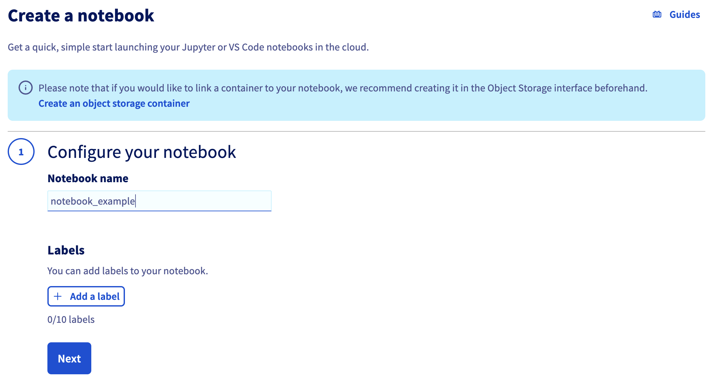
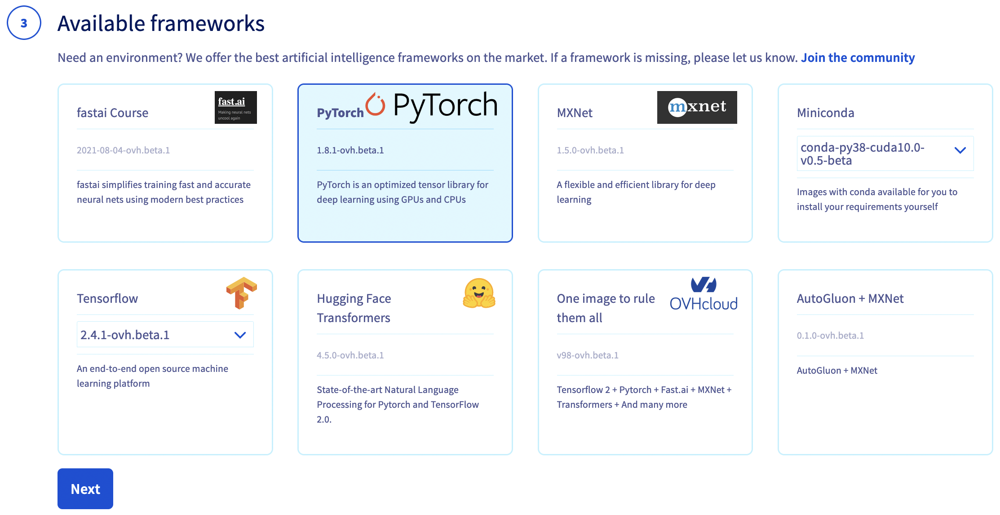
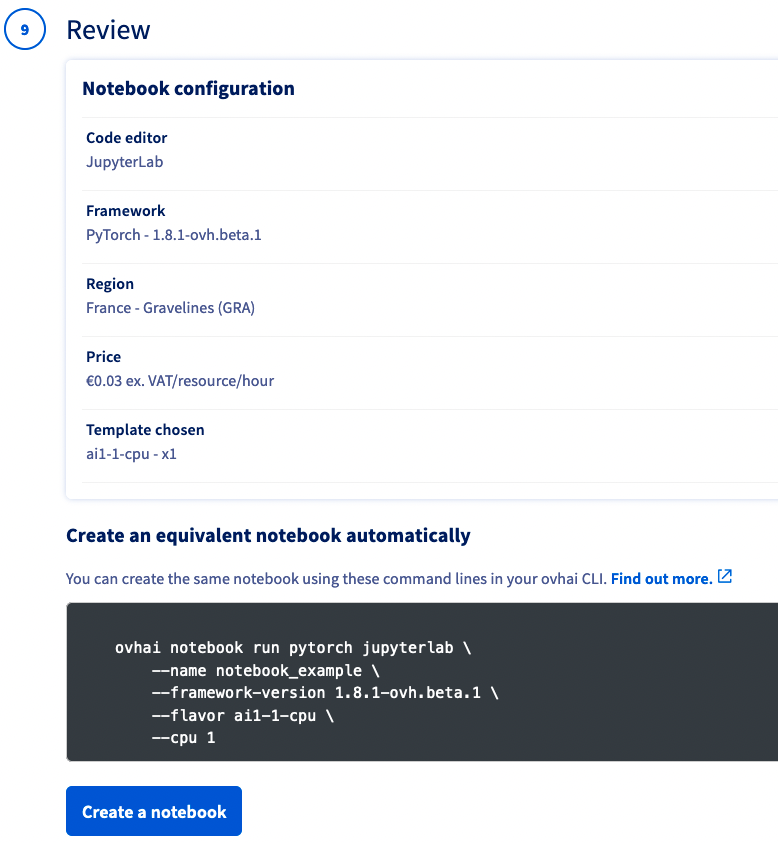
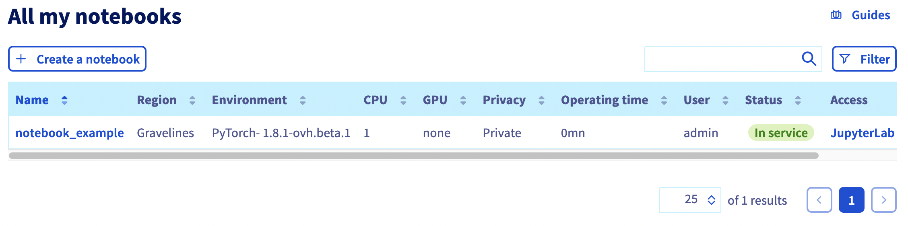
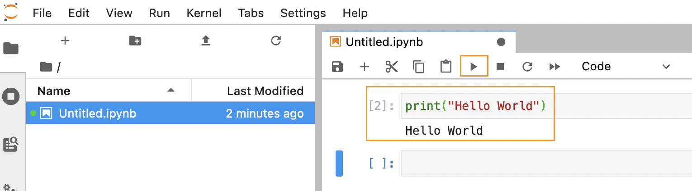

**Last updated 24th November, 2022.**

## Objective

The OVHcloud AI Notebooks service provides you Jupyter or VSCode notebooks, linked to CPU or GPU resources, without the hassle of installing or operating them. This guide will cover the creation of a new notebook.

## Requirements

- a [Public Cloud project](https://www.ovhcloud.com/asia/public-cloud/) in your OVHcloud account
- access to the [OVHcloud Control Panel](https://ca.ovh.com/auth/?action=gotomanager&from=https://www.ovh.com/asia/&ovhSubsidiary=asia)
- a Public Cloud user with `administrator` or `AI Training admin` role, see [here](https://docs.ovh.com/asia/en/publiccloud/ai/users/) for more information

## Definition

**Notebooks** are files which contain both computer code (e.g. python) and rich text elements (paragraph, equations, figures, links, etc…). Notebooks are both human-readable documents containing the analysis description and the results (figures, tables, etc..) as well as executable files which can be run to perform data analysis. It's vastly used across developer world, especially in the data and artificial intelligence fields.

**OVHcloud AI Notebook** is our solution for managed Jupyter or VSCode notebooks. You can launch your notebooks quickly with the CPUs and GPUs resources you need.
You also get secure user access, simplified use of your data, and the most popular artificial intelligence frameworks (TensorFlow, PyTorch, Hugging Face, Scikit-learn, ...).

The advantage compared to doing your own setup is that everything is already installed for you, and that you pay only for your notebooks while they are running.

Each notebook is linked to a **Public Cloud** project and specifies hardware resources along with a machine learning framework and an editor among those available.

You can create notebooks with the OVHcloud Control Panel (see below in this tutorial) or use the [ovhai CLI](https://docs.ovh.com/asia/en/publiccloud/ai/cli/getting-started-cli/).

AI Notebooks also provide an easy way to access data from your Object Storage, you can read more about it [here](https://docs.ovh.com/asia/en/publiccloud/ai/notebooks/tuto-access-object-storage-data/).

## Launch your first AI Notebook

Log in to the [OVHcloud Control Panel](https://ca.ovh.com/auth/?action=gotomanager&from=https://www.ovh.com/asia/&ovhSubsidiary=asia), go to the `Public Cloud`{.action} section and select the Public Cloud project concerned.

Access the administration UI for your OVHcloud AI Notebooks by clicking on `AI Notebooks`{.action} in the left-hand menu and click on `Create a Notebook`{.action}.

{.thumbnail}

Give a name to your Notebook.
Next, click on the `Next`{.action} button.

{.thumbnail}

Choose the code editor you want.
In this example, it's _JupyterLab_, but you can choose _Visual Studio Code_.

Both of them have their own pros and cons, but usually we can consider Jupyter as easier to user for a start.

Select _JupyterLab_, then click on the `Next`{.action} button.

{.thumbnail}

> [!primary]
> Note the _Edit this step_ link on the right up corner to edit the previous step of the wizard.
>

Choose the AI framework you want to use and click on the `Next`{.action} button.

{.thumbnail}

> [!primary]
>
> As you can see a lot of fameworks are available. This guide uses one of the most famous, _PyTorch_.
> As you can guess all of these Frameworks are _deployed_ as container based on images.
>

Next, select your privacy settings and click on the `Next`{.action} button.

{.thumbnail}

> [!warning]
>
> _Public access_ will expose your data and code to anyone getting the AI Notebook link. Be careful and don't use it with sensitive data.
>

Next, select a location for your new cluster.

{.thumbnail}

You can adjust the amount of resources by clicking on the `+`{.action} or `-`{.action} buttons.
Click on the `Next`{.action} button.

{.thumbnail}

Next step is about **storage options**.

By default, you will have an ephemeral storage space (local storage) and in this step you can link Object Storage containers to your AI Notebook, and directly play with your data.

You can also download Git repositiories easily in your AI Notebook.

This step is optional, you can configure these options later.

Leave them blank and click on the `Next`{.action} button.

{.thumbnail}

SSH public keys section is optional, click on the `Next`{.action} button.

{.thumbnail}

At the end of the wizard, review your settings and click on the `Create a Notebook`{.action} button to launch the creation of your notebook.

{.thumbnail}

> [!primary]
>
> Note at the bottom of the screen the equivalent of all these steps with the Command Line Interface (CLI) `ovhai`.
>

When your notebook is created, it will appear on your dashboard.

{.thumbnail}

At this point your AI Notebook is created, you can test it with a simple _Hello World_ as explained below.

Click on the `JupyterLab`{.action} link in the `Access` column in the array that lists all the created AI Notebooks.

{.thumbnail}

If you have not already created a Public Cloud user account, follow this [guide](https://docs.ovh.com/asia/en/publiccloud/ai/users/) and then log in with your Public Cloud user account.

Click on the `Connect`{.action} button.

{.thumbnail}

Next, click on `Python 3 (ipykernel)`{.action} button.

{.thumbnail}

Next, enter the following code in your code section:
```python
print("Hello World")
```

And run the code by pressing the `▶️`{.action} button:

```bash
Hello World
```
Your code is executed in your browser and will consume the CPU and GPU resources linked to your AI Notebook.

{.thumbnail}

You can save your example by clicking in the sub menu `Save`{.action} of the `File` menu.

## Stop the AI Notebook

Go back to the OVHcloud Control Panel. In the AI Notebook panel you can directly stop the desired notebooks.

### Considerations

- A notebook will run indefinitely until manual interruption, meaning that you will pay for it.
- When you stop an AI Notebook, you release the compute resources, but we keep the data from your workspace. It will be billed at the price of OVHcloud Object storage.
- Billing is per minute. Each started minute is due.

## Notebook lifecycle

During its lifetime the AI Notebook will transition between the following statuses:

> [!primary]
> * Billing starts once a notebook is `Pending` and ends when its status switches to `Cancelling`.
> * Only notebooks in states `Pending` and `In service` are included in the resource quota computation.

- `Pending`: The AI Notebook is starting, and volumes are synchronized from the Object Storage.
- `In service`: The AI Notebook is running and can be accessed from your browser.
- `Cancelling`: The AI Notebook is still running, but an interruption order was received and `RW` volumes are uploaded to your Object Storage.
- `Stopped`: The AI Notebook is stopped and `RW` volumes have been synchronized back to your Object Storage. Compute resources are released.
- `Deleted`: The AI Notebook data is fully deleted, you don't pay anything.

## Feedback

Please send us your questions, feedback and suggestions to improve the service:

- On the OVHcloud [Discord server](https://discord.com/invite/vXVurFfwe9)
