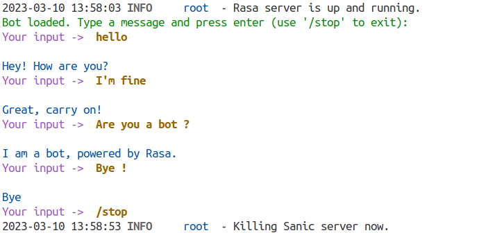

**Last updated 9th December, 2022.**

## Objective

The aim of the tutorial is to understand how to create and train a chatbot model with AI Notebooks. We will create and train the chatbot with a Visual Studio Code notebook. At the end of the tutorial, we will have a model and we can speak to our chatbot. There is an another tutorial where you can train your chatbot with the tool `AI Training`. Here is the link [how to train a chatbot with AI Training](https://docs.ovh.com/gb/en/publiccloud/ai/).

We will use the famous open source framework [Rasa](https://rasa.community/) to build the chatbot. 


**Requirements**

- Access to the [OVHcloud Control Panel](https://www.ovh.com/auth/?action=gotomanager&from=https://www.ovh.co.uk/&ovhSubsidiary=GB);
- A Public Cloud project created.
- The ovhai CLI interface installed on your laptop. More information [here](https://docs.ovh.com/gb/en/publiccloud/ai/cli/install-client/).
- A [user for AI Notebooks](https://docs.ovh.com/gb/en/publiccloud/ai/users/);

## Instructions

### Create a token to access your AI services

The first step consists to create an AI applicative token. With this token, you will be able to securely access all of your AI services. 
To do this, launch this command on the terminal once ovhai CLI installed:
Here is the reference to install the CLI : [CLI Installation](https://docs.ovh.com/gb/en/publiccloud/ai/cli/install-client/)

``` bash
ovhai token create -l model=rasabotRW --role operator token-RW-chatbot
```

Token is now created. Don't forget to save the token to use it later.

Now, if you already have trained some rasa models with AI Training by following the tutorial ([Train with AI Training](https://docs.ovh.com/gb/en/publiccloud/ai/)), you already have created a container with your trained models. You can skip the next part and go directly [here](#Create-and-train-a-chatbot-with-a-visual-studio-code-notebook).

### Understand storage concepts

The obvious goal about using object storage and not the local storage of the AI Notebook, is to de-correlate compute and storage, allowing us to stop or delete the notebook while keeping the data safe.
If you want to know more about data storage concept please fill free to check this : [Create an object container](https://docs.ovh.com/gb/en/storage/object-storage/pcs/create-container/). 

For the chatbot, we will create one object storage bucket. This bucket will be filled over time by our trained model output. The container where the model will be saved don't have to be created. When we will launch our notebook, the container will be automatically created. 

Now, let's start to create and train our chatbot.

### Create and train a chatbot with a Visual Studio Code notebook

 In order to do it you will need to create a Visual Studio Code notebook. You can attach one volume if you want to save the model created. 
Don't forget to put the model inside the folder `trained-models` before stopping your notebook. By doing this, your model will be save in your object container even if you delete your notebook. Here is the command to run: 


``` console
ovhai notebook run conda vscode \
--name vscode-ovh-chatbot \
--framework-version conda-py39-cuda11.2-v22-4 \
--volume <model-output-container>@GRA:/workspace/trained-models:RW \
--cpu 10 \
--token <token> \
--label model=rasabotRO \
-s ~/.ssh/id_rsa.pub
```

Few explanations here, line by line:
- It will launch a notebook with the Python Miniconda framework a Visual Studio Code editor.
- With the name "vscode-ovh-chatbot".
- We specify a version for the conda framework (Python 3.9). 
- we attach 1 data volume to the notebook, as explained previously.
- We request 10 CPUs. The more we add, the more performant it is.
- we add the token previously created.
- We labelize this notebook with label "rasabotRO".
- Optional : the last line is the path to your ssh key on your machine. It is important to setup the key here to connect by remote on VScode. If you don't want to, you can connect directly on the web with the token you create before.

> [!primary]
>
> Note that the **GitHub** repository don't have to be added because it is already present when you create an AI Notebook. 
>

Your notebook is ready, you can access it and log in. 

But just before training an AI model inside the notebook, you must install all the dependencies of rasa. Open a terminal and launch this command!
```console 
pip install rasa
```

Once you have installed all the dependencies, you can create and train the chatbot with only one command in your terminal. Run at the root of your directory:
```console
rasa init
```

It will create some folders with basic data for rasa chatbot. During the command, you can also train a model and speak with the chatbot at the end. Here is a small example of a conversation with the chatbot. 

{.thumbnail}

Here, we train a very simple model with small data. There are some frameworks like [chatette](https://github.com/SimGus/Chatette) who generate some data and permits to create more powerful models. 

## Go further

If you want to use more functionnality about Rasa, please fill free to go into this link. We use Rasa Open Source and not Rasa X. 

[Rasa Open source](https://rasa.com/docs/rasa/)

If you want to deploy your model created with the chatbot, you can follow this tutorial. 

[How to deploy a chatbot](https://docs.ovh.com/gb/en/publiccloud/ai/)

If you want to train a rasa chatbot with the tool AI Training, please look at this tutorial. 

[How to train a chatbot with docker and AI Training](https://docs.ovh.com/gb/en/publiccloud/ai/)

## Feedback

Please send us your questions, feedback and suggestions to improve the service:

- On the OVHcloud [Discord server](https://discord.com/invite/vXVurFfwe9)
