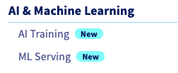

**Last updated 20th April, 2021.**

## Objective

This guide covers the process of adding a private registry to the **AI Training** service.

## Requirements

-   a **Public Cloud** project
-   credentials for the Docker registry you wish to add
-   access to the [OVHcloud Control Panel](https://ca.ovh.com/auth/?action=gotomanager&from=https://www.ovh.com/ca/fr/&ovhSubsidiary=qc)

## Instructions

### Step 1: Going to the AI Training menu

Log in to the [OVHcloud Control Panel](https://ca.ovh.com/auth/?action=gotomanager&from=https://www.ovh.com/ca/fr/&ovhSubsidiary=qc), go to the `Public Cloud`{.action} section, then to the `AI Training` section which is located under `AI & Machine Learning`.

{.thumbnail}

From the dashboard you can add your Docker registry by clicking `Private Docker Registry`{.action} > `Add`{.action} button.

### Step 2: Adding the registry

To add a registry you simply need to provide the credentials of your registry along with its URL.

{.thumbnail}

Once the form is filled out click `Add`{.action}.

### Step 3: Submitting an image from your registry

Once your registry is added you can use any images pushed on the registry for your jobs.

From the OVHcloud Control Panel while [submitting a job](https://docs.ovh.com/ca/fr/publiccloud/ai/training/submit-job), you can choose a custom Docker image in Step 7.

{.thumbnail}

With the `ovhai` command line CLI simply provide the image with `ovhai job run <image>`.

The default shared registry remains available even with a private registry added.

## Going Further

-   You can check the official documentation about [how to submit a **job**](https://docs.ovh.com/ca/fr/publiccloud/ai/training/submit-job)
-   You can check out the documentation about the [`ovhai` CLI](https://docs.ovh.com/ca/fr/publiccloud/ai/cli/overview-cli)
-   You can check out the documentation about [how to setup the `ovhai` CLI](https://docs.ovh.com/ca/fr/publiccloud/ai/cli/install-client)

## Feedback

Please send us your questions, feedback and suggestions to improve the service:

- On the OVHcloud [Discord server](https://discord.com/invite/vXVurFfwe9)
