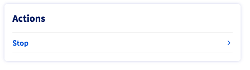
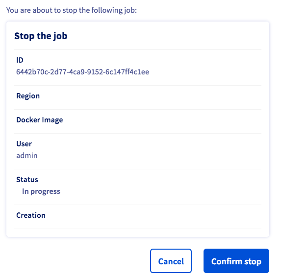

**Last updated 3rd May, 2021.**

## Objective

This guide covers the process of starting a simple interactive notebook leveraging GPUs over **AI Training** service.

## Requirements

-   access to the [OVHcloud Control Panel](https://ca.ovh.com/auth/?action=gotomanager&from=https://www.ovh.com/ca/en/&ovhSubsidiary=ca)
-   an **AI Training project** created inside a **public cloud** project
-   a [user for AI Training](https://docs.ovh.com/ca/en/publiccloud/ai/users)

## Instructions

### Step 1 - Begin as classic job submission

Follow the same steps as a classic job submission described [here](https://docs.ovh.com/ca/en/publiccloud/ai/training/submit-job) until you reach the [Step 5 - Providing a Docker image](https://docs.ovh.com/ca/en/publiccloud/ai/training/submit-job/#step-5-providing-a-docker-image).

### Step 2 - Select the notebook corresponding to your needs

A `job` is basically a Docker container that is run within the OVHcloud infrastructure.

Notebooks are `daemon jobs`, meaning that they will run indefinitely until the user request an interuption.

AI Training offers several notebooks images with different configurations. You can choose the configuration that best suits your needs among them.

Currently the following configurations are available :

-   **PyTorch** : An OVHcloud preset image including JupyterLab notebook, Visual Studio Code IDE and `pytorch` libraries
-   **Tensorflow 2** : An OVHcloud preset image containing JupyterLab notebook, Visual Studio Code IDE and `tensorflow 2` libraries
-   **Hugging Face Transformers** : An OVHcloud preset image containing JupyterLab notebook, Visual Studio Code IDEand `hugging face` libraries
-   **MXNet** : An OVHcloud preset image containing JupyterLab notebook, Visual Studio Code IDE and `mxnet` libraries
-   **Fast.ai** : An OVHcloud preset image containing JupyterLab notebook, Visual Studio Code IDE and `fast.ai` libraries
-   **autogluon** : An OVHcloud preset image containing JupyterLab notebook, Visual Studio Code IDE and `AutoGluon` + `mxnet` libraries
    {.thumbnail}

Once your image is chosen, click `Next`{.action}.

### Step 3 - Continue as a classic job submission

Continue to follow the same steps as a classic job submission described [here](https://docs.ovh.com/ca/en/publiccloud/ai/training/submit-job) until you reach the [Step 10 - Consulting your job](https://docs.ovh.com/ca/en/publiccloud/ai/training/submit-job/#step-10-consulting-your-job).

> [!warning]
> If you want to be able to save your notebook files on your object storage we strongly advise to plug a **read** and **write** volume on your job before submitting. That volume will be synchronized with your object storage at the end of the job.

### Step 4 - Access notebook URL

Once your job is `In progress`, in the job description panel you should see the `access url` link. Click on it and you will be redirected on your job url.

{.thumbnail}

### Step 5 - Login as an AI Training user

If your are not authenticated as a AI Training user you should see a screen asking your username and password.

> [!primary]
> If you have never created a user for AI Training yet you can follow the instruction [here](https://docs.ovh.com/ca/en/publiccloud/ai/users)

Fill the field and click `Login`{.action}.

{.thumbnail}

### Step 6 - Use your notebook

In most provided preset images you can choose which editor you prefer between JupyterLab and VisualStudio code.

{.thumbnail}

Just select the one that you want to use and you will be redirected to the corresponding one.

{.thumbnail}

By default the home directory of your job is located under `/workspace`. It means that you will have **read** and **write** access on that directory as well as your **read** and **write** mounted volumes.

> [!warning]
>
> If you are missing a library or a configuration, you can add it directly in command line in the **console** of the notebook as long as you don't need priviledge access (root access). Example : `pip install <...>`
>
> For installing specific libraries that require priviledge access you will have to build your own notebook image and use it as **custom image** at [step 2](./#step-2-select-the-notebook-corresponding-to-your-needs) instead of **preset image**. More information about creating your own docker image can be found [here](https://docs.ovh.com/ca/en/publiccloud/ai/training/build-use-custom-image)

> [!primary]
>
> If you open a **console** tab in your notebook and type `nvidia-smi` you will see the available GPUs that you can use on your notebook.
>
> {.thumbnail}

### Step 7 - Stop your notebook

Once you are done working with your notebook don't forget to stop it.

You can do it by selecting `Stop`{.action} in the action menu.

{.thumbnail}

Then `confirm`{.action} your choice.

{.thumbnail}

After some time your job should go in `interrupted` state meaning that the job has been stopped.

{.thumbnail}

> [!primary]
>
> Before going into `interrupted` state, your job may run through `finalizing` state. During this phase all data inside `read & write volumes` are saved inside their linked containers in your object storage.

## Feedback 

Please send us your questions, feedback and suggestions to improve the service:

- On the OVHcloud [Discord server](https://discord.com/invite/vXVurFfwe9) 
