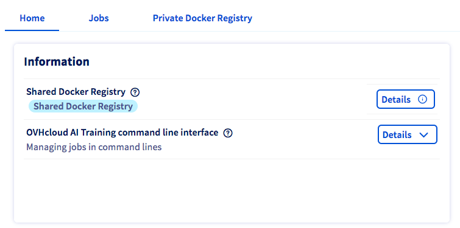

**Last updated 1st September, 2022.**

## Objective

This tutorial covers the process of building your own job image for specific needs

## Requirements

-   access to the [OVHcloud Control Panel](https://ca.ovh.com/auth/?action=gotomanager&from=https://www.ovh.com/asia/&ovhSubsidiary=asia)
-   an **AI Training project** created inside a **Public Cloud** project
-   a [user for AI Training](https://docs.ovh.com/asia/en/publiccloud/ai/users)
-   [Docker](https://www.docker.com/get-started) installed on your local computer
-   some knowledge about building an image and a [Dockerfile](https://docs.docker.com/engine/reference/builder/)

## Write your own Dockerfile

Create a new file and name it `Dockerfile`

### Choosing a base image

First you need to choose a base image to start from.

Header of your Dockerfile should look like this :

``` {.console}
FROM <base-image>
```

> [!warning]
>
> If you want to be able to use **GPU** hardware on your **AI TRAINING jobs**, the base image should have **cuda drivers installed on**.

Here is a list of base images (including **cuda drivers**) that OVHcloud uses within notebooks :

-   [pytorch/pytorch:1.6.0-cuda10.1-cudnn7-runtime](https://hub.docker.com/r/pytorch/pytorch)
-   [tensorflow/tensorflow:2.3.0-gpu](https://hub.docker.com/r/tensorflow/tensorflow)
-   [transformers/transformers-pytorch-gpu:3.1.0](https://hub.docker.com/r/transformers/transformers)
-   [mxnet/python:1.5.0_gpu_cu101_py3](https://hub.docker.com/r/mxnet/python)
-   [fastdotai/fastai-course:2.0.9](https://hub.docker.com/r/fastdotai/fastai-course)

For example if you want to start from the base image `tensorflow/tensorflow:2.3.0-gpu` :

``` {.console}
FROM tensorflow/tensorflow:2.3.0-gpu
```

### Install what you need

Bash command instructions on your Dockerfile should begin with `RUN` prefix.

Example if your want to install vim :

``` {.console}
RUN apt-get update && apt-get install -y vim
```

You can copy files from your local directory inside docker image with the `COPY` prefix.

Example if you want to add the file `example.txt` at the root of the image :

``` {.console}
COPY example.txt /example.txt
```

> [!warning]
>
> Images in AI Training are not run as root user, but by an "ovh" user with UID 42420. It means that if you want to be able to write in a specific directory at runtime you will have to give it specific rights.
> You can do it with the following instruction :
>
>     RUN chown -R 42420:42420 <your-target-directory>

> [!warning]
>
> The home directory for the "ovh" user (with UID 42420) will be /workspace.
> If your base image (the one used by the FROM instruction) does not create the /workspace directory (and it probably doesn't if you didn't use an image provided by OVHcloud), then you should create it in your Dockerfile.
>
>     RUN mkdir -p /workspace && chown -R 42420:42420 /workspace
>     ENV HOME /workspace
>     WORKDIR /workspace

You can set environment variables with the `ENV` prefix.

Example if you want to add an environment variable `KEY` with value `VALUE`

``` {.console}
ENV KEY VALUE
```

> [!primary]
>
> For more information about dockerfile we recommand you to refer to the [official documentation](https://docs.docker.com/engine/reference/builder/)

## Build image

Once your **Dockerfile** is complete and match your needs you have to choose a name and build the image using the following command in the same directory :

``` {.console}
docker build . -t <image-identifier>
```

> [!primary]
>
> The dot `.` argument indicates that your build context (place of the **Dockerfile** and other needed files) is the current directory.

> [!primary]
>
> The `-t` argument allow you to choose the identifier to give to your image. Usually image identifiers are composed of a **name** and a **version tag** `<name>:<version>`.

## Test it locally (Optional)

If you want to verify that your built image is working properly, run the following command :

``` {.console}
docker run --rm -it --user=42420:42420 <image-identifier>
```

> [!warning]
>
> Don't forget the `--user=42420:42420` argument if you want to simulate the exact same behavior that will occur on **AI TRAINING jobs**. It executes the docker container as the specific OVHcloud user (user **42420:42420**).

## Push image in the registry of your choice

Pushing your image to a registry is needed in order for AI Training to pull it.

AI Training provides a default registry called **Shared registry** where users are able to push their custom images. It is linked with every project by default.

If you prefer using your own private docker registry instead of the shared one, feel free to use it. Just don't forget to [add your registry in your AI Training project](https://docs.ovh.com/asia/en/publiccloud/ai/training/add-private-registry) before using it.

The basic commands to push a docker image to a registry is :

    docker login -u <registry-user> -p <registry-password> <registry>
    docker tag <image-identifier> <registry>/<image-identifier>
    docker push <registry>/<image-identifier>

Example if you want to push an image named `custom-image` inside a registry `registry.gra.training.ai.cloud.ovh.net` :

    docker login -u <registry-user> -p <registry-password> my-registry.ai.cloud.ovh.net
    docker tag custom-image:latest my-registry.ai.cloud.ovh.net/custom-image:latest
    docker push my-registry.ai.cloud.ovh.net/custom-image:latest

If you want to know the exact commands to push on the shared registry, please consult the `Details`{.action} button of the **Shared Docker Registry** section in the **Home** panel of AI Training.

{.thumbnail}

A full **Dockerfile** example about building a **Jupyter** notebook image with **Tensorflow** is available on our example repository [here](https://github.com/ovh/ai-training-examples/tree/main/jobs/jupyterlab/tensorflow).

## Go further

- You can also build a custom Docker image to deploy a **Streamlit** app. [Here it is](https://docs.ovh.com/asia/en/publiccloud/ai/deploy/build-use-streamlit-image/).
- You can imagine deploying a Docker image for data processing and training tasks. Refer to this [tutorial](https://docs.ovh.com/asia/en/publiccloud/ai/training/tuto-models-comparaison-weights-and-biases/).

## Feedback

Please send us your questions, feedback and suggestions to improve the service:

- On the OVHcloud [Discord server](https://discord.com/invite/vXVurFfwe9)
