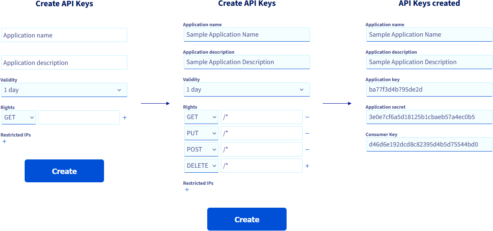

> [!primary]
> The Data Integration product is in `beta`. During the beta-testing phase, the infrastructure’s availability and performances are not guaranteed. Please do not use this service for applications that are in production, while this phase is not complete.

## Objective

This guide covers the installation of the **ovhdata-cli** command line interface (CLI). The CLI is the recommended means of interaction with the **Data Integration** service.

## Requirements

- An OVHcloud account with the associated credentials.
- A [Public Cloud project](https://www.ovhcloud.com/es-es/public-cloud/) in your OVHcloud account.

## Instructions

### Step 1: Download the CLI

Download the CLI corresponding to your operating system.

``` {.console}
# Linux
curl -s https://github.com/ovh/ovhdata-cli/releases/latest/download/ovhdata-cli_linux_amd64
```

``` {.console}
# Mac
curl -s https://github.com/ovh/ovhdata-cli/releases/latest/download/ovhdata-cli_darwin_amd64
```

``` {.console}
# Windows
curl -s https://github.com/ovh/ovhdata-cli/releases/latest/download/ovhdata-cli_windows_amd64.exe
```

### Step 2: Installing the CLI

After downloading the right binary for your platform, add it to your `PATH`:

``` {.console}
mkdir -p $HOME/bin
mv ovhdata-cli-<os-build> $HOME/bin/ovhdata-cli
export PATH=$PATH:$HOME/bin/
```

Optionally you could generate the CLI completion script and add it to your settings.
Here is an example for `bash` though other shells are supported:

``` {.console}
ovhdata-cli completion bash > ~/ovhdata-cli-completion.sh
echo 'source ~/ovhdata-cli-completion.sh' > ~/.bashrc
source ~/.bashrc
```

You should now be able to use the tabulation to complete your commands as you type.

> [!primary]
> You may have to regenerate the completion script after updating the CLI to a version supporting new commands.

### Step 3: Authenticating

Once the **ovhdata-cli** CLI is installed, you need to authenticate.

``` {.console}
ovhdata-cli login
```

The above command will open your browser and ask you to login.
Fill in your OVHcloud account credentials, submit and then click on continue:

{.thumbnail}

### Step 4: Creating API keys

Once authenticated on your browser you will have to create API keys.

- Set the application name.
- Set the application description.
- Choose the validity period.
- Pick the following rights: GET, PUT, POST and DELETE, all four on `/*`.

{.thumbnail}

### Step 5: Completing the authentication

Go back to your terminal and use your newly created API keys to complete the CLI authentication process:

- First copy the `application key` from your browser and paste it.
- Then copy the `secret key` from your browser and paste it (it will be considered as a password and will not be displayed).
- Finally copy the `consumer key` from your browser and paste it.

You should receive a feedback message informing you that you are now logged in.

### Step 6: Using the command line CLI

You can use the command `ovhdata-cli --help` to list generic CLI actions, `ovhdata-cli di --help` to list actions specific to the Data Integration service, and `ovhdata-cli di <action> --help` for more information about a specific action.

Please refer to the [CLI commands reference guide](/pages/platform/data-integration/guide_02_cli_commands_reference) for more information.

## We want your feedback!

Visit our [Discord server](https://discord.gg/ovhcloud). Ask questions, provide feedback and interact directly with the team that builds the Data Integration service.

If you need training or technical assistance to implement our solutions, contact your sales representative or click on [this link](https://www.ovhcloud.com/es-es/professional-services/) to get a quote and ask our Professional Services experts for a custom analysis of your project.
