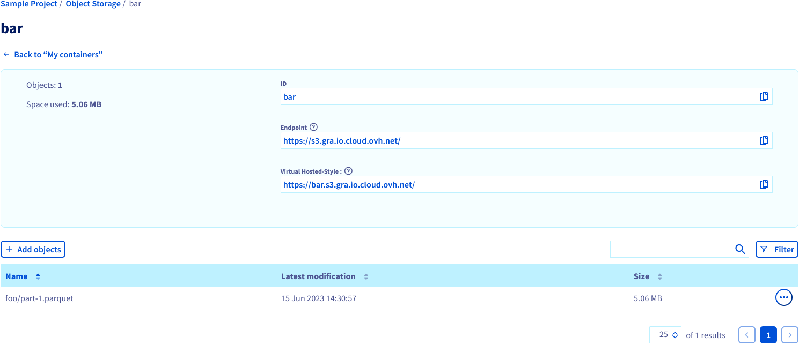

## Objective

This guide covers the usage of the **ovhdata-cli** CLI. The CLI is the recommended means of interaction with the **Data Integration** service.

## Requirements

- A working `ovhdata-cli` CLI with an active login. [This guide](/pages/platform/data-integration/guide_01_cli_installation) can help you meet this requirement.
- A PostgreSQL database instance accessible from the Internet.
- An S3 bucket accessible from the Internet.

## Instructions

### Create a source

Setting up a data integration usually begins by creating a source.

First let's list the available source connectors:

``` {.console}
ovhdata-cli di source-connector list
```

You should see a list of source connectors with their `name`, `identifier` and `version`.

Let's create a PostgreSQL source. We can either provide all the required parameters on the command line or just the name of the source. If one or multiple parameters are missing,the CLI will help us fill them in interactively:

``` {.console}
ovhdata-cli di source create MY_FIRST_SRC
```

When all the parameters have been set, a summary is displayed along with a confirmation prompt:

``` {.console}
ovhdata-cli di source create MY_FIRST_SRC

Source connector PG Source selected. id=e89d092a-701d-4928-8d95-00f62cd75eae

Name:         MY_FIRST_SRC
Connector Id: e89d092a-701d-4928-8d95-00f62cd75eae
Parameters:
  NAME       VALUE
  host       postgresql-6642b541-da2648aa3.database.cloud.ovh.net
  port       20184
  username   avnadmin
  database   defaultdb
  schema     public
  password   
  tables     foo
? Do you want to create the source MY_FIRST_SRC ? (y/n) ›
```

The source is then created and the connection tested. If all goes well you should be greeted with a success message.

### Create a destination

Creating a destination is similar to creating a source.

First let's list the available destination connectors:

``` {.console}
ovhdata-cli di destination-connector list
```

You should see a list of destination connectors with their `name`, `identifier` and `version`.

Let's create an S3 destination. As for the source, we cab either provide all the required parameters on the command line or just the name of the destination. If one or multiple parameters are missing, the CLI will help us fill them in interactively:

``` {.console}
ovhdata-cli di destination create MY_FIRST_DEST
```

When all the parameters have been set, a summary is displayed along with a confirmation prompt:

``` {.console}
ovhdata-cli di destination create MY_FIRST_DEST

Destination connector S3 Destination selected. id=8a3ff403-cc6d-4e8c-b03b-a30ddae420e4 

Name:         MY_FIRST_DEST
Connector Id:  8a3ff403-cc6d-4e8c-b03b-a30ddae420e4
Parameters:
  NAME         VALUE
  access_key   ioevhuxxojczcqm1cqbaxmymtpeyuy1d
  secret_key   bcjh5oo2klhmwclc8xrxx4f4910hm5kw
  bucket       bar
  endpoint     https://s3.gra.io.cloud.ovh.net/
  path         /
  region       gra
  secure       true
✔ Do you want to create the destination MY_FIRST_DEST ? (y/n) ›
```

The destination is then created and the connection tested. If all goes well you should be greeted with a success message.

### Create a workflow

Now that we have a source and a destination, we can create a workflow to wire them together.

As you may have guessed, the workflow we want to create will backup the `foo` table of the PostgreSQL database instance to the `bar` S3 bucket.

Let's start the workflow creation with the following command:

``` {.console}
ovhdata-cli di workflow create --region GRA MY_FIRST_WF
```

You will have to first select the source and then select the destination, after that a summary is displayed along with a confirmation prompt:

``` {.console}
ovhdata-cli di workflow create --region GRA MY_FIRST_WF

Name:           MY_FIRST_WF
Region:         GRA
Description:    ~
Source Id:      6679b0ac-c626-4c93-b71f-c11722c8b7f1
Destination Id: b798c80b-9112-4575-bbf9-df43e57e6ea4
Schedule:       ~
Enabled:        true
? Do you want to create the workflow MY_FIRST_WF ? (y/n) ›
```

The workflow is then created and can now be run.

### Run a job

The source and the destination are now tied together with a workflow, it is time to launch its first job.

Execute the following command and select your workflow:

``` {.console}
λ ovhdata-cli.exe di workflow run

Id:         d35e530b-b974-4111-a5f2-62bccb96d292
Status:     PROVISIONING
Created At: 15-06-23 10:06:58
Started At: 15-06-23 10:07:04
Ended At:   15-06-23 10:07:04
```

Once the job is submitted, its identifier and status will be displayed.

### Check a job status

A job was created by running the workflow and you can check its completion by executing the following command and selecting your workflow and your job:

``` {.console}
ovhdata-cli di job get

Id:         d35e530b-b974-4111-a5f2-62bccb96d292
Status:     COMPLETED
Created At: 15-06-23 10:06:58
Started At: 15-06-23 10:07:24
Ended At:   15-06-23 10:07:34
```

Alternatively you can check that the `foo` table was successfully backed up in the `bar` bucket.

{.thumbnail}

## We want your feedback!

Visit our [Discord server](https://discord.gg/ovhcloud). Ask questions, provide feedback and interact directly with the team that builds the Data Integration service.

If you need training or technical assistance to implement our solutions, contact your sales representative or click on [this link](https://www.ovhcloud.com/pt/professional-services/) to get a quote and ask our Professional Services experts for a custom analysis of your project.
