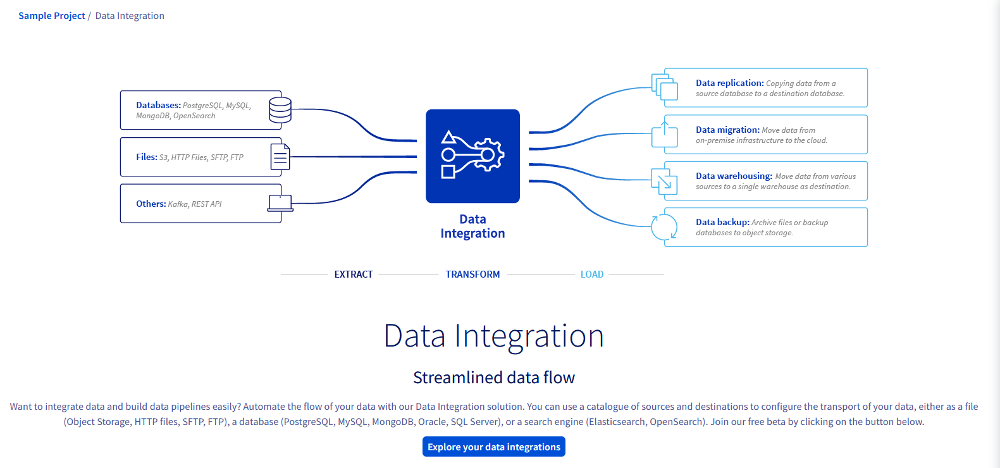
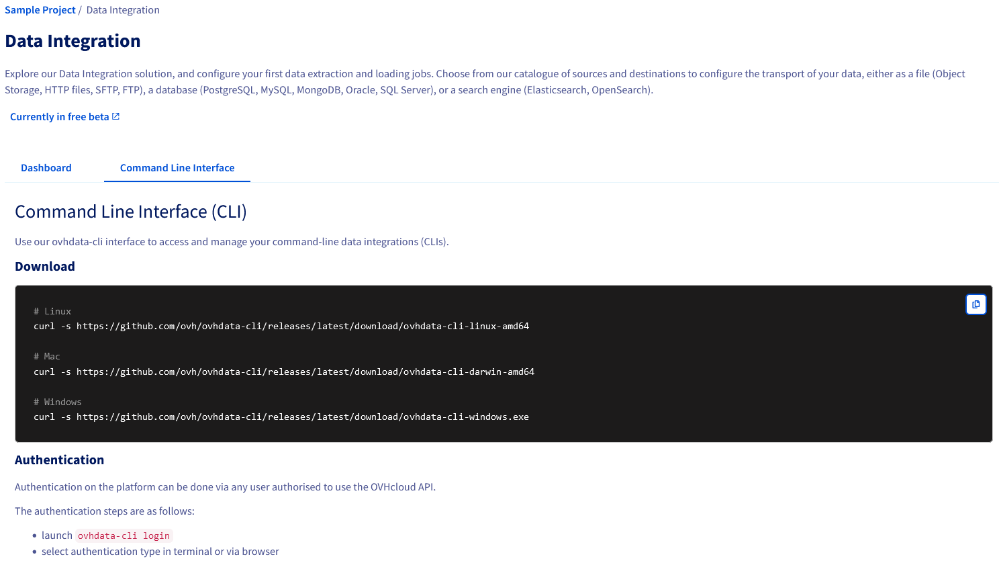
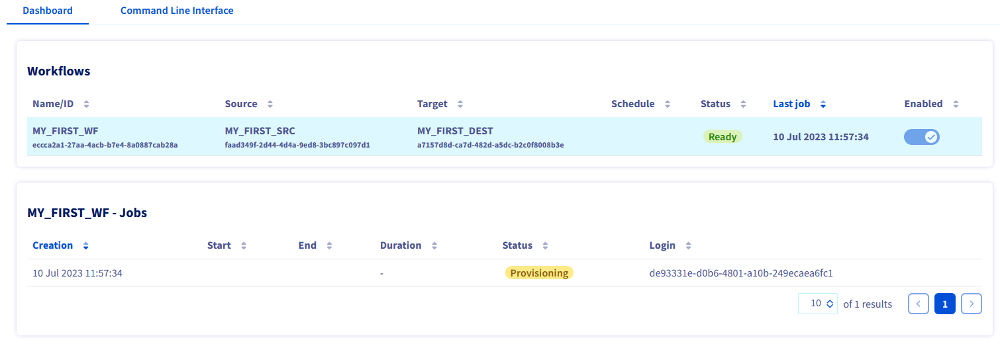

## Objective

This guide covers the usage of the Control Panel to explore the **Data Integration** service.

## Requirements

- Access to the [OVHcloud Control Panel](https://www.ovh.com/auth/?action=gotomanager&from=https://www.ovh.ie/&ovhSubsidiary=ie).
- A [Public Cloud project](https://www.ovhcloud.com/en-ie/public-cloud/) in your OVHcloud account.

## Instructions

### Access to the Data Integration service

Log in to your [OVHcloud Control Panel](https://www.ovh.com/auth/?action=gotomanager&from=https://www.ovh.ie/&ovhSubsidiary=ie) and switch to the `Public Cloud`{.action} section. After selecting your Public Cloud project, click on `Data Integration`{.action} in the left-hand navigation bar under **Data & Analytics**.

{.thumbnail}

If your project does not yet contain any `workflow` you will be greated with the following page:

{.thumbnail}

Click on the `Explore your data integrations` button.

### Command Line Interface

The Command Line Interface page describes how to download and setup the `ovhdata-cli`:

{.thumbnail}

For more information please read the [CLI installation guide](/pages/platform/data-integration/guide_01_cli_installation).

### Dashboard

If your project does not yet contain any `workflow` the following page will be displayed:

{.thumbnail}

Please read the [CLI commands reference guide](/pages/platform/data-integration/guide_02_cli_commands_reference) to help you create your first workflow:

{.thumbnail}

By clicking on the workflow you will be able to see the associated jobs:

{.thumbnail}

When the job is finished the table is updated to display additional information:

{.thumbnail}

## We want your feedback!

Visit our [Discord server](https://discord.gg/ovhcloud). Ask questions, provide feedback and interact directly with the team that builds the Data Integration service.

If you need training or technical assistance to implement our solutions, contact your sales representative or click on [this link](https://www.ovhcloud.com/en-ie/professional-services/) to get a quote and ask our Professional Services experts for a custom analysis of your project.
