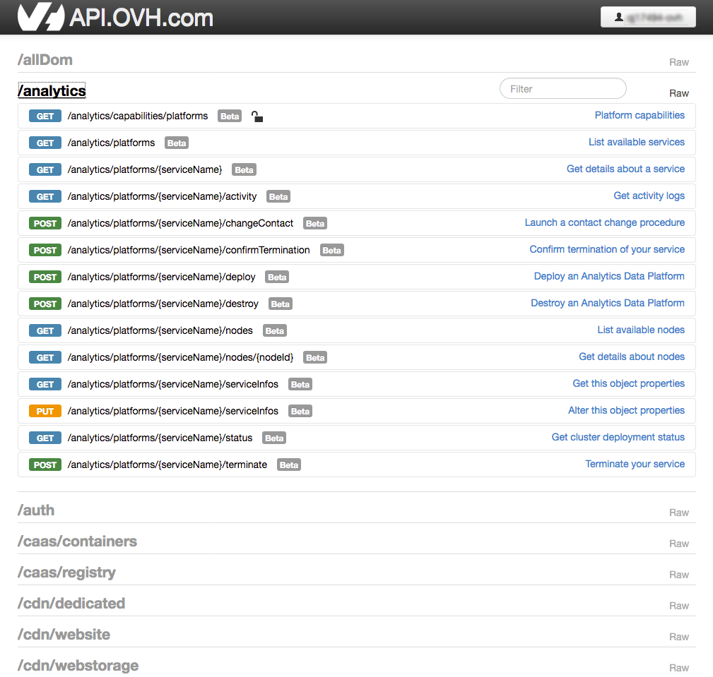

>[!warning]
>
> Destroying an Analytics Data Platform will result in the permanent loss of all data on it.

## Requirements

To destroy your cluster you will need to get an OpenStack token of your Public Cloud project.
To do so:

1.  Login to your [OVH Manager](https://www.ovh.com/manager/public-cloud/index.html)
2.  Select your project in the sidebar
3.  Navigate to the *Project Management* -> *Users* section
4.  If you don't have a user, create one and save your password
5.  Click on the option button of your user and select *Generate an OpenStack token*
6.  Enter your user password and retrieve your token

## Delete your Analytics Data Platform

To delete your Analytics Data Platform:

1.  Go on the [OVH API](https://api.ovh.com/console/#/) web page and log in with your OVH user and password

2.  In the **/analytics** section, select the route `/analytics/platforms/{serviceNane}/destroy`

3.  In the field *serviceName*, enter your cluster ID and , in the *osToken* field, enter your token.
4.  Press the **Execute** button

You can see your cluster's status while it's destroying in your OVH manager (see [Get your Data Platform status](../get-status/guide.en-gb.md))

>[!warning]
>
> Ensure that every instance and volume has correctly been destroyed on the [OVH Manager](https://www.ovh.com/manager/public-cloud/index.html), in the *Intances* section of your project.