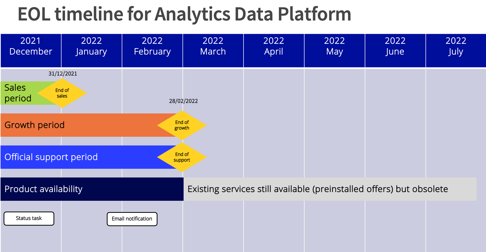

**Last updated 29th December 2021**

## Summary

OVHcloud has announced the end of life of its Analytics Data Platform solution (preinstalled Apache Hadoop Big Data Clusters). 
Active services can be kept by customers but will no longer be supported after February 1st 2022, end of support date. 

You can track the operation using this [status task](https://public-cloud.status-ovhcloud.com/incidents/kdkvvxjw5m9d).

## End of Life Planning

Affected customers with active Analytics Data Platform services have received an email notification on their technical and billing OVHcloud accounts.

### Schedule table

| Milestone                 | Definition                                                                                                          | Date       |
|-----------------------|---------------------------------------------------------------------------------------------------------------------|------------|
| End of Sales | Last day to purchase a new service on OVHcloud.  | 31/12/2021 |
| End of support | Last day to use services with provided support. Existing services can be kept by customers, since it's preinstalled offers. No official support will be provided after this date. | 28/02/2022 |

### Visual timeline

{.thumbnail}

## End of life scope

This end-of-life includes:

- All Analytics Data Platforms public offers, worldwide.
