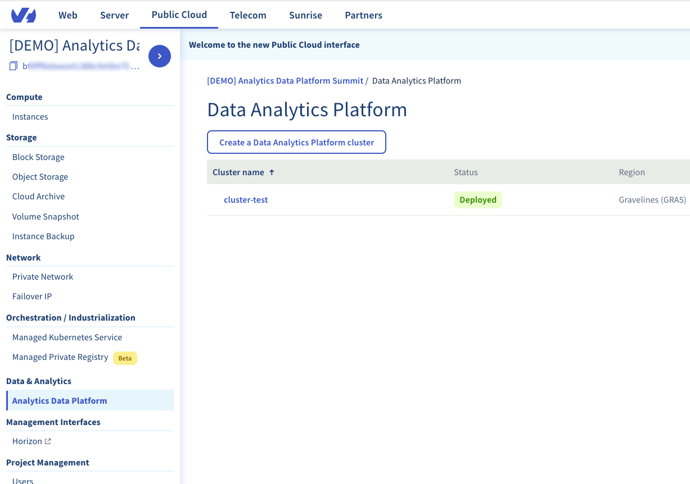
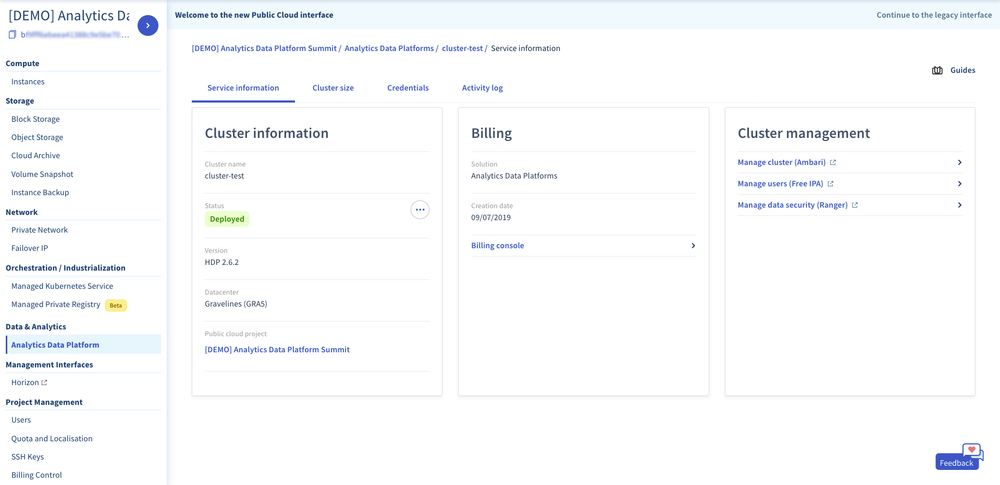

## Get the cluster status

To get the status of a Data Platform : 

1.  Login to your [OVH Manager](https://www.ovh.com/manager/public-cloud/index.html)
2.  Select your project in the *sidebar* 
3.  In the *Data & Analytics* section of the *sidebar*, select *Analytics Data Platform*

If at least one cluster has been deployed, its status can be seen on this view. Further information about each Data Platform are available by selecting a cluster in the list.

## Get the nodes status

To get the status of the nodes inside a cluster : 

1.  Login to your [OVH Manager](https://www.ovh.com/manager/public-cloud/index.html)
2.  Go on the *cluster information* page (see above)
3.  Go into the *Cluster Size* section

On this page, all the nodes of the Data Platform are listed and you can see some information like the IP address and the status of each one.

