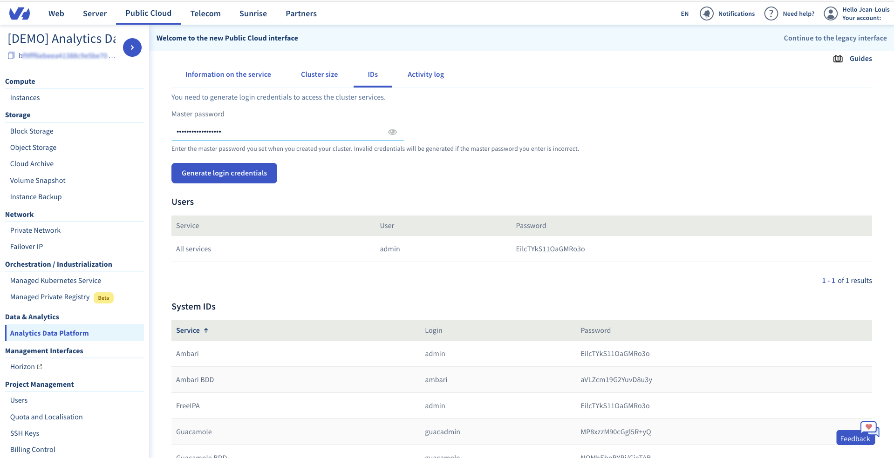

When your data platform is installed, it is initialized with a master password you gave. This password must always be kept safe
as it allows to retrieve all the credentials of your platform services.  

To retrieve your credentials:

1.  Login to your [OVH Manager](https://www.ovh.com/manager/public-cloud/index.html)
2.  Select your project in the *sidebar* 
3.  In the *Data & Analytics* section of the *sidebar*, select *Analytics Data Platform*
4.  Click on the name of your Data Platform in the list
5.  Go in the *IDs* view
6.  Enter your master password
7.  Click on **Generate login credentials** button

## Description of credentials

You will need the *All services* credentials to connect to the Ambari, Ranger and FreeIPA UIs.

The other crendentials listed are :

Credentials         | Description
--------------------|----------------------------------------------------------
 Ambari             | Ambari administrator password: manage your cluster services (same as *All services*)
 Ambari BDD         | Ambari MySQL DB administrator
 FreeIPA            | Use this password to access the FreeIPA management interface through your browser (same as *All services*)
 Hive BDD           | Hive metastore MySQL DB administrator
 Kerberos KDC       | Kerberos Key Distribution Center administrator
 MariaDB SQL server | MariaDB SQL server administrator
 Oozie BDD          | Oozie MySQL DB administrator
 Ranger KMS         | Ranger KMS administrator
