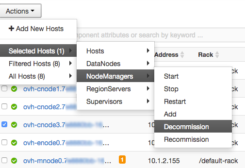
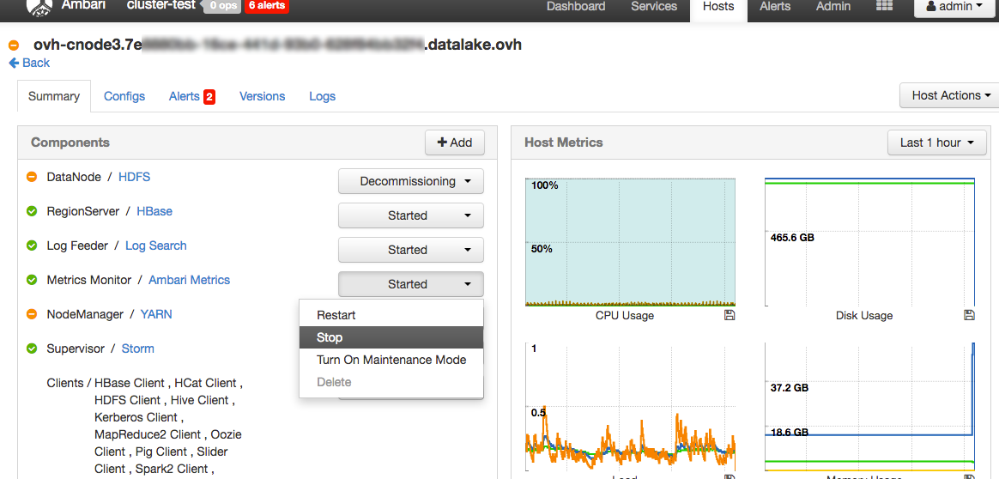
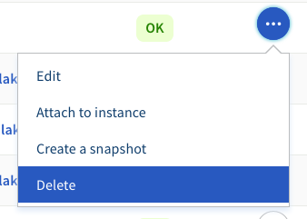

If you want to remove a node from your Data Platform, you will need to decommission it from the cluster and then destroy the VM in order to stop paying for it.

>[!primary]
>
> In you Analytics Data Platform, worker nodes names are `ovh-cnodeX.{your_cluster_id}.datalake.ovh` and edge nodes names are `ovh-enodeX.{your_cluster_id}.datalake.ovh`

## Remove a worker node

### Remove node from Ambari

To remove a worker node from the cluster, you need to go on the Ambari UI and do the following steps:

1- Go to the *Host* page
2- Select the node(s) you want to destroy in the list
3- Decommission the **NodeManagers**



4- Decommission the **DataNodes**


5- Click on the node name to reach the node summary page
6- Stop the *Ambari Metrics* service



7- In the *Host Actions* menu, chose *Stop All Components*


8- Connect as admin to the node to stop the Ambari agent running on it (see [Connect to your Data Platform using SSH](../connect-using-ssh/guide.en-gb.md))

```bash
$ sudo ambari-agent stop
```

9- On the the node summary page in Ambari UI, select *Host Actions* -> *Delete Host*


10- Restart HDFS and YARN by clicking on *Host Actions* -> *Restart all services* into both services summary page


### Delete VM and volumes

Now the instance is no more a part of your cluster, but you are still paying for it until you delete it.
To delete a worker node instance :

1-  Login to your [OVH Manager](https://www.ovh.com/manager/public-cloud/index.html)
2-  Select your project in the *sidebar* 
3-  Go to the *Block storage* section of the *sidebar*
4-  Detach the volumes linked to the to-be-deleted instance


5-  Delete these volumes     



>[!warning]
>
> Ensure that you have done the 2 previous steps for all volumes attached to the instance, otherwise you won't be able to delete it.

6-  Navigate to the *Intances* section of the *sidebar*
7-  Delete the instance(s) you have previously decommission


## Remove an edge node

### Remove node from Ambari

To remove an edge node from the cluster, you need to go on the Ambari UI and do the following steps:

1-  Go to the *Host* page
2-  Click on the name of the node you want to destroy to reach the node summary page
3-  Stop the *Ambari Metrics* service
4-  In the *Host Actions* menu, chose *Stop All Components*
5-  Connect as admin to the node to stop the Ambari agent running on it (see [Connect to your Data Platform using SSH](../connect-using-ssh/guide.en-gb.md))
```bash
$ sudo ambari-agent stop
```
6-  On the the node summary page in Ambari UI, select *Host Actions* -> *Delete Host*


### Delete VM and volumes

To delete an edge node instance, the process is the same except you don't have to delete volumes:

1-  Login to your [OVH Manager](https://www.ovh.com/manager/public-cloud/index.html)
2-  Select your project in the *sidebar* 
3-  Navigate to the *Intances* section of the *sidebar*
4-  Delete the instance(s) you want to remove from your project 


