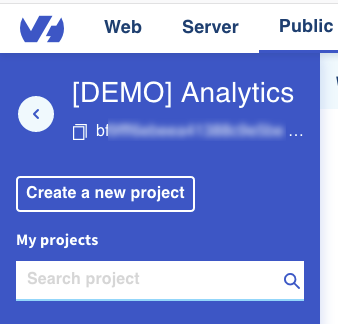
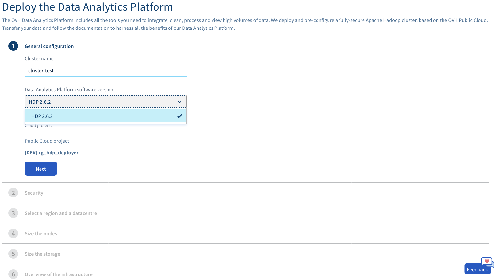
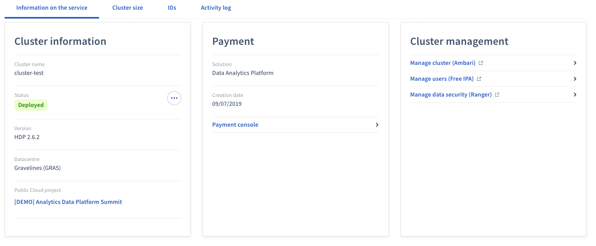

## Before you begin

Before starting your cluster deployment, you should define you needs in terms of number of nodes, flavor (CPU, RAM or balanced) and in terms of volume of storage.

## Requirements

Analytics Data Platform is deployed inside an Public Cloud project.
If you don't have one, you need create a new project:

1-  Login to your [OVH Manager](https://www.ovh.com/manager/public-cloud/index.html)
2-  In the sidebar, click on the *create a new project* button    

3-  Choose a project name in which your cluster will run and create the project

The cloud project that you will use to deploy your Analytics Data Platform has to be connected to
[OVH vRack technology](https://www.ovh.com/world/solutions/vrack/) to create and add it to your project,
please see [section about vRack](../vrack/guide.en-gb.md).

## Create your first cluster

In this section you deploy a new Analytics Data Platform running on OVH Public
Cloud instances:

1-  Login to your [OVH Manager](https://www.ovh.com/manager/public-cloud/index.html)
2-  Select your project in the *sidebar* 
3-  In the *Data & Analytics* section of the *sidebar*, select *Analytics Data Platform*
4-  Click on the **Create Analytics Data Platform**    

5-  Fill in the deployement form

6-  Save your master password to a secure place, you will need it to connect to your cluster
7- Congratulations, your cluster is now deploying! It should take less than 1 hour to complete.

## Connect to your cluster

Each OVH Analytics Data Platform instance is installed with Apache
Ambari, an easy-to-use web UI to monitor and configure your cluster.

You can find the links to your Ambari, Free IPA and Ranger interfaces on the *Cluster information* page just after you Data Platform has been deployed successfully.

