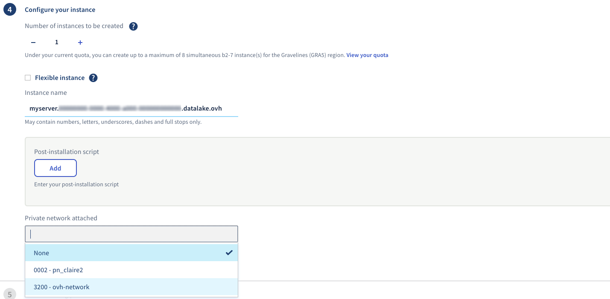
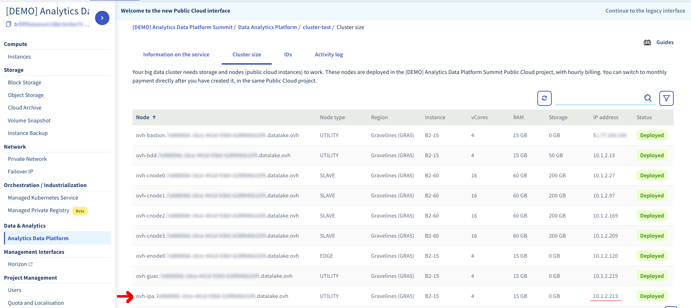
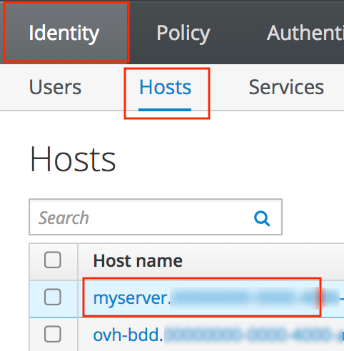
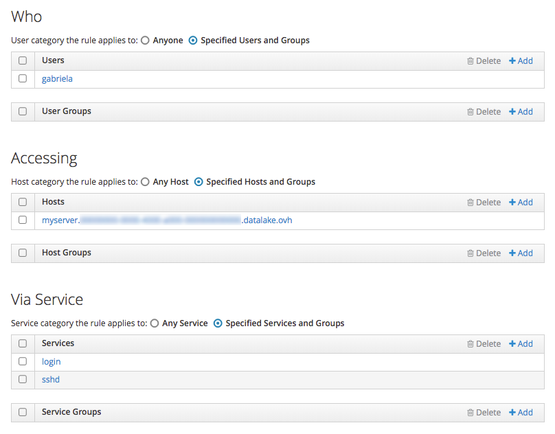

## Motivations

Many data ingestion workflow rely on external machines responsible for data collection.
To ingest data from such sources to HDFS or Kafka you must be able to provide
adequate Kerberos authentication. Using OVH vRack, you can rely on your Data Platform idM to handle
host authentication and Kerberos ticket exchange by enrolling your external
host.

## Enroll an external host with idM

> [!warning]
>
> The following tutorial requires your to modify the hostname of the external host.
>

### Connect to the vRack

Select the type of server to connect:

#### Dedicated server
1.  [Login to your OVH Manager](https://www.ovh.com/manager/public-cloud/index.html)
2. Navigate to *Server* -> *vRack*
3. Choose the vRack containing your Analytics Data Platform
4. Locate the server you want enroll in the left pane
5. Add it to the vRack on the right pane

#### Public Cloud Instance
1.  [Login to your OVH Manager](https://www.ovh.com/manager/public-cloud/index.html)
2. Navigate to *Cloud* -> *Servers*
3. Select the project containing your Data Platform
3. Click on *Create an instance*
4. Select your desired flavor, OS, SSH key, remember that the instance name should end by `.{cluster_id}.datalake.ovh`
5. In the *Configure your instance* part, in the *Private network* field, chose the private network of your cluster.

6. Create the instance

### Configure the VLAN

In this section you learn how to add your second network interface (vRack dedicated)
to your Data Platform subnet.
#### Ubuntu 16+
1. Install `vlan` package and activate 802.1q module
```bash
$ sudo apt-get install vlan
$ sudo modprobe 8021q
```

2. Create a new virtual network interface on `eth1` with your Data Platform VLAN id
```bash
$ sudo vconfig add eth1 3200
```
3. Create a permanent IP configuration
````bash
$ vim /etc/network/interfaces
auto eth1.3200
iface eth1.3200 inet manual
  address     10.1.1.100
  netmask     255.255.255.0
  vlan-raw-device eth1
$ sudo systemctl restart networking
````

#### Centos 7
1. Activate 8021q module if not already activated
```bash
$ modprobe --first-time 8021q
```

2. Configure eth1 interface
```bash
$ vim /etc/sysconfig/network-scripts/ifcfg-eth1.3200
DEVICE=eth1.3200
BOOTPROTO=none
ONBOOT=yes
IPADDR=10.1.1.100
PREFIX=24
NETWORK=10.1.1.0
VLAN=yes
```

3. Restart networking
````bash
$ systemctl restart network
````

### Retrieve idM address

You first need to retrieve your idM IP address:

1- Login to your [OVH Manager](https://www.ovh.com/manager/public-cloud/index.html)
2- Navigate to *Data & Analytic* -> *Analytics Data Platform*
3- Choose the Analytics Data Platform you want in the list by clicking on its name
4- Go to the *Cluster size* section
5- Write down the IP address [10.1.2.XX] of the node with a name like `ovh-ipa.{cluster_id}.datalake.ovh`




### Enroll your server

> [!primary]
>
> For this tutorial we assume that your server will be called `myserver.{cluster_id}.datalake.ovh`.
You can choose any valid hostname value ending by `.{cluster_id}.datalake.ovh`.
>

Connect to your external server using SSH to enroll it with your idM.

Install the required packages

**Ubuntu 16+**
```bash
$ sudo apt-get install freeipa-client
```

**Centos 7**
```bash
$ sudo yum install freeipa-client
```

Edit `/etc/resolv.conf` and at the top of the file add your idM IP address.
```bash
nameserver 10.1.2.XX
```

Update your hostname

```bash
$ sudo hostname myserver.{cluster_id}.datalake.ovh
```

Start the enrollment process
```bash
$ sudo ipa-client-install \
  --mkhomedir \
  --server=ovh-ipa.{cluster_id}.datalake.ovh \
  --ip-address=10.1.1.100 \
  --domain={cluster_id}.datalake.ovh
```

You will get a warning about your idM being single instance, answer **yes**
```text
Autodiscovery of servers for failover cannot work with this configuration.
If you proceed with the installation, services will be configured to always access the discovered server for all operations and will not fail over to other servers in case of failure.
Proceed with fixed values and no DNS discovery? [no]: yes
```

Use the *admin* user to enroll the server
````text
User authorized to enroll computers: admin
````

Answer the different questions and provide your Data Platform *admin* user password.

After you enter the password, the command-line will configure the system.
The last line of output will be `Client configuration complete` and indicates a successful install.

### Check enrollment

1. Navigate to your idM web interface on `https://ipa.{cluster_id}.datalake.ovh`
2. Log in with *admin* credentials
3. Navigate to *Identity* -> *Hosts* tab
4. If your server appears in the list the enrollment is successful



### Update access rules

Your platform idM controls login and SSH access to the nodes. To allow your IPA users to login to your new external server,
your must update Host Based Access Control (HBAC) in your idM.

1- Navigate to your idM web interface on `https://ipa.{cluster_id}.datalake.ovh`
2- Log in with *admin* credentials
3- Navigate to *Policy* -> *Host Based Access Control* tab


4- Click on *+ Add* button, enter a new name for your rule, click on *Add and Edit*



5- In the *Who* section add user(s) and group(s) you want to allow to connect to your server
6- In the *Accessing* section add your host
7- In the *Via Service* section add *sshd* and *login* services
8- Save the rule
