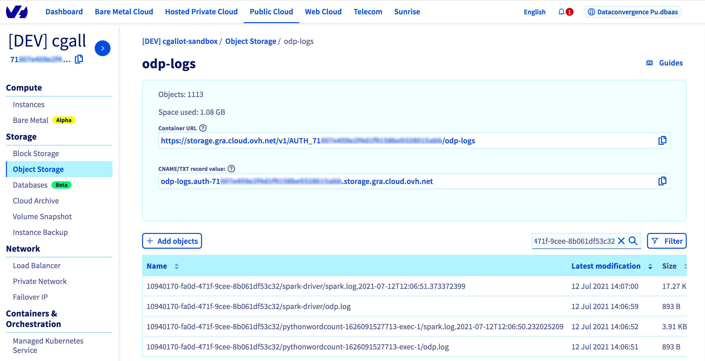

**Last updated 14th July, 2021**

## Objective

This guide will help you to check your job's logs while your job is running or after your job is finished. 

To read an introduction about Data Processing service you can visit [Data Processing Overview](../overview){.external}.

## Requirements 

- Access to [OVHcloud Manager](https://ca.ovh.com/auth/?action=gotomanager&from=https://www.ovh.com/ca/en/&ovhSubsidiary=ca){.external}
- A job that has been already submitted to Data Processing

## Get your running job's logs

When you launch a job with Data Processing, you may want to read your job's logs as it is running. 
There are three ways to get live logs:

- Using the [OVHcloud Manager](https://ca.ovh.com/auth/?action=gotomanager&from=https://www.ovh.com/ca/en/&ovhSubsidiary=ca){.external}
- Using the OVHcloud API
- Using the Data Processing CLI

### With the OVHcloud Manager

To see your logs in the manager, you need to follow these steps:

- Login to the OVHcloud Manager and select `Public Cloud`{.action}.
- Select the project in which you submitted your job. 
- Select `Data Processing`{.action} from the left panel. 
- Click on the name of the job that you want to check the logs for, to open the job dashboard. (The job should be in **RUNNING** status.)
{.thumbnail}
- Click on the `Logs`{.action} tab in your job dashboard page. 
- If your job is still running, you will see its live logs in this tab.
{.thumbnail}

>[!primary]
>
>Those logs will appear only if your job is running. Once your job has ended you will get a link to your Object Storage where your logs files are stored.
>

### With the Data Processing CLI

If you are using the [ovh-spark-submit CLI](https://github.com/ovh/data-processing-spark-submit){.external} (see [How to launch jobs through the CLI](../submit-cli){.external}), then you do not have to take action.

The logs will appear in the standard output while your job is running.

>[!primary]
>
> Once the job has ended, the URL to the Object Storage container containing the job's logs will be displayed. This could be used to list your job's logs files through the OpenStack API. Thus, you will be able to upload them.
>
> Please refer to the section below to know how.
>

>[!warning]
>
> If you use the OVHcloud Manager or the CLI, you may never see the last entries of your logs before the job stops. It is because the job has finished before the UI was updated.
> But don't worry, all the logs are uploaded to your Object Storage at the job's end.

### With the OVHcloud API

An other way to read your job's logs is to use the OVH cloud API by calling the endpoint to GET a job's logs (see [How to use the OVHcloud API](../use-api){.external})

To get the logs you have to use the `GET` on the `/cloud/project/{serviceName}/dataProcessing/jobs/{jobId}/logs` endpoint (where the service name is your Public Cloud project ID).
This endpoint can take a query parameter which is `from`. This parameter allows you to specify the date from which you want to retrieve the logs. Its default value is 1970-01-01T00:00:00 UTC.

Whether you chose to set this start date or not, you will retrieve all the logs that came after in the limit of 10 000 characters.

>[!primary]
>
> Once the job has ended, the URL to the Object Storage container containing the job's logs will be displayed. This could be used to list your job's logs files through the OpenStack API. Thus, you will be able to upload them.
>
> Please refer to the section below to know how.
>

>[!warning]
>
> When streaming logs you are limited to 10 000 characters at a time. Meaning you could experience missing logs in streaming mode (in the manager, in the CLI). All logs will be uploaded to your Object Storage at job end.
>

## Download your logs files from Object Storage

Once your job is finished, its logs are uploaded to your Object Storage. While you can only retrieve the Spark driver node's logs when the job is running, you will have the logs from all the node (driver and executors) stored.

For each node, you will have at least 2 logs files: 

- one **{jobId}/{nodeName}/odp.logs** file which contains the logs generated by your job environment creation.
- one or more **{jobId}/{nodeName}/spark.log.yyyy-MM-ddThhhmmmss.sssssssss** gathering all the logs generated by your Data Processing Job.

>[!primary]
>
> Some **{jobId}/{nodeName}/spark.log.yyyy-MM-ddThhhmmmss.sssssssss** files can be uploaded in Object Storage while your job is still running. This is due to the logs rotation that is configured to upload the files that reach the maximum logs files size of 100 MiB.

There is three ways to download your logs from your Object Storage:

- with the OVHcloud Manager
- with the OpenStack CLI
- with the OpenStack API

### With the OVHcloud Manager
To see your logs in the manager, you need to follow these steps:

- Log in to the [OVHcloud Manager](https://ca.ovh.com/auth/?action=gotomanager&from=https://www.ovh.com/ca/en/&ovhSubsidiary=ca){.external} and select `Public Cloud`{.action}.
- Select the project in which you submitted your job. 

From here, you can either go to your Object Storage section of your Public Cloud project and select the `odp-logs`{.action} container. Then filter the list of object with your job ID to get its logs.
{.thumbnail}

Or you can go through your job dashboard instead, to do so:

- Select `Data Processing`{.action} from the left panel.
- Click on the name of the job that you want to download the logs for, to open the job dashboard. (The job should finished.)
- Click on the `Logs`{.action} tab in your job dashboard page. 
- If your job is already finished, click on `Download logs`{.action} to download the output logs of your job from your Object Storage account. 

{.thumbnail}

This button will lead you to the Object Storage container pre-filtered with the wanted job ID.

### With the OpenStack CLI

You can access to your Object Storage by using the OpenStack CLI or the [Swift CLI](https://docs.openstack.org/mitaka/cli-reference/swift.html){.external} (Swift being the name of the OpenStack Object Storage).

Please follow the OpenStack documentation on [installing the CLI](https://docs.openstack.org/newton/user-guide/common/cli-install-openstack-command-line-clients.html){.external} and [using the CLI](https://docs.openstack.org/newton/user-guide/cli.html){.external}.

In order to authenticate with the CLI you will have to [set environment variables using an OpenStack RC file](https://docs.openstack.org/newton/user-guide/common/cli-set-environment-variables-using-openstack-rc.html){.external}.
You can find your RC file by following these steps:

- Log in to the [OVHcloud Manager](https://ca.ovh.com/auth/?action=gotomanager&from=https://www.ovh.com/ca/en/&ovhSubsidiary=ca){.external} and select `Public Cloud`{.action}.
- Select the project in which you submitted your job. 
- Select `Users & Roles`{.action} from the left panel.
- Click on the `...`{.action} option button of your user and select `Download OpenStack's RC file`.
{.thumbnail}

### With the OpenStack API

In order to use the OpenStack API, you will need an OpenStack token. You can generate one in the OVHcloud manager by following these steps:

- Log in to the [OVHcloud Manager](https://ca.ovh.com/auth/?action=gotomanager&from=https://www.ovh.com/ca/en/&ovhSubsidiary=ca){.external} and select `Public Cloud`{.action}.
- Select the project in which you submitted your job in the sidebar. 
- Select `Users & Roles`{.action} from the left panel.
- Click on the `...`{.action} option button of your user and select `Generate an OpenStack token`.
- Enter your user password and retrieve your token.

With this token you should be able to list and to download the logs files of your jobs using the [OpenStack API](https://docs.openstack.org/api-ref/object-store/?expanded=show-container-details-and-list-objects-detail){.external}.

## Go further

To learn more about using Data Processing and how to submit a job and process your data, we invite you to look at the [Data Processing documentations page](../).

You can send your questions, suggestions or feedbacks in our community of users on [https://community.ovh.com/en/](https://community.ovh.com/en/){.external} or on our [Discord](https://discord.gg/VVvZg8NCQM){.external} in the channel **#dataprocessing-spark**
