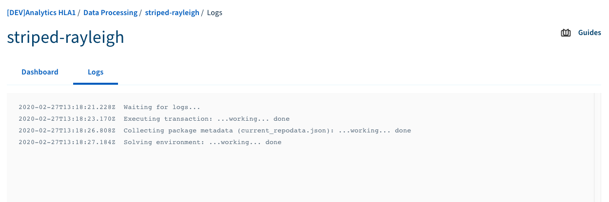

**Last updated 06th March, 2020**

## Objective

This guide will help you to check your job's logs while your job is running or after your job is finished. 

In this guide, we are assuming that you're using the [OVHcloud Manager](https://www.ovh.com/manager/cloud/){.external} to use the Data Processing platform.

To read an introduction about Data Processing service you can visit [Data Processing Overview](../overview){.external}.

## Requirements 

- Access to [OVHcloud Manager](https://www.ovh.com/manager/cloud/){.external}
- A job that has been already submitted to Data Processing

## Instructions

You can see your live job's logs while it is running in the job dashboard. After your job is finished, you can download the logs either from your job dashboard or from your Object Storage directly. 

{.thumbnail}

### **Download the logs from your job dashboard**

Follow these steps to download your job's logs from your job dashboard: 

- Login to the OVHcloud Manager and select `Public Cloud`{.action}.
- Select the project in which you submitted your job. 
- Select `Data Processing`{.action} from the left panel. 
- Click on the name of the job that you want to check the logs for, to open the job dashboard.
- Click on the `Logs`{.action} tab in your job dashboard page. 
- If your job is still running, you will see its live logs in this tab.

{.thumbnail}

- If your job is already finished, click on `Download logs`{.action} to download the output logs of your job from your Object Storage account. 

{.thumbnail}

>[!primary]
>
> When your job is finished, the output log is automatically saved in your **Object Storage** and you can download it whenever you would like. 

### **Download your job logs from Object Storage**

When the job is finished, the output logs will be saved automatically in your **Object Storage** account and in the **odp-logs** container. Beside using the job dashboard from the Data Processing page of the OVHcloud Manager, you can also use the **Object Storage** directly to download the logs. To download your logs from the **Object Storage**, follow these steps: 

- Login to the OVHcloud Manager and select `Public Cloud`{.action}
- Select the project in which you submitted your job. 
- Select `Object Storage`{.action} from the left panel and then you will see the list of all containers in your project. 
- Click on the container named `odp-logs`{.action}
- Find the log file of your job. The file name is `odp-<Engine>-logs-<JobID>.log`
- Click on `...`{.action} at the end of the line to open the context menu. 
- Click on `Download`{.action}

## Go further

To learn more about using Data Processing and how to create cluster and process your data, we invite you to look at [Data Processing documentations page](../).

You can send your questions, suggestions or feedbacks in our community of users on [https://community.ovh.com/en/](https://community.ovh.com/en/){.external} or in our public [Gitter](https://gitter.im/ovh/data-processing){.external}