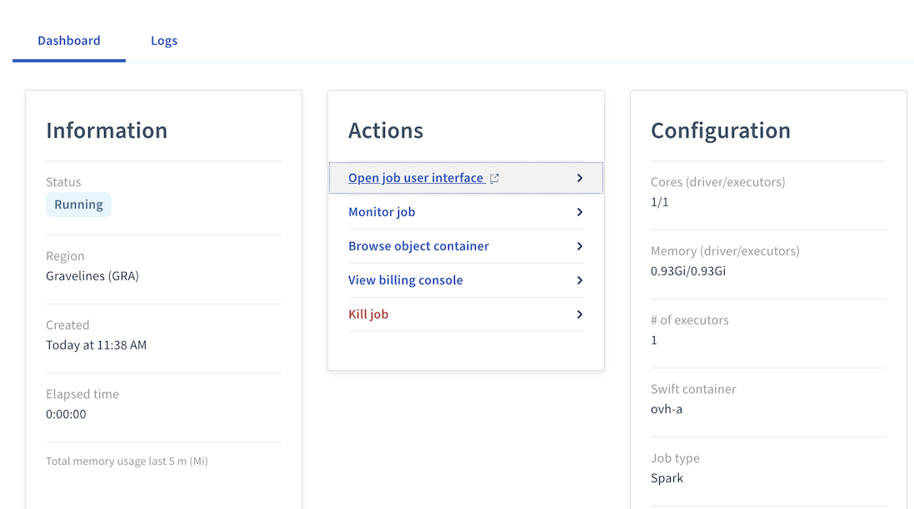
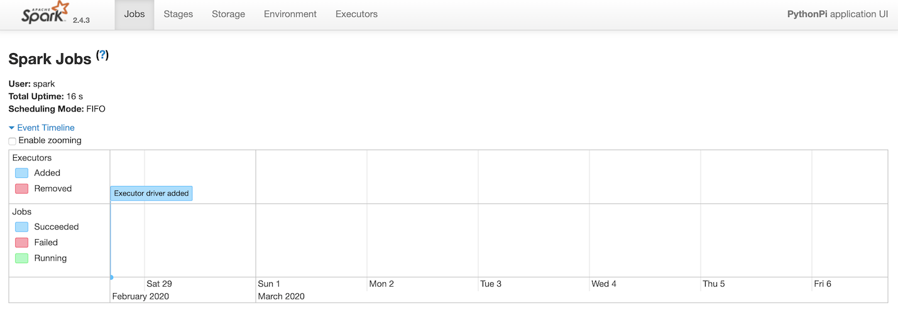
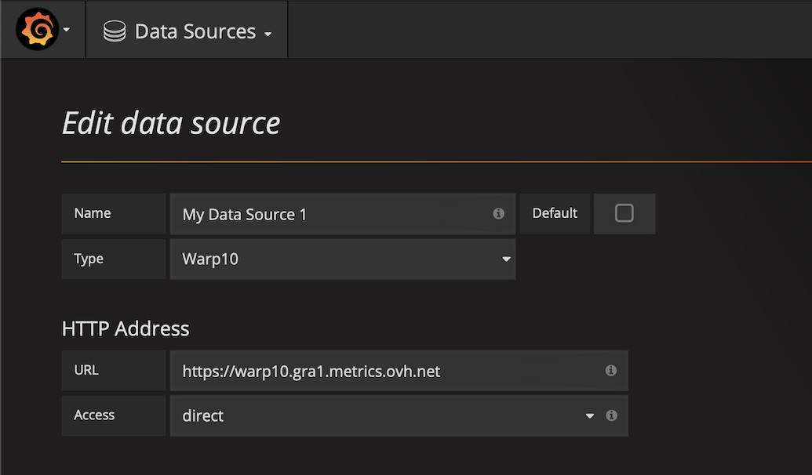
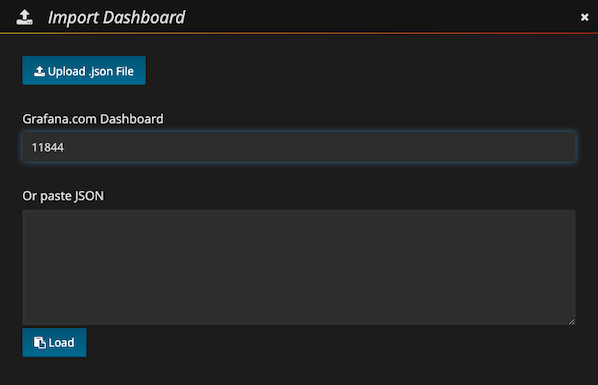
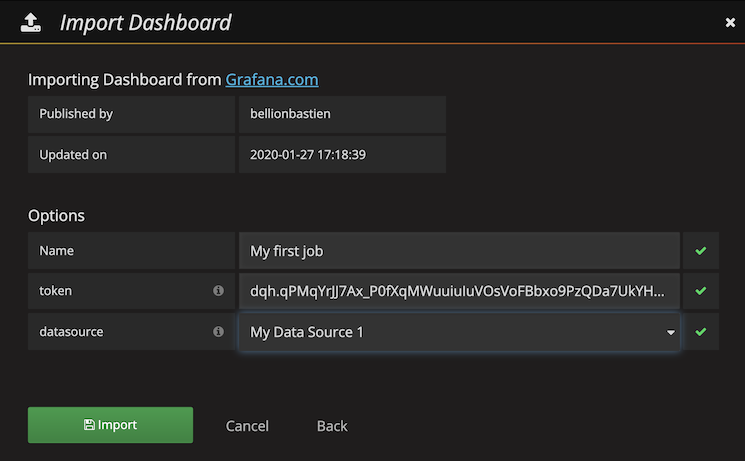

**Last updated 06th March, 2020**

## Objective

This guide will tell you how you can monitor you jobs after submitting them. 

In this guide, we are assuming that you're using the [OVHcloud Manager](https://ca.ovh.com/auth/?action=gotomanager){.external} to use the Data Processing platform and you have already submitted a job. 

To read an introduction about Data Processing service you can visit [Data Processing Overview](../overview){.external}.

## Requirements 

- Access to the [OVHcloud Manager](https://ca.ovh.com/auth/?action=gotomanager){.external}
- A job that has been already submitted to Data Processing

## Instructions

### Apache Spark Dashboard 

After submitting your job, follow these steps to open its Apache Spark dashboard: 

- Find your job in the list of jobs in the Data Processing page of the OVHcloud Manager.
- Click on the name of the job to open its dashboard. 

{.thumbnail}

- Click on  `Open job user interface`{.action} in the **Actions** panel to open the Apache Spark dashboard. If you do this right after submitting a job, you will see a warm up page for a few seconds while your job is starting. 

{.thumbnail}

The Apache Spark dashboard for your job will then start automatically. 

{.thumbnail}

### Grafana Dashboard

After you submit a job to the Data Processing platform, follow these steps to monitor your job using a Grafana dashboard. 

- Find your job in the list of jobs in the Data Processing page in the OVHcloud Manager.
- Click on the name of the job to open its dashboard. 
- In the dashboard, click on `Monitor job`{.action} in the **Actions** panel. 

{.thumbnail}

- Copy and save the metrics token that is now displayed in the popup. 
- Open [https://grafana.metrics.ovh.net/login](https://grafana.metrics.ovh.net/login) and login with your OVHcloud account. 
- Click on the Grafana logo at the upper left corner of the page and from the main menu select `Data Sources`{.action}
- Click on the `Add data source`{.action} button. 
- Fill in the fields like in the pictures with the following data: 
  - Name: Select a name for your data source (for example `My Data Source 1`). 
  - Type: `Warp10`
  - URL: `https://warp10.gra1.metrics.ovh.net`
  - Access: `direct`

{.thumbnail}

- Click on the `Add`{.action} button. 
- Click on the `Save & Test`{.action} button. 
- Click on the Grafana logo at the upper left corner of the page and from the main menu select `Dashboards`{.action} -> `Import`{.action}
{.thumbnail}

- In the import dashboard page, inside the `Grafana.com Dashboard` textbox write `11844` and click on the `Load`{.action} button. (11844 is the ID of a Grafana template that has been created specifically for Data Processing monitoring)

{.thumbnail}

- Write a name for your dashboard 
- Paste the metrics token that you copied and saved before. 
- For *datasource*, select `My Data Source 1`{.action} from the menu (Or any other name that you selected for your data source).
- Click on the `Import`{.action} button to open your dashboard. 

{.thumbnail}

- You can now select a job ID from the list of all the jobs you have submitted so far to see its Grafana dashboard. 

{.thumbnail}

## Go further

To learn more about using Data Processing and how to create cluster and process your data, we invite you to look at [Data Processing documentations page](../).

You can send your questions, suggestions or feedbacks in our community of users on [https://community.ovh.com/en/](https://community.ovh.com/en/){.external} or in our public [Gitter](https://gitter.im/ovh/data-processing){.external}
