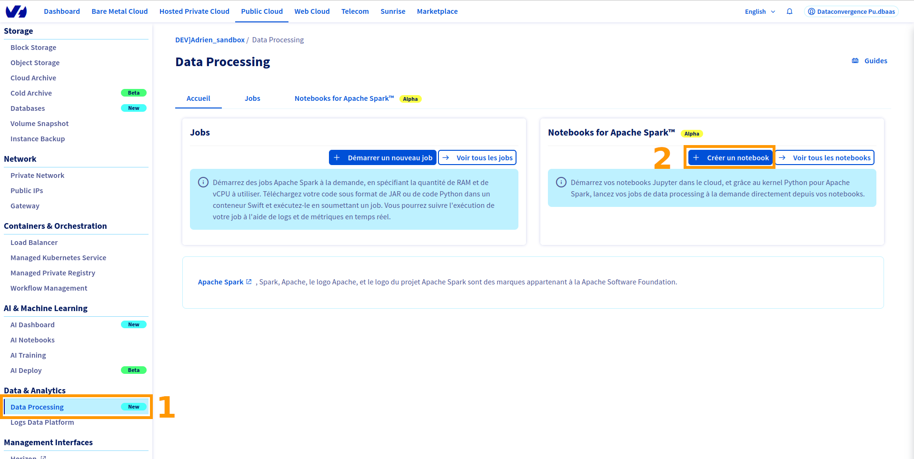
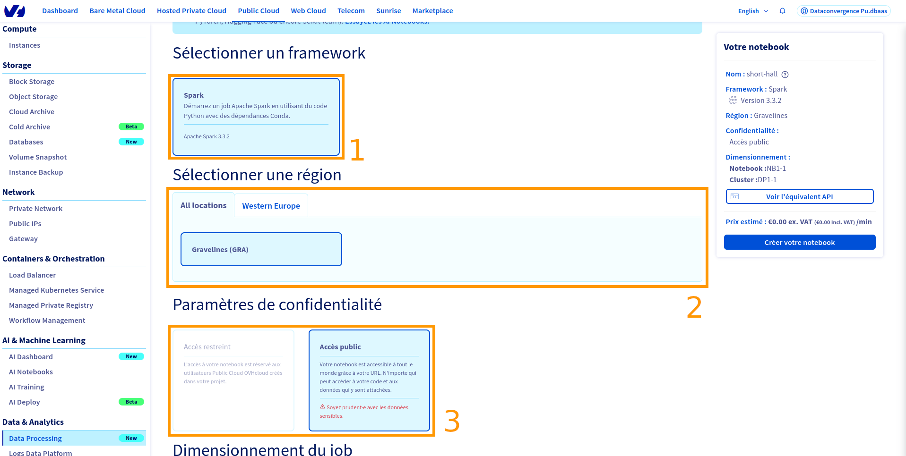
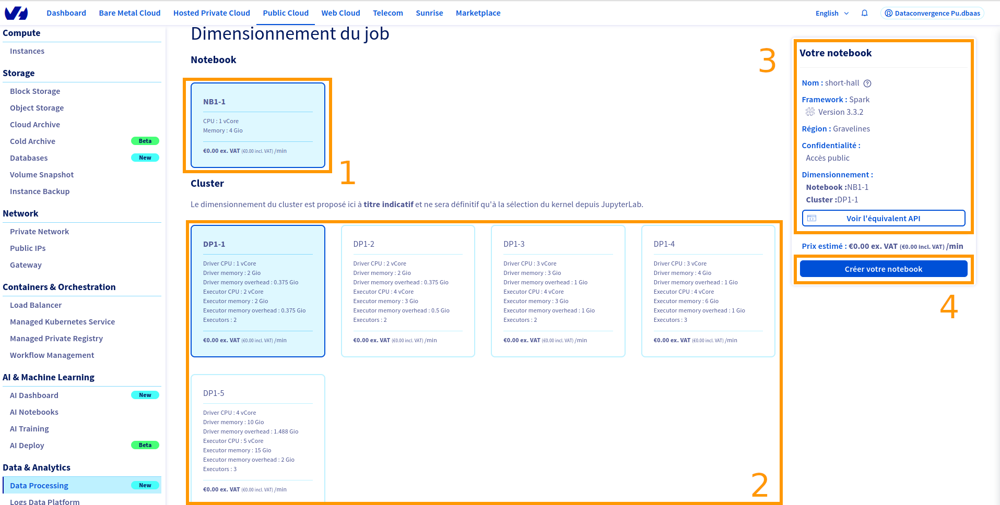
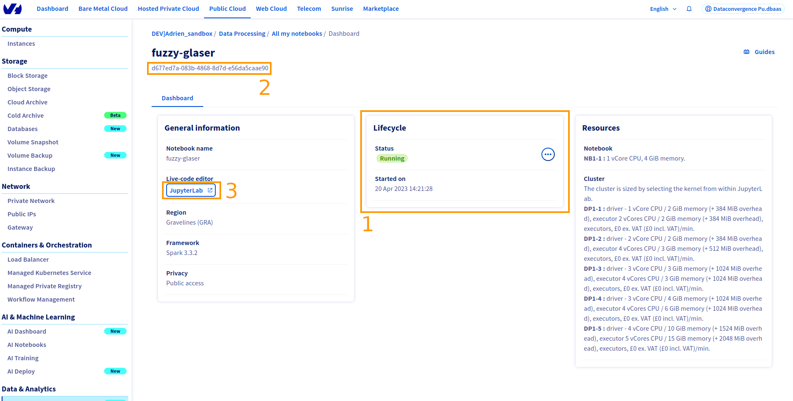
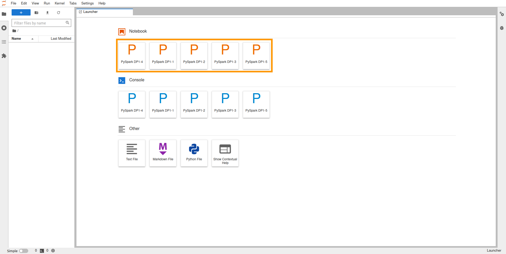
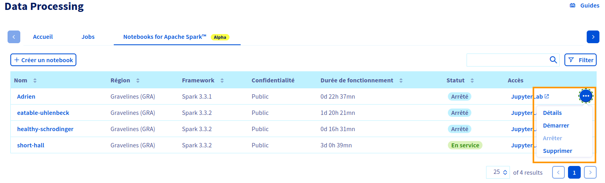

**Last updated 28th March, 2023.**

## Objective

The OVHcloud Data Processing Notebooks service provides you Jupyter notebooks, linked to an Apache Spark environnement totally configured that can be propagated to all nodes and executors 
without any needed installation.
This guide will cover the creation of a new Apache Saprk notebook.

## Requirements

- a [Public Cloud project](https://www.ovhcloud.com/en-gb/public-cloud/) in your OVHcloud account
- access to the [OVHcloud Control Panel](https://www.ovh.com/auth/?action=gotomanager&from=https://www.ovh.co.uk/&ovhSubsidiary=GB)
- a Public Cloud user with `administrator` role
- Data Processing activated (see [How to activate the Data Processing service](../activation){.external} for details).

## Definition
**Notebooks** are files which contain both computer code (e.g. python) and rich text elements (paragraph, equations, figures, links, etc…). Notebooks are both human-readable documents containing the analysis description and the results (figures, tables, etc..) as well as executable files which can be run to perform data analysis. It's vastly used across developer world, especially in the data and artificial intelligence fields.

The advantage compared to doing your own setup is that everything is already installed for you, and that you pay only for your notebooks while they are running.

Each notebook is linked to a **Public Cloud** project and specifies hardware resources.

You can create notebooks with the OVHcloud Control Panel or use the [OVHcloud APIv6]

## Instructions

### Step 1
Log in to the [OVHcloud Control Panel](https://www.ovh.com/auth/?action=gotomanager&from=https://www.ovh.co.uk/&ovhSubsidiary=GB), go to the 'Public Cloud'{.action} section and select the Public Cloud project concerned.

Access the administration UI for your OVHcloud Data Processing by clicking on (1)`Data Processing`{.action} in the left-hand menu and click on (2)`Créer un notebook`{.action}

{.thumbnail}

On the `Control Panel` the name is randomly choosen, don't forget it.
Select the (1)framework you want and the (2)area.
Select (3)notebook privacy, be careful with your sensitive data when you choose public access.

{.thumbnail}

Now select the dimensioning necessary for the job:
(1) Select your notebook 
(2) Select the cluster size. The dimensioning of the cluster is proposed here as an indication and will be final only when the kernel is selected from JupyterLab.

(3) After configuring your notebook, check in the summary at the top left that all information is correct.
(4) then click on "create a notebook" to create your notebook. 

{.thumbnail}

You will be redirected on the notebook dashboard. There you will find information such as the notebook life cycle(1) or the notebook ID(2). 
To access your notebook, click on JupyterLab(3).

{.thumbnail}

Once on the notebook, you will be able to choose the size of the cluster. if you want to find the cluster costs, refer to the dashboard of your notebook as in the previous part. 

{.thumbnail}

Now you can start to enter your code in your code section (1):
```python
print("Hello World")
```

And run the code by pressing the `▶️`{.action} button (2):

```bash
Hello World
```
Your code is executed in your browser. You can save your example by clicking in the sub menu `Save`{.action} of the `File` menu.

{.thumbnail}

To see all your active kernels, click on the "Terminals and running kernels" menu (3).

To change kernels, click on 'select kernel' (4) and select a new kernel (changing cluster may include additional costs).

At the bottom left, a small summary (5) shows how many kernels are used with which cluster.


### Stop the Data Processing Notebook

Go back to the OVHcloud Control Panel. In the Data Processing panel you can directly stop the desired notebooks.

{.thumbnail}
  
### Considerations

- A notebook will run indefinitely until manual interruption, meaning that you will pay for it.
- When you stop a Apache Spark Notebook, you release the compute resources, but we keep the data from your workspace. It will be billed at the price of OVHcloud Object storage.
- Billing is per minute. Each started minute is due.

## Notebook lifecycle

During its lifetime the Apache Spark Notebook will transition between the following statuses:

> [!primary]
> * Billing starts once a notebook is `Pending` and ends when its status switches to `Cancelling`.
> * Only notebooks in states `Pending` and `In service` are included in the resource quota computation.

- `Pending`: The Notebook is starting.
- `In service`: The Notebook is running and can be accessed from your browser.
- `Cancelling`: The Notebook is still running, but an interruption order was received.
- `Stopped`: The Notebook is stopped. Compute resources are released.
- `Deleted`: The Notebook data is fully deleted, you don't pay anything.

### Step 2

## Go further

Join our community of users on <https://community.ovh.com/en/>.
