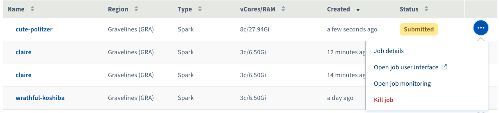

**Last updated 06th March, 2020**

## Objective

In this guide, we will see how to cancel a running job using the Data Processing page in the OVHcloud Manager.

In this guide, we are assuming that you're using the [OVHcloud Manager](https://www.ovh.com/auth/?action=gotomanager){.external} to use Data Processing platform and you have already submitted a job.  

## Requirements 

- Access to [OVHcloud Manager](https://www.ovh.com/auth/?action=gotomanager){.external}
- A running job that has been already submitted to Data Processing

## Instructions

### Cancelling a running job through the job list screen 

To cancel a running job through the job list screen, follow these steps:

- Login to the OVHcloud Manager and select `Public Cloud`{.action}
- Select the project in which you submitted your job. 
- Select `Data Processing`{.action} from the left panel.
- From the job list, find the job that you want to cancel and click on `...`{.action} at the end of the line.
- Click on the `Kill job`{.action} item. 

{.thumbnail}

### Cancelling a running job through the job dashboard

To cancel a running job using the job dashboard, follow these steps: 

- Login to the OVHcloud Manager and select `Public Cloud`{.action}
- Select the project in which you submitted your job. 
- Select `Data Processing`{.action} from the left panel.
- From the job list, click on the name of the job that you want to cancel. 
- Click on the `Kill job`{.action} from the **Actions** panel. 

{.thumbnail}

## Go further

To learn more about using Data Processing and how to create cluster and process your data, we invite you to look at [Data Processing documentations page](../).

You can send your questions, suggestions or feedbacks in our community of users on [https://community.ovh.com/en/](https://community.ovh.com/en/){.external} or in our public [Gitter](https://gitter.im/ovh/data-processing){.external}
