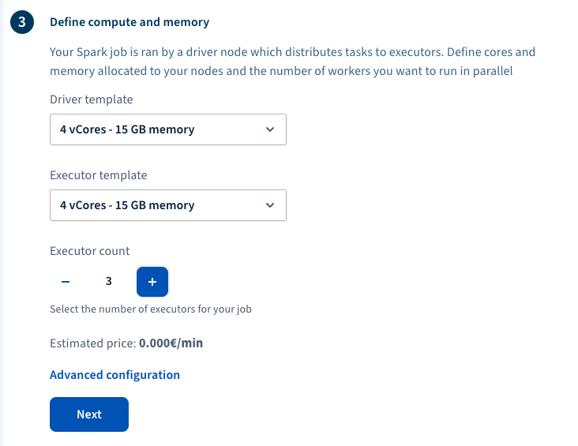
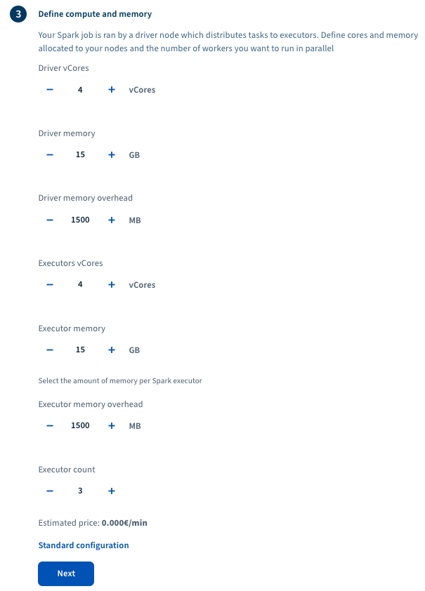

**Last updated 06th March, 2020**

## Objective

This guide will help you to understand the different parameters that you can set when submitting a new job to the Data Processing platform

In this guide, we are assuming that you're using the [OVHcloud Manager](https://ca.ovh.com/auth/?action=gotomanager){.external} to use the Data Processing platform. 

To read an introduction about Data Processing service you can visit [Data Processing Overview](../overview){.external}.

## Requirements 

- Access to the [OVHcloud Manager](https://ca.ovh.com/auth/?action=gotomanager){.external}
- An OVHcloud account 
- A cloud project in your OVHcloud account (see [How to create a cloud project](../../public-cloud/getting_started_with_public_cloud_logging_in_and_creating_a_project){.external} for details.)
- Your application must be uploaded into a container in your Object Storage.
- For the Spark engine, your application can either be :
  - a JAR file, if you're using Java or Scala
  - Python files and a yaml requirement file (in Conda format), if your job is in Python

## Instructions

### Step 1: Select your processing engine

To submit your job with your required parameters follow these steps: 

- Login to the OVHcloud Manager and select `Public Cloud`{.action}
- Select the relevant project if you have multiple projects in your OVHcloud account.
- Select `Data Processing`{.action} from the left panel. 
- Select `Submit a new job`{.action}
- Select the processing engine you want to use. 
- Go to the next step by clicking on the `Next`{.action} button.

{.thumbnail}

### Step 2: Select a region

In this step you will have to select the region in which you would like your Data Processing job to be run. The region list you will see will only contain the currently supported regions. Select a region and then click on `Next`{.action} button.

{.thumbnail}

### Step 3: Define your computation power and memory needs

An OVHcloud Data Processing job being executed in a distributed environment, you will have to specify the amount of resources you would like your job to use. The resources you will have to specify are going to depend on the engine you selected previously.

For the Apache Spark Engine, the resources you will have to specify are:

- Resources for each executor nodes
- Resources for the masters nodes
- Number of executors

If you want to know more about how to size your resources or how Apache Spark works, visit [Apache Spark Documentation](http://spark.apache.org/docs/latest/).

You can choose how to size your resources by either selecting some templates from the default view or clicking on Advanced configuration and setting everything by hand.

{.thumbnail}

If you click on `Advanced configuration`{.action}, you will have more options to configure your Driver and Executors and also you are not limited to some pre-defined templates. In advanced mode, you can change memory overhead for Drivers and Executors as well. Memory overhead is the amount of memory that each node of cluster requires for running Apache Spark processes itself. 

When you configured compute and memory of your cluster, click on `Next`{.action} button to go to the next step. 

{.thumbnail}

### Step 4: Configure your job 

Follow these steps to configure your job before submitting it to the Data Processing service: 

- A random name is selected for your job by default. You can change the name and set a more meaningful name for you. Otherwise you can leave it as it is. 
- Select the container that you created in your Object Storage where your application is uploaded. All contents of this container will be downloaded later by the Data Processing service. So, it is better to create one dedicated container for each job or keep the container clean and delete extra files. 

For Apache Spark, for example, you will also have to :

- select your job type between Java/Scala or Python.
- select your main application file.
- If necessary, specify your application's required input arguments.
- Finally, click on the `Submit Job`{.action} button and your application will be sent to the Data Processing platform and should start shortly after that.

{.thumbnail}

> [!warning]
> The arguments of the application are stored in plain text. It is advised that you store your credentials in configuration files instead of using arguments in the Manager. You need to upload the configuration files in the same Object Storage container that you upload the code so they will be downloaded to the data processing cluster together when you submit the job. 

## Go further

To learn more about using Data Processing and how to create cluster and process your data, we invite you to look at [Data Processing documentations page](../).

You can send your questions, suggestions or feedbacks in our community of users on [https://community.ovh.com/en/](https://community.ovh.com/en/){.external} or in our public [Gitter](https://gitter.im/ovh/data-processing){.external}
