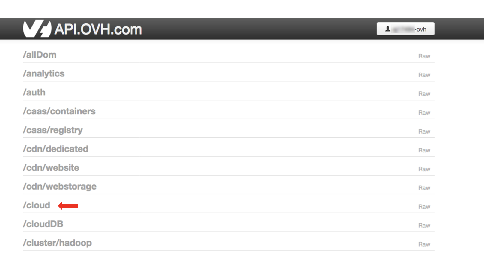

**Last updated 14<sup>th</sup> May, 2021**

## Objective

This guide helps you to use the Data Processing endpoints through the OVHcloud API in order to develop your own applications with Data Processing.

To read an introduction about the Data Processing service you can visit [Data Processing Overview](../overview).

## Requirements

- An OVHcloud account
- An activated Public Cloud project in your OVHcloud account (see [How to create a project](../../public-cloud/create_a_public_cloud_project/) and [How to activate the Data Processing service](../activation){.external} for details.)
- An OpenStack user in your Public Cloud project and access to OpenStack Horizon dashboard (see [How to create an OpenStack user and access to Horizon](../../public-cloud/configure_user_access_to_horizon/) for details.)
- An application code to be run in Apache Spark environment

## Instructions

### Step 1: Get your OVHcloud API credentials

To be able to use the OVHcloud API, you must set up some configurations that will allow it to authenticate.
To do so, you will need an application key, a secret application key and a consumer key. These can be obtained [here](https://eu.api.ovh.com/createToken/){.external}.

You need to add the rights `GET/POST/PUT` on the endpoint `/cloud/project/*/dataProcessing/*`.

{.thumbnail}

Keep those credentials as they will be needed to use the OVHcloud API.

To store and use them you can create a configuration file or set them as environment variables. 
The way to proceed depends on which medium you chose to reach the API.

Most of the wrappers provided by OVHcloud use an `ovh.conf` file that looks like the following:

```
endpoint=ovh-eu
application_key=my_app_key
application_secret=my_application_secret
consumer_key=my_consumer_key
```

Create this file in your application's directory and fill it with your own 3 keys.

### Step 2: Chose your method to reach the OVHcloud API

Once you have your credentials, you will be able to query the OVHcloud API. To do so, you can choose between two options.

- Using a HTTP client or the curl command line: You can find the documentation to learn how to use the OVHcloud API [here](../../api/first-steps-with-ovh-api/).

- Using one of the wrappers provided by OVHcloud which will handle all the authentication for you: Several wrappers (for Python, Java, C#, PHP, Go, etc.) are available on the [OVHcloud GitHub](https://github.com/ovh?q=&type=&language=&sort=){.external}. All the information needed to use them can be found in their respective README.md files.

### Step 3: Take a look at the OVHcloud API endpoints

In order to know which endpoints are available through the OVHcloud API, you can have a look at the [API web page](https://api.ovh.com/){.external} and click on the `Explore`{.action} button.

To use this UI, you have to be logged in with your OVHcloud account credentials.

Here you can find all the Data Processing endpoints in the "cloud" section. 

{.thumbnail}

Scroll down into the "cloud" section until you reach the `/cloud/project/{serviceName}/dataProcessing/...` endpoints.

Once you have expanded the section, you can try out the endpoints directly in the UI by clicking on them.

>[!primary]
>
> The "serviceName" parameter for each endpoint of the `cloud` section requires your Public Cloud project ID.

For further information about an endpoint, the `Response Class` tab under the `Execute`{.action} button shows what the API response will look like. Switch the tabs to display wrapper code examples.

{.thumbnail}

You can also see what your request body for a specific endpoint looks like in a json format via the `Raw` tab, which appears after the request has been executed once.

{.thumbnail}

>[!primary]
>
> For the POST on `cloud/project/{serviceName}/dataProcessing/jobs` endpoint, the `engineParameters` property is a mandatory list of key/value parameters.
>
> To know which parameters to use, query the `cloud/project/{serviceName}/dataProcessing/capabilites` endpoint to list the several parameters depending on the engine you are using.
>
> It will also show you which of those parameters are required and how they should be formed.

### Step 4: Make sure the Data Processing service is activated for your Public Cloud project

Using the Data Processing endpoints requires the Data Processing service to be activated for your Public Cloud project.

You can check your project activation status by calling the `GET cloud/project/{serviceName}/dataProcessing/activation` endpoint.

You can also verify this in the OVHcloud Control Panel: In the `Public Cloud`{.action} section, select your project and click on `Data Processing`{.action} in the left-hand menu. If your project is activated, you should see a list (or an empty list) of jobs. The page invites you to activate your current project otherwise.

To learn how and why to activate your project, you can refer to this documentation: [How to activate the Data Processing service for your cloud project](../activation).

### Step 5: Use Data Processing with your application

By following the previous steps you have your credentials, your OVHcloud API access method and all the information about the request body and response for each of Data Processing endpoints.<br>Now you can begin to use the Data processing endpoints from your own application. 

Bear in mind that for submitting a job, you need to have your application code stored in your Public Cloud Object Storage.<br>
If this is your first time using Data Processing, we advise to try it out first by following [this documentation for a Java job](../submit-javascala) or [this one for Python](../submit-python).

## Go further

To learn more about using Data Processing and how to submit a job and process your data, we invite you to look at the [Data Processing documentations page](../).

You can send your questions, suggestions or feedbacks in our community of users on [https://community.ovh.com/en/](https://community.ovh.com/en/){.external} or on our [Discord](https://discord.gg/VVvZg8NCQM){.external} in the channel **#dataprocessing-spark**

