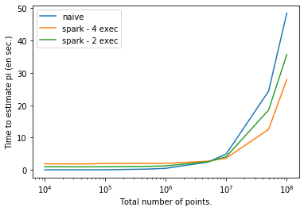

**Last updated 30<sup>th</sup> April, 2020**

## Objective
This guide  gives you a basic example about using Apache Spark and OVHcloud Data Processing.
We will first explain how to calculte π number, then use a naive method and OVHcloud Data Processing.

We want to calculate the value of π (pi) with the Monte-Carlo method. It is based on the following principle: we use a square which side equals 1 and a circle of radius 1 and center (0,0) as shown in the graph below. Then take a random point inside this square, the probability that it is in the circle equals to π/4.

{.thumbnail}

This probabilty can be estimated by picking a high number of random points and then dividing the number of points within the circle by the total number of points.


## Requirements 
- Access to the [OVHcloud Control Panel](https://www.ovh.com/auth/?action=gotomanager){.external}
- An OVHcloud account 
- A cloud project in your OVHcloud account (see [How to create a cloud project](../../public-cloud/getting_started_with_public_cloud_logging_in_and_creating_a_project){.external} for details.)
- Data Processing activated (see [How to activate the Data Processing](../activation){.external} for details.)


## 1. Naive method

Let's start by writing a naive method. We pick a total of n points. In order to make a uniform distribution, we choose x and y, the points' coordinates, uniformly between 0 and 1 with the module 'random' of numpy. Then, since the circle's center is 0, we can easily know if it is within the circle by calculating x²+y².

Don't forget to multiply your result by 4 to get an estimation of π.


```python
import numpy as np
from time import time
from random import random

inside = 0
n = 10000000

t_0 = time()
for i in range(n):
    x, y = random(), random()
    if x**2 + y**2 < 1:
        inside += 1
print(np.round(time()-t_0, 3), "seconds elapsed for naive method and n=", n)
print("pi is roughly", inside/n*4)

```

    6.131 seconds elapsed for naive method and n= 10000000
    pi is roughly 3.141556
    

No surprise here, time complexity of such operation is linear. Save this code for later.


##2. Apache Spark approach

Spark allows us to use this method much faster. Instead of making each calculation one after the other, Spark distributes the calculations between several workers. In our example, that means that the n points will be equally separated between the workers. Each worker will perform its task, calculate the number of points within the circle, and the results will be aggregated together (by simply adding them here).


### Step 1 : Write a python code using Apache Spark

Here is a code sample written in Python do calculate π.
Save it in a file called 'pi-spark.py' or download it from this repository: [Data Processing Samples - Calculate Pi](https://github.com/ovh/data-processing-samples/tree/master/python_calculatePi).


```python
from time import time
import numpy as np
from random import random
from operator import add

from pyspark.sql import SparkSession

spark = SparkSession.builder.appName('CalculatePi').getOrCreate()
sc = spark.sparkContext

n = 10000000


def is_point_inside_unit_circle(p):
    # p is useless here
    x, y = random(), random()
    return 1 if x*x + y*y < 1 else 0


t_0 = time()

# parallelize creates a spark Resilient Distributed Dataset (RDD)
# its values are useless in this case
# but allows us to distribute our calculation (inside function)
count = sc.parallelize(range(0, n)) \
             .map(is_point_inside_unit_circle).reduce(add)
print(np.round(time()-t_0, 3), "seconds elapsed for spark approach and n=", n)
print("Pi is roughly %f" % (4.0 * count / n))

# VERY important to stop SparkSession
# Otherwise, the job will keep running indefinitely
spark.stop()

```

    5.622 seconds elapsed for spark approach and n= 10000000
    Pi is roughly 3.141336
    


### Step 2 : Create an environment.yml file

All Python jobs launched via Data Processing require a conda environment.yml file in order to manage libraries used and versions.
You can find how to generate them here: [How to submit a Python job on the Data Processing platform using the OVHcloud manager](../job-submit-form){.external} . 


Both files must be placed in the same object container.

*In this particular case*, you can use this environment. Copy and paste in a environment.yml file.

```yml
name: condaenv
channels:
  - defaults
dependencies:
  - python=3.7.6
  - pyspark==2.4.5
```


### Step 3 : submit your job with Data Processing

You are now ready to submit this job.

A detailed version about how to deploy a job in Python is explained on the guide [How to submit a job in Python](../submit-python){.external}.

Briefly, inside OVHcloud Data Processing control panel, click on "start a new job" then:

- Put your Python Script and environment.yml file in a OVHcloud Object storage container (public or private) 
- Select `Data Processing`{.action} from the left panel 
- Select `Submit a new job`{.action}
- Select Apache Spark, choose a region
- Configure your Spark cluster (4vCores - 15GB memory for driver & executor template, executor count set to 4 recommended)
- Name your job, select your object storage container, find your Python file (the environment file is detected automatically within your job's container), do not set additional arguments
- Submit your job (make sure that your code stops your SparkSession, otherwise it will be kept running)

When the job is completed, you can access his log file, either in the object container 'odp-files' or in the dashboard of your job. Below are two extracts of this log.

Here is an extract :

{.thumbnail}

As you can see, the two Python's print functions are displayed in the logs. It is the easiest way to keep track of a job run. We also see Apache Spark logs. You can notice the 4 tasks executed simultaneously by the executors. 


## 3. Performance comparison between the methods used

The first reason to use Apache Spark is to increase the performance or our tasks. 

Let's run another Python script where we increase gradually the amount of points, from 10k to 100M.


```python
from time import time
import numpy as np
from random import random
from operator import add
import matplotlib.pyplot as plt

from pyspark.sql import SparkSession


def naive_method_time(n):
    inside = 0

    t_0 = time()
    for i in range(n):
        x, y = random(), random()
        if x**2 + y**2 < 1:
            inside += 1
    return(np.round(time()-t_0, 3))


def spark_method_time(n):
    def is_point_inside_unit_circle(p):
        # p is useless here
        x, y = random(), random()
        return 1 if x*x + y*y < 1 else 0
    t_0 = time()
    # parallelize creates a spark Resilient Distributed Dataset (RDD)
    # its values are useless in this case
    # but allows us to distribute our calculation (inside function)
    # we do not need to store the results
    sc.parallelize(range(0, n)) \
        .map(is_point_inside_unit_circle).reduce(add)
    return(np.round(time()-t_0, 3))


spark = SparkSession.builder.appName('CalculatePi').getOrCreate()
sc = spark.sparkContext

N = [10000, 50000, 100000, 500000,
     1000000, 5000000, 10000000, 50000000, 100000000]
T = []
T_spark = []
T_spark_2_executors = []
for n in N:
    T_spark.append(spark_method_time(n))
    T.append(naive_method_time(n))

spark.stop()
spark = SparkSession.builder.appName('CalculatePi').getOrCreate()
sc = spark.sparkContext
for n in N:
    T_spark_2_executors.append(spark_method_time(n))

spark.stop()

plt.plot(N, T, label="naive")
plt.plot(N, T_spark, label="spark - 4 exec")
plt.plot(N, T_spark_2_executors, label="spark - 2 exec")

plt.xscale("log")
plt.xlabel("Total number of points.")
plt.ylabel("Time to estimate pi (en sec.)")
plt.legend()
plt.show()

```

Apache Spark tasks distribution to workers is not very efficient for simple calculations.
However, in the long run Apache Spark becomes much more efficient which can be very useful when dealing with large amounts of data.

Here is a graphical representation of the results :

{.thumbnail}


## Go further

Calculating π number is a basic example, but Apache Spark is capable of powerful features on data processing and machine learning.

If you are not familiar with Apache Spark, we recommend you to visit [Apache Spark's official website](https://spark.apache.org/) and [pyspark's documentation](https://spark.apache.org/docs/latest/api/python/index.html).

You can send your questions, suggestions or feedbacks in our community of users in our public [Gitter](https://gitter.im/ovh/data-processing){.external}
