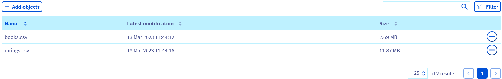

**Last updated March 14th, 2023**

## Objective

The purpose of this tutorial is to show how to clean data with [Apache Spark](https://spark.apache.org/) inside a [Jupyter Notebook](https://jupyter.org/).

*Data Cleaning* or *Data Cleansing* is the preparation of raw data by detecting and correcting records within a dataset.

The tutorial presents a simple data cleaning with `Notebooks for Apache Spark`.

## Requirements 

- A [Public Cloud project](https://www.ovhcloud.com/en-ca/public-cloud/) in your OVHcloud account
- Access to the [OVHcloud Control Panel](https://ca.ovh.com/auth/?action=gotomanager&from=https://www.ovh.com/ca/en/&ovhSubsidiary=ca)

## Instructions

### Upload data

First, download these 2 datasets CSV files locally:
* [books.csv](https://raw.githubusercontent.com/ovh/data-processing-samples/master/apache_spark_notebook_data_cleaning/books.csv)
* [ratings.csv](https://raw.githubusercontent.com/ovh/data-processing-samples/master/apache_spark_notebook_data_cleaning/ratings.csv)

Then, from the [OVHcloud Control Panel](https://ca.ovh.com/auth/?action=gotomanager&from=https://www.ovh.com/ca/en/&ovhSubsidiary=ca), go to the Object Storage section, locate your S3 bucket and upload your data by clicking `Add object`{.action}.

Select both files from your computer and add them to the root `/` of your bucket.

{.thumbnail}

### Retrieve bucket credentials

There are a few information that we will need as inputs of the notebook.

First, and while we're on the container page of the [OVHcloud Control Panel](https://ca.ovh.com/auth/?action=gotomanager&from=https://www.ovh.com/ca/en/&ovhSubsidiary=ca) we will copy the `Endpoint` information and save it.

Go back to the Object Storage home page and then to the S3 users tab, copy the user's `access key` and save it.

Finally, click on action "hamburger" at the end of the user row `(...)`{.action} > `View the secret key`{.action}, copy the value and save it.

### Launch and access a Notebook for Apache Spark

From the [OVHcloud Control Panel](https://ca.ovh.com/auth/?action=gotomanager&from=https://www.ovh.com/ca/en/&ovhSubsidiary=ca), go to the Data Processing section and create a new notebook by clicking `Data Processing`{.action} > `Create notebook`{.action}.

You can then reach the `JupyterLab` URL directly from the notebooks list or from the notebook page.

### Experiment with notebook

Now that you have your initial datasets ready on an Object Storage and a notebook running, you could start cleaning this data!

A preview of this notebook can be found on [GitHub](https://github.com/ovh/data-processing-samples/blob/master/apache_spark_notebook_data_cleaning/apache_spark_notebook_data_cleaning_tutorial.ipynb).

### Go further

- Do you want to create a data cleaning job you could replay based on your notebook? [Here it is](https://docs.ovh.com/ca/en/data-processing/submit-python/).

## Feedback

Please send us your questions, feedback and suggestions to improve the service:

- On the OVHcloud [Discord server](https://discord.com/invite/vXVurFfwe9)

