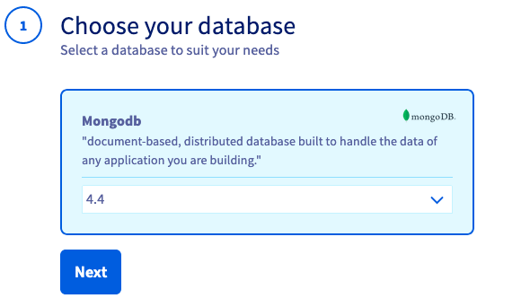
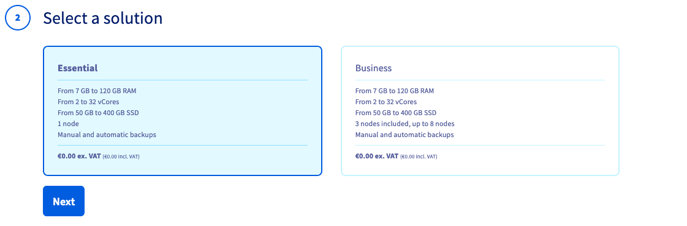
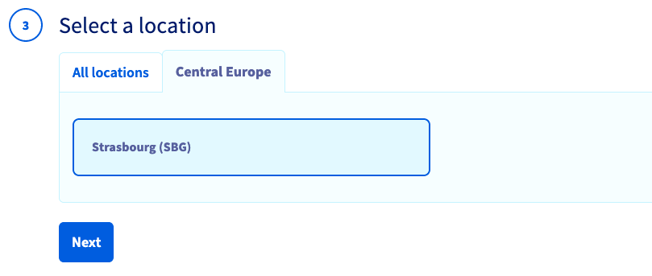
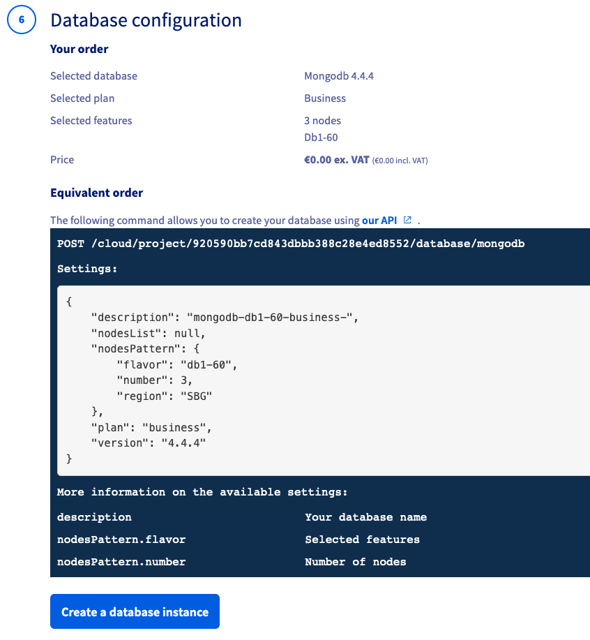

**Last updated 14th June 2021**

## Objective

OVHcloud Databases as-a-service (DBaaS) allow you to focus on building and deploying cloud applications while OVHcloud takes care of the database infrastructure and maintenance.

**This guide explains how to order a MongoDB database solution in the OVHcloud Control Panel.**

## Requirements

- access to the [OVHcloud Control Panel](https://ca.ovh.com/auth/?action=gotomanager&from=https://www.ovh.com/asia/&ovhSubsidiary=asia)
- a [Public Cloud project](https://www.ovhcloud.com/asia/public-cloud/) in your OVHcloud account

## Instructions

### Subscribing to the service

Log in to your [OVHcloud Control Panel](https://ca.ovh.com/auth/?action=gotomanager&from=https://www.ovh.com/asia/&ovhSubsidiary=asia) and switch to `Public Cloud`{.action} in the top navigation bar. After selecting your Public Cloud project, click on `Databases`{.action} in the left-hand navigation bar under **Storage*.

Click on the button `Create a database instance`{.action}.

#### Step 1: Choose your database

Select a version to install from the drop-down menu inside the `MongoDB`{.action} box. Click on `Next`{.action} to continue.

{.thumbnail}

#### Step 2: Select a solution

In this step, choose an appropriate service plan.

{.thumbnail}

Please visit the [MongoDB capabilities page](https://docs.ovh.com/asia/en/publiccloud/databases/mongodb/capabilities/) for detailed information on each plan's properties.

Click on `Next`{.action} to continue.

#### Step 3: Select a location

Choose the geographical region of the data centre in which your database will be hosted.

{.thumbnail}

Click on `Next`{.action} to continue.

#### Step 4: Configure database nodes

You can increase the number of nodes and choose the node model in this step. The initial and maximum numbers of nodes depends on the solution chosen in step 2.

{.thumbnail}

Please visit the [MongoDB capabilities page](https://docs.ovh.com/asia/en/publiccloud/databases/mongodb/capabilities/) for detailed information on the hardware resources and other properties of the database installation.

Take note of the pricing information and click on `Next`{.action} to continue.

#### Step 5: Configure your options

You can name your database in this step and decide to attach a private network.

{.thumbnail}

##### **Connecting a private network (optional)**

{.thumbnail}

If you already have a private subnet available, check the box **Private** and select it from the drop-down menu. Note that this option is not available for an **Essential** plan.

You can be forwarded to create a private network or subnet by clicking on the respective links. Bear in mind that you will have to restart the order process afterwards.

Please follow [this guide](https://docs.ovh.com/asia/en/public-cloud/public-cloud-vrack/) for detailed instructions.

#### Step 6: Summary and confirmation

The final section will display a summary of your order as well as the API equivalent for creating this database instance, for use with the [OVHcloud API](https://docs.ovh.com/asia/en/api/first-steps-with-ovh-api/).

{.thumbnail}

Within a few minutes your new database service will be deployed. Messages in the OVHcloud Control Panel will inform you when the database is ready to use.

Please continue with the [Database Management guide](https://docs.ovh.com/asia/en/publiccloud/databases/mongodb/managing-service/) to configure your service after installation.

## Go further

[MongoDB capabilities](https://docs.ovh.com/asia/en/publiccloud/databases/mongodb/capabilities/)

[Managing a MongoDB service from the OVHcloud Control Panel](https://docs.ovh.com/asia/en/publiccloud/databases/mongodb/managing-service/)

[Configuring vRack for Public Cloud](https://docs.ovh.com/asia/en/public-cloud/public-cloud-vrack/)

Visit our dedicated Discord channel: <https://discord.gg/PwPqWUpN8G>. Ask questions, provide feedback and interact directly with the team that builds our databases services.

Join our community of users on <https://community.ovh.com/en/>.