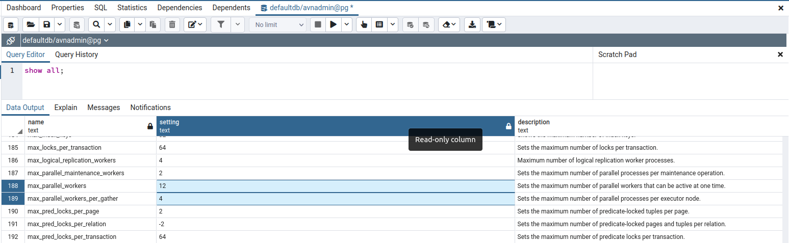

**Last updated 1st April, 2022**

## Objective

Public cloud database engines are managed services, which means that they are not fully configurable. For example, it is not possible to modify *pg_hba.conf*.
However, it is possible to modify some parameters via the API.

> [!primary]
>
> These actions are not available from the OVHcloud Control Panel
>

## Requirements

- A [Public Cloud project](https://www.ovhcloud.com/it/public-cloud/) in your OVHcloud account
- A database running on your OVHcloud Public Cloud Databases ([this guide](https://docs.ovh.com/it/databases/getting-started/) can help you to meet this requirement)

If you have never used the OVHcloud API before, then follow this tutorial: [First Steps with the OVHcloud APIs](https://docs.ovh.com/gb/en/api/first-steps-with-ovh-api/).

Here, we consider that your are logged on the relevant API (Europe: https://api.ovh.com, Canada/Asia: https://ca.api.ovh.com).

## Instructions

### Get your service and cluster IDs

You first need to identify the service and the cluster you want to apply the changes to.

####  Get the desired service ID

Execute the following API call:

> [!api]
>
> @api {get} /cloud/project
>

{.thumbnail}

From the resulting list, select and copy the service identifier corresponding to the desired service, also known as serviceName.

#### Get the desired cluster ID

Open the following API call, paste your service ID into the `serviceName` input field and click `Execute`{.action}:

> [!tabs]
> Cassandra
>> > [!api]
>> >
>> > @api {GET} /cloud/project/{serviceName}/database/cassandra
>> >
> Kafka
>> > [!api]
>> >
>> > @api {GET} /cloud/project/{serviceName}/database/kafka
>> >
> Kafka Connect
>> > [!api]
>> >
>> > @api {GET} /cloud/project/{serviceName}/database/kafkaConnect
>> >
> M3DB
>> > [!api]
>> >
>> > @api {GET} /cloud/project/{serviceName}/database/m3db
>> >
> MySQL
>> > [!api]
>> >
>> > @api {GET} /cloud/project/{serviceName}/database/mysql
>> >
> Opensearch
>> > [!api]
>> >
>> > @api {GET} /cloud/project/{serviceName}/database/opensearch
>> >
> PostgreSQL
>> > [!api]
>> >
>> > @api {GET} /cloud/project/{serviceName}/database/postgresql
>> >
> Redis
>> > [!api]
>> >
>> > @api {GET} /cloud/project/{serviceName}/database/redis
>> >

{.thumbnail}

From the resulting list, select and copy the cluster ID, also known as clusterId.

### Get the existing Advanced Configuration

Open the following API call and paste the corresponding inputs (serviceName, clusterId) and click `Execute`{.action}:

> [!tabs]
> Cassandra
>> > [!api]
>> >
>> > @api {GET} /cloud/project/{serviceName}/database/cassandra/{clusterId}/advancedConfiguration
>> >
> Kafka
>> > [!api]
>> >
>> > @api {GET} /cloud/project/{serviceName}/database/kafka/{clusterId}/advancedConfiguration
>> >
> Kafka Connect
>> > [!api]
>> >
>> > @api {GET} /cloud/project/{serviceName}/database/kafkaConnect/{clusterId}/advancedConfiguration
>> >
> M3DB
>> > [!api]
>> >
>> > @api {GET} /cloud/project/{serviceName}/database/m3db/{clusterId}/advancedConfiguration
>> >
> MySQL
>> > [!api]
>> >
>> > @api {GET} /cloud/project/{serviceName}/database/mysql/{clusterId}/advancedConfiguration
>> >
> Opensearch
>> > [!api]
>> >
>> > @api {GET} /cloud/project/{serviceName}/database/opensearch/{clusterId}/advancedConfiguration
>> >
> PostgreSQL
>> > [!api]
>> >
>> > @api {GET} /cloud/project/{serviceName}/database/postgresql/{clusterId}/advancedConfiguration
>> >
> Redis
>> > [!api]
>> >
>> > @api {GET} /cloud/project/{serviceName}/database/redis/{clusterId}/advancedConfiguration
>> >

{.thumbnail}

### Advanced Configuration parameters list

Open the following API call and paste the corresponding inputs (serviceName, clusterId) and click `Execute`{.action}:

> [!tabs]
> Cassandra
>> > [!api]
>> >
>> > @api {GET} /cloud/project/{serviceName}/database/cassandra/{clusterId}/capabilities/advancedConfiguration
>> >
> Kafka
>> > [!api]
>> >
>> > @api {GET} /cloud/project/{serviceName}/database/kafka/{clusterId}/capabilities/advancedConfiguration
>> >
> Kafka Connect
>> > [!api]
>> >
>> > @api {GET} /cloud/project/{serviceName}/database/kafkaConnect/{clusterId}/capabilities/advancedConfiguration
>> >
> M3DB
>> > [!api]
>> >
>> > @api {GET} /cloud/project/{serviceName}/database/m3db/{clusterId}/capabilities/advancedConfiguration
>> >
> MySQL
>> > [!api]
>> >
>> > @api {GET} /cloud/project/{serviceName}/database/mysql/{clusterId}/capabilities/advancedConfiguration
>> >
> Opensearch
>> > [!api]
>> >
>> > @api {GET} /cloud/project/{serviceName}/database/opensearch/{clusterId}/capabilities/advancedConfiguration
>> >
> PostgreSQL
>> > [!api]
>> >
>> > @api {GET} /cloud/project/{serviceName}/database/postgresql/{clusterId}/capabilities/advancedConfiguration
>> >
> Redis
>> > [!api]
>> >
>> > @api {GET} /cloud/project/{serviceName}/database/redis/{clusterId}/capabilities/advancedConfiguration
>> >

{.thumbnail}

### Change Advanced Configuration

> [!warning]
>
> Please note that changes to the advanced settings apply at the cluster level and therefore to all the databases in the cluster.
>

Open the following API call and paste the corresponding inputs (serviceName, clusterId)

> [!tabs]
> Cassandra
>> > [!api]
>> >
>> > @api {PUT} /cloud/project/{serviceName}/database/cassandra/{clusterId}/advancedConfiguration
>> >
> Kafka
>> > [!api]
>> >
>> > @api {PUT} /cloud/project/{serviceName}/database/kafka/{clusterId}/advancedConfiguration
>> >
> Kafka Connect
>> > [!api]
>> >
>> > @api {PUT} /cloud/project/{serviceName}/database/kafkaConnect/{clusterId}/advancedConfiguration
>> >
> M3DB
>> > [!api]
>> >
>> > @api {PUT} /cloud/project/{serviceName}/database/m3db/{clusterId}/advancedConfiguration
>> >
> MySQL
>> > [!api]
>> >
>> > @api {PUT} /cloud/project/{serviceName}/database/mysql/{clusterId}/advancedConfiguration
>> >
> Opensearch
>> > [!api]
>> >
>> > @api {PUT} /cloud/project/{serviceName}/database/opensearch/{clusterId}/advancedConfiguration
>> >
> PostgreSQL
>> > [!api]
>> >
>> > @api {PUT} /cloud/project/{serviceName}/database/postgresql/{clusterId}/advancedConfiguration
>> >
> Redis
>> > [!api]
>> >
>> > @api {PUT} /cloud/project/{serviceName}/database/redis/{clusterId}/advancedConfiguration
>> >

Now, according the parameters you chose, set the different values into the string arrays, such as in the example below:

{.thumbnail}

When ready, click `Execute`{.action} to update the parameters.

### Checking

You can check the changes in different ways such as:

**API call**

{.thumbnail}

**pgAdmin**

{.thumbnail}

*Follow this [guide](https://docs.ovh.com/it/publiccloud/databases/postgresql/connect-pgadmin/) to learn more about pgAdmin*

## We want your feedback!

We would love to help answer questions and appreciate any feedback you may have.

Are you on Discord? Connect to our channel at <https://discord.gg/PwPqWUpN8G> and interact directly with the team that builds our databases service!
