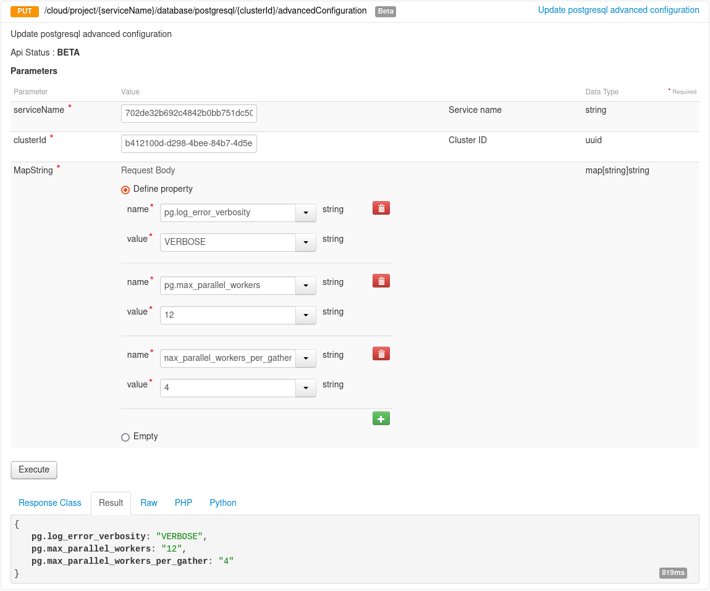

**Last updated 1st April, 2022**

## Objective

Public cloud database engines are managed services, which means that they are not fully configurable. For example, it is not possible to modify *pg_hba.conf*.

> [!primary]
>
> Advanced configuration is available for the following Public Cloud Databases engines :
>
> - Cassandra   
> - Kafka  
> - Kafka Connect  
> - MySQL  
> - Opensearch  
> - PostgreSQL  
> - Redis  
>

## Requirements

- A [Public Cloud project](https://www.ovhcloud.com/asia/public-cloud/) in your OVHcloud account   
- A database running on your OVHcloud Public Cloud Databases ([this guide](https://docs.ovh.com/asia/en/publiccloud/databases/getting-started/) can help you to meet this requirement)   
- Access to your [OVHcloud Control Panel](https://ca.ovh.com/auth/?action=gotomanager&from=https://www.ovh.com/asia/&ovhSubsidiary=asia) or to the [OVHcloud API](https://api.ovh.com/console/)   

## Instructions

> [!warning]
>
> Please note that changes to the advanced settings apply at the cluster level and therefore to all the databases in the cluster.
>

> [!primary]
>
> Depending on the engine, some settings may already be defined.
>

> [!primary]
>
> Once the advanced configuration has been submitted, it is not possible to reset it to initial values. It is only possible to update the values, so we recommend that you take note of the initial values before changing them.
>
> See the [Checking](#checking) section below
>

### Using the OVHcloud Control Panel

To change the advanced configuration, you first need to log in to your [OVHcloud Control Panel](https://ca.ovh.com/auth/?action=gotomanager&from=https://www.ovh.com/asia/&ovhSubsidiary=asia) and open your `Public Cloud`{.action} project. Click on `Databases`{.action} in the left-hand navigation bar, select your engine instance then the `Advanced configuration`{.action} tab.

Select the key of the advanced setting you want to define, then set its value.

When ready, click on `Update advanced configuration`{.action}.

> [!primary]
>
> On the top-right of the advanced configuration tab, you can see the settings which are already defined.
>

### Using API

> [!primary]
>
> If you are not familiar with using the OVHcloud API, please refer to our guide on [First Steps with the OVHcloud APIs](https://docs.ovh.com/asia/en/api/first-steps-with-ovh-api/).
>

#### Get your service and cluster IDs

You first need to identify the service and the cluster you want to apply the changes to.

##### **Get the desired service ID**

Execute the following API call:

> [!api]
>
> @api {GET} /cloud/project
>

{.thumbnail}

From the resulting list, select and copy the service identifier corresponding to the desired service, also known as serviceName.

##### **Get the desired cluster ID**

Open the following API call, paste your service ID into the `serviceName` input field and click `Execute`{.action}:

> [!tabs]
> Cassandra
>> > [!api]
>> >
>> > @api {GET} /cloud/project/{serviceName}/database/cassandra
>> >
> Kafka
>> > [!api]
>> >
>> > @api {GET} /cloud/project/{serviceName}/database/kafka
>> >
> Kafka Connect
>> > [!api]
>> >
>> > @api {GET} /cloud/project/{serviceName}/database/kafkaConnect
>> >
> MySQL
>> > [!api]
>> >
>> > @api {GET} /cloud/project/{serviceName}/database/mysql
>> >
> Opensearch
>> > [!api]
>> >
>> > @api {GET} /cloud/project/{serviceName}/database/opensearch
>> >
> PostgreSQL
>> > [!api]
>> >
>> > @api {GET} /cloud/project/{serviceName}/database/postgresql
>> >
> Redis
>> > [!api]
>> >
>> > @api {GET} /cloud/project/{serviceName}/database/redis
>> >

{.thumbnail}

From the resulting list, select and copy the cluster ID, also known as clusterId.

#### Get the existing advanced configuration

Open the following API call and paste the corresponding inputs (serviceName, clusterId) and click `Execute`{.action}:

> [!tabs]
> Cassandra
>> > [!api]
>> >
>> > @api {GET} /cloud/project/{serviceName}/database/cassandra/{clusterId}/advancedConfiguration
>> >
> Kafka
>> > [!api]
>> >
>> > @api {GET} /cloud/project/{serviceName}/database/kafka/{clusterId}/advancedConfiguration
>> >
> Kafka Connect
>> > [!api]
>> >
>> > @api {GET} /cloud/project/{serviceName}/database/kafkaConnect/{clusterId}/advancedConfiguration
>> >
> MySQL
>> > [!api]
>> >
>> > @api {GET} /cloud/project/{serviceName}/database/mysql/{clusterId}/advancedConfiguration
>> >
> Opensearch
>> > [!api]
>> >
>> > @api {GET} /cloud/project/{serviceName}/database/opensearch/{clusterId}/advancedConfiguration
>> >
> PostgreSQL
>> > [!api]
>> >
>> > @api {GET} /cloud/project/{serviceName}/database/postgresql/{clusterId}/advancedConfiguration
>> >
> Redis
>> > [!api]
>> >
>> > @api {GET} /cloud/project/{serviceName}/database/redis/{clusterId}/advancedConfiguration
>> >

{.thumbnail}

#### Advanced configuration settings list

Open the following API call and paste the corresponding inputs (serviceName, clusterId) and click `Execute`{.action}:

> [!tabs]
> Cassandra
>> > [!api]
>> >
>> > @api {GET} /cloud/project/{serviceName}/database/cassandra/{clusterId}/capabilities/advancedConfiguration
>> >
> Kafka
>> > [!api]
>> >
>> > @api {GET} /cloud/project/{serviceName}/database/kafka/{clusterId}/capabilities/advancedConfiguration
>> >
> Kafka Connect
>> > [!api]
>> >
>> > @api {GET} /cloud/project/{serviceName}/database/kafkaConnect/{clusterId}/capabilities/advancedConfiguration
>> >
> MySQL
>> > [!api]
>> >
>> > @api {GET} /cloud/project/{serviceName}/database/mysql/{clusterId}/capabilities/advancedConfiguration
>> >
> Opensearch
>> > [!api]
>> >
>> > @api {GET} /cloud/project/{serviceName}/database/opensearch/{clusterId}/capabilities/advancedConfiguration
>> >
> PostgreSQL
>> > [!api]
>> >
>> > @api {GET} /cloud/project/{serviceName}/database/postgresql/{clusterId}/capabilities/advancedConfiguration
>> >
> Redis
>> > [!api]
>> >
>> > @api {GET} /cloud/project/{serviceName}/database/redis/{clusterId}/capabilities/advancedConfiguration
>> >

{.thumbnail}

#### Change advanced configuration

Open the following API call and paste the corresponding inputs (serviceName, clusterId)

> [!tabs]
> Cassandra
>> > [!api]
>> >
>> > @api {PUT} /cloud/project/{serviceName}/database/cassandra/{clusterId}/advancedConfiguration
>> >
> Kafka
>> > [!api]
>> >
>> > @api {PUT} /cloud/project/{serviceName}/database/kafka/{clusterId}/advancedConfiguration
>> >
> Kafka Connect
>> > [!api]
>> >
>> > @api {PUT} /cloud/project/{serviceName}/database/kafkaConnect/{clusterId}/advancedConfiguration
>> >
> MySQL
>> > [!api]
>> >
>> > @api {PUT} /cloud/project/{serviceName}/database/mysql/{clusterId}/advancedConfiguration
>> >
> Opensearch
>> > [!api]
>> >
>> > @api {PUT} /cloud/project/{serviceName}/database/opensearch/{clusterId}/advancedConfiguration
>> >
> PostgreSQL
>> > [!api]
>> >
>> > @api {PUT} /cloud/project/{serviceName}/database/postgresql/{clusterId}/advancedConfiguration
>> >
> Redis
>> > [!api]
>> >
>> > @api {PUT} /cloud/project/{serviceName}/database/redis/{clusterId}/advancedConfiguration
>> >

Now, according to the settings you chose, set the different values into the string arrays, such as in the example below:

{.thumbnail}

When ready, click on `Execute`{.action} to update the advanced configuration.

### Checking

You can check the changes in different ways such as:

**Using API**

{.thumbnail}

**Using pgAdmin**

{.thumbnail}

*Follow this [guide](https://docs.ovh.com/asia/en/publiccloud/databases/postgresql/connect-pgadmin/) to learn more about pgAdmin*

## We want your feedback!

We would love to help answer questions and appreciate any feedback you may have.

Are you on Discord? Connect to our channel at <https://discord.gg/PwPqWUpN8G> and interact directly with the team that builds our databases service!
