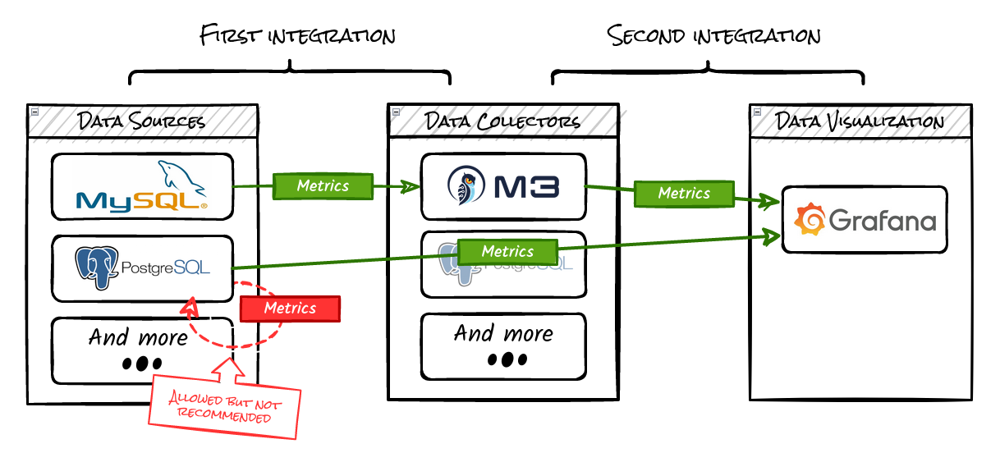
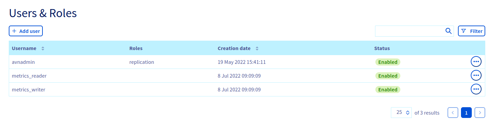
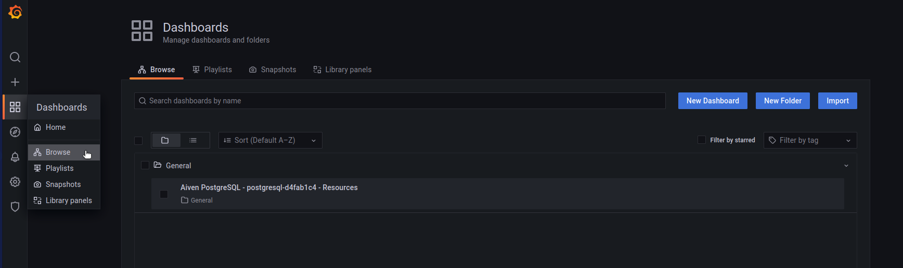
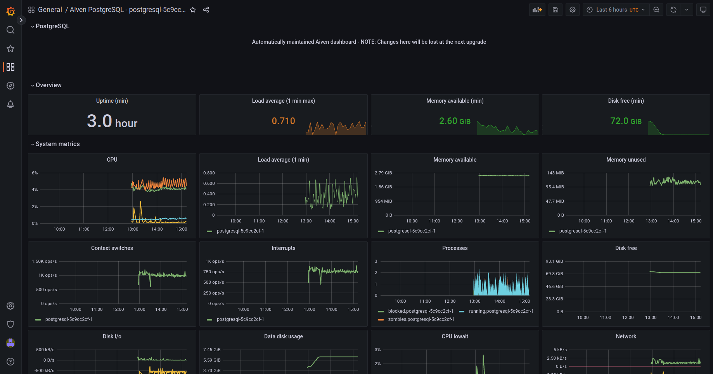
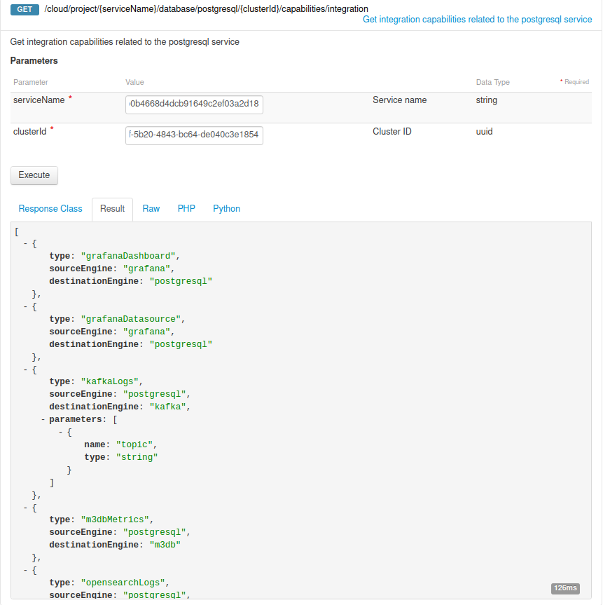
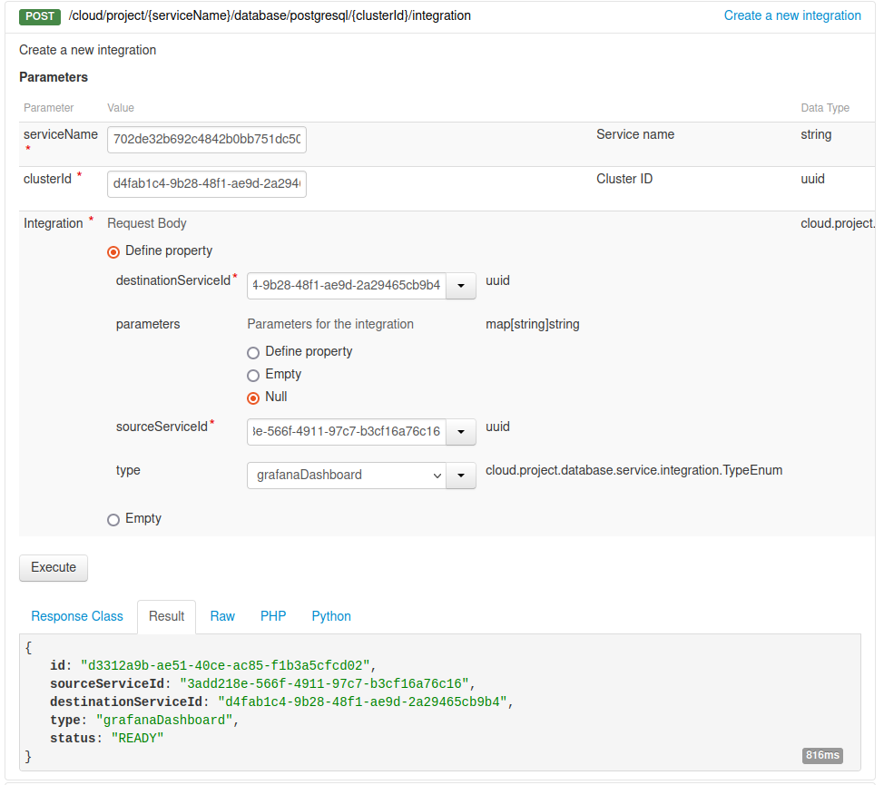
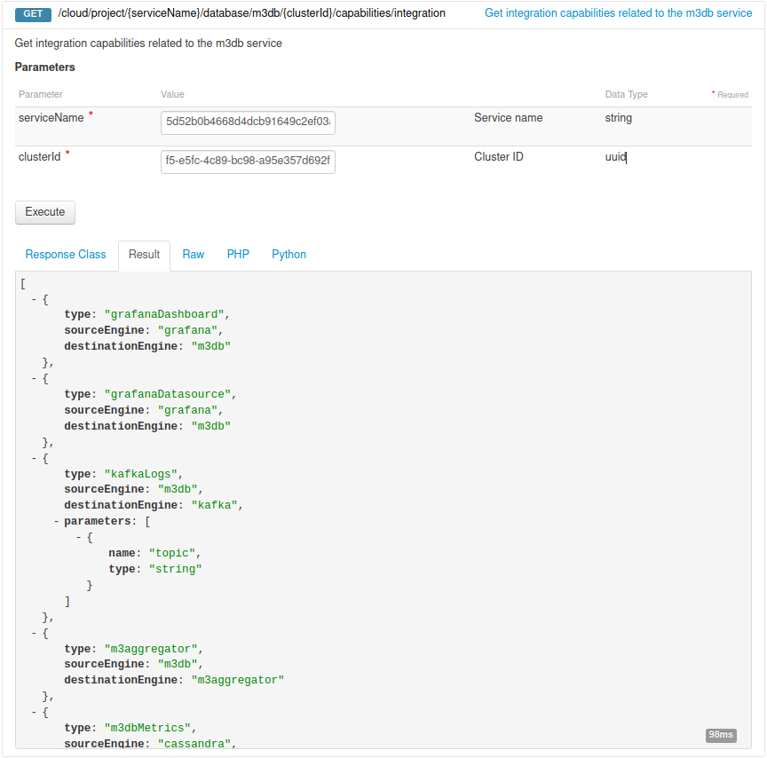
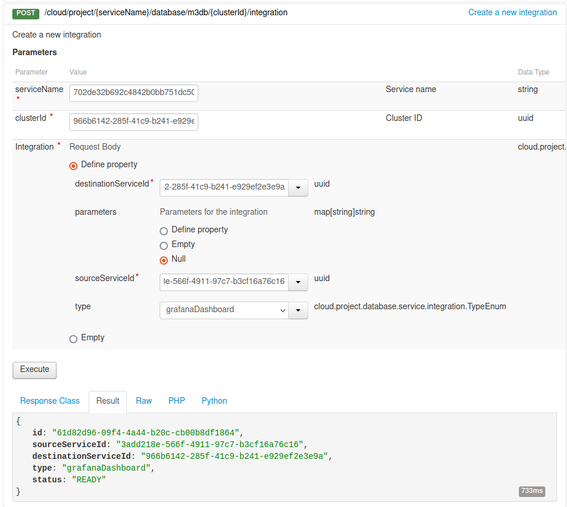

**Last updated July 8th, 2022**

## Objective

Cross Service Integration allows you to expose your Public Cloud Databases Logs and Metrics.

**This guide explains how to use Cross Service Integration.**

> [!warning]
>
> **Out of scope:**
>
> - Expose metrics and logs outside of OVHcloud Public Cloud
> - MongoDB engine is not supported  
>

## Requirements

- A [Public Cloud project](https://www.ovhcloud.com/en-sg/public-cloud/) in your OVHcloud account   
- A database running on your OVHcloud Public Cloud Databases ([this guide](https://docs.ovh.com/sg/en/publiccloud/databases/getting-started/) can help you to meet this requirement)   
- Access to your [OVHcloud Control Panel](https://ca.ovh.com/auth/?action=gotomanager&from=https://www.ovh.com/sg/&ovhSubsidiary=sg) or to the [OVHcloud API](https://api.ovh.com/console/)

## Concept

The Cross Service Integrations for Logs and Metrics allow you for example:

- To send Redis or MySQL metrics or Cassandra metrics in M3db or PostgreSQL.
- To send PostgreSQL or MySQL metrics to OpenSearch.
- To show metrics in Grafana.

For that you need:

- A source service
- A destination service

{.thumbnail}

> [!warning]
>
> Although it is possible to define the same cluster as destination service and source service, this is a bad practice for multiple reasons (performance, security, resiliency, ...)
>

### Integration matrix

- All services support logs to opensearch & kafka_logs to kafka.
- All services except m3db & m3agg support metrics to pg & metrics to m3db.

Other integrations:

| source → ↓ destination | grafana	| m3db	| kafka |
|:--|---|---|---|
| pg | dashboard, datasource | | |
| opensearch | datasource | | |
| m3db | dashboard, datasource | | |
| m3agg | | m3agg | |
| kmm | | | kafka_mirrormaker |
| kc | | | kafka_connect |

## Instructions

### Using the OVHcloud Control Panel

#### Store yours logs or metrics

Log in to your OVHcloud Control Panel and open your `Public Cloud`{.action} project. Click on `Databases`{.action} in the left-hand navigation bar, select your engine instance and open the `Service integration`{.action} tab.

Click on `Add an integration`{.action}:

{.thumbnail}

Define the `Integration type`{.action} and the `Destination service`{.action}:

> [!warning]
>
> First create a Public Cloud Database for your *Destination* service via your Control Panel or API.
>

> [!primary]
>
> If you want to store the metrics of your *postgresql* cluster to *m3db*, select `m3dbMetrics` as `Integration type`{.action} and `m3db` as `Destination service`{.action}, as shown below.
>

{.thumbnail}

Your first integration is ready:

{.thumbnail}

> [!primary]
>
> Note that this integration creation has created two users, respectively: `metrics_reader` and `metrics_writer` in your engine instance.
>
> {.thumbnail}
>
> Don't delete them.
>

#### Allow metrics visualization into Grafana

Go to the `Service integration`{.action} tab of your `Destination service` service and click on `Add an integration`{.action}

{.thumbnail}

> [!primary]
>
> As you can see, the first integration is referenced.
>

Define `grafanaDashboard` as `Integration type`{.action} and the `Source service`{.action}:

{.thumbnail}

Your second integration is ready:

{.thumbnail}

Connect to your Grafana instance and browse the dashboards:

{.thumbnail}

Then open your new dashboard:

{.thumbnail}

### Using API

> [!primary]
>
> If you are not familiar with using the OVHcloud API, please refer to our guide on [First Steps with the OVHcloud APIs](https://docs.ovh.com/sg/en/api/first-steps-with-ovh-api/).
>

#### Get your service and cluster IDs

You first need to identify your `serviceId` and your `clusterId`.

##### **Get the desired service ID**

Execute the following API call:

> [!api]
>
> @api {GET} /cloud/project
>

{.thumbnail}

From the resulting list, select and copy the service identifier corresponding to the desired service, also known as `serviceName`.

##### **Get the desired cluster ID**

Open the following API call, paste your service ID into the `serviceName` input field and click `Execute`{.action}:

> [!tabs]
> Cassandra
>> > [!api]
>> >
>> > @api {GET} /cloud/project/{serviceName}/database/cassandra
>> >
> Grafana
>> > [!api]
>> >
>> > @api {GET} /cloud/project/{serviceName}/database/grafana
>> >
> Kafka
>> > [!api]
>> >
>> > @api {GET} /cloud/project/{serviceName}/database/kafka
>> >
> Kafka Connect
>> > [!api]
>> >
>> > @api {GET} /cloud/project/{serviceName}/database/kafkaConnect
>> >
> Kafka MirrorMaker
>> > [!api]
>> >
>> > @api {GET} /cloud/project/{serviceName}/database/kafkaMirrorMaker
>> >
> M3 Aggregator
>> > [!api]
>> >
>> > @api {GET} /cloud/project/{serviceName}/database/m3aggregator
>> >
> M3db
>> > [!api]
>> >
>> > @api {GET} /cloud/project/{serviceName}/database/m3db
>> >
> MySQL
>> > [!api]
>> >
>> > @api {GET} /cloud/project/{serviceName}/database/mysql
>> >
> Opensearch
>> > [!api]
>> >
>> > @api {GET} /cloud/project/{serviceName}/database/opensearch
>> >
> PostgreSQL
>> > [!api]
>> >
>> > @api {GET} /cloud/project/{serviceName}/database/postgresql
>> >
> Redis
>> > [!api]
>> >
>> > @api {GET} /cloud/project/{serviceName}/database/redis
>> >

{.thumbnail}

#### Get integration capabilities

Get integration capabilities related to your Public Cloud Databases service:

> [!tabs]
> Cassandra
>> > [!api]
>> > @api {GET} /cloud/project/{serviceName}/database/cassandra/{clusterId}/capabilities/integration
>> >
> Grafana
>> > [!api]
>> > @api {GET} /cloud/project/{serviceName}/database/grafana/{clusterId}/capabilities/integration
>> >
> Kafka
>> > [!api]
>> > @api {GET} /cloud/project/{serviceName}/database/kafka/{clusterId}/capabilities/integration
>> >
> Kafka Connect
>> > [!api]
>> > @api {GET} /cloud/project/{serviceName}/database/kafkaConnect/{clusterId}/capabilities/integration
>> >
> Kafka MirrorMaker
>> > [!api]
>> > @api {GET} /cloud/project/{serviceName}/database/kafkaMirrorMaker/{clusterId}/capabilities/integration
>> >
> M3 Aggregator
>> > [!api]
>> > @api {GET} /cloud/project/{serviceName}/database/m3aggregator/{clusterId}/capabilities/integration
>> >
> M3db
>> > [!api]
>> > @api {GET} /cloud/project/{serviceName}/database/m3db/{clusterId}/capabilities/integration
>> >
> MySQL
>> > [!api]
>> > @api {GET} /cloud/project/{serviceName}/database/mysql/{clusterId}/capabilities/integration
>> >
> OpenSearch
>> > [!api]
>> > @api {GET} /cloud/project/{serviceName}/database/opensearch/{clusterId}/capabilities/integration
>> >
> PostgreSQL
>> > [!api]
>> > @api {GET} /cloud/project/{serviceName}/database/postgresql/{clusterId}/capabilities/integration
>> >
> Redis
>> > [!api]
>> > @api {GET} /cloud/project/{serviceName}/database/redis/{clusterId}/capabilities/integration
>> >

{.thumbnail}

#### Store yours logs or metrics

As a first step, you need to push your metrics or logs somewhere, in order to store them and retrieve the metrics with Grafana.

For that, you need to create a new integration:

> [!tabs]
> Cassandra
>> > [!api]
>> > @api {POST} /cloud/project/{serviceName}/database/cassandra/{clusterId}/integration
>> >
> Grafana
>> > [!api]
>> > @api {POST} /cloud/project/{serviceName}/database/grafana/{clusterId}/integration
>> >
> Kafka
>> > [!api]
>> > @api {POST} /cloud/project/{serviceName}/database/kafka/{clusterId}/integration
>> >
> Kafka Connect
>> > [!api]
>> > @api {POST} /cloud/project/{serviceName}/database/kafkaConnect/{clusterId}/integration
>> >
> Kafka MirrorMaker
>> > [!api]
>> > @api {POST} /cloud/project/{serviceName}/database/kafkaMirrorMaker/{clusterId}/integration
>> >
> M3 Aggregator
>> > [!api]
>> > @api {POST} /cloud/project/{serviceName}/database/m3aggregator/{clusterId}/integration
>> >
> M3db
>> > [!api]
>> > @api {POST} /cloud/project/{serviceName}/database/m3db/{clusterId}/integration
>> >
> MySQL
>> > [!api]
>> > @api {POST} /cloud/project/{serviceName}/database/mysql/{clusterId}/integration
>> >
> OpenSearch
>> > [!api]
>> > @api {POST} /cloud/project/{serviceName}/database/opensearch/{clusterId}/integration
>> >
> PostgreSQL
>> > [!api]
>> > @api {POST} /cloud/project/{serviceName}/database/postgresql/{clusterId}/integration
>> >
> Redis
>> > [!api]
>> > @api {POST} /cloud/project/{serviceName}/database/redis/{clusterId}/integration
>> >

Fill in the form with the information corresponding to the type of integration chosen.

{.thumbnail}

The `destionationServiceId` and the `sourceServiceId` correspond to the destination cluster ID and to the source cluster ID.

#### Allow metrics visualization into Grafana

Now that metrics are stored somewhere, you need to connect your Public Cloud Databases service to a Grafana service.

For that, first create a Public Cloud Database for Grafana via our Control Panel or API.

Once done, get the `GrafanaDashboard` integration capability related to the destination service:

{.thumbnail}

Then create a second integration from your *Destination* service name:

> [!tabs]
> Cassandra
>> > [!api]
>> > @api {POST} /cloud/project/{serviceName}/database/cassandra/{clusterId}/integration
>> >
> Grafana
>> > [!api]
>> > @api {POST} /cloud/project/{serviceName}/database/grafana/{clusterId}/integration
>> >
> Kafka
>> > [!api]
>> > @api {POST} /cloud/project/{serviceName}/database/kafka/{clusterId}/integration
>> >
> Kafka Connect
>> > [!api]
>> > @api {POST} /cloud/project/{serviceName}/database/kafkaConnect/{clusterId}/integration
>> >
> Kafka MirrorMaker
>> > [!api]
>> > @api {POST} /cloud/project/{serviceName}/database/kafkaMirrorMaker/{clusterId}/integration
>> >
> M3 Aggregator
>> > [!api]
>> > @api {POST} /cloud/project/{serviceName}/database/m3aggregator/{clusterId}/integration
>> >
> M3db
>> > [!api]
>> > @api {POST} /cloud/project/{serviceName}/database/m3db/{clusterId}/integration
>> >
> MySQL
>> > [!api]
>> > @api {POST} /cloud/project/{serviceName}/database/mysql/{clusterId}/integration
>> >
> OpenSearch
>> > [!api]
>> > @api {POST} /cloud/project/{serviceName}/database/opensearch/{clusterId}/integration
>> >
> PostgreSQL
>> > [!api]
>> > @api {POST} /cloud/project/{serviceName}/database/postgresql/{clusterId}/integration
>> >
> Redis
>> > [!api]
>> > @api {POST} /cloud/project/{serviceName}/database/redis/{clusterId}/integration
>> >

{.thumbnail}

Connect to your Grafana instance and browse the dashboards:

{.thumbnail}

Then open your new dashboard:

{.thumbnail}

## We want your feedback!

We would love to help answer questions and appreciate any feedback you may have.

Are you on Discord? Connect to our channel at <https://discord.gg/PwPqWUpN8G> and interact directly with the team that builds our databases service!
