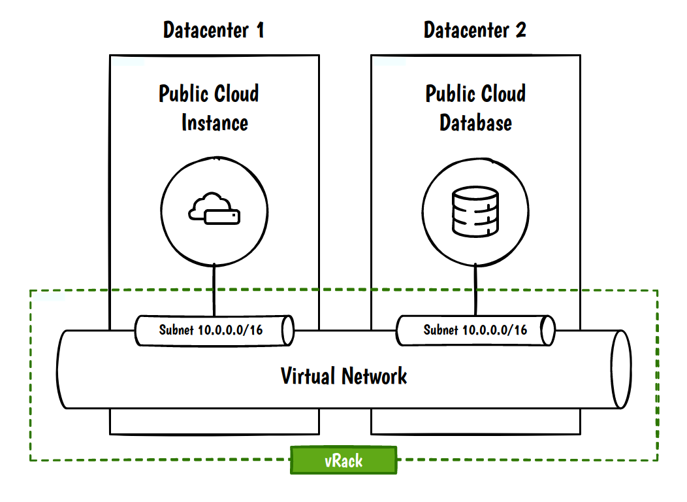
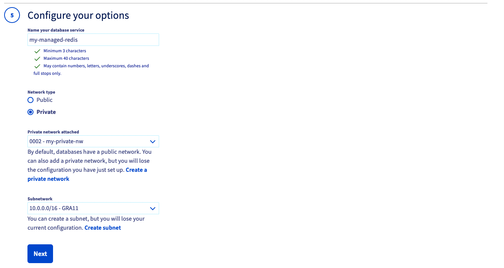
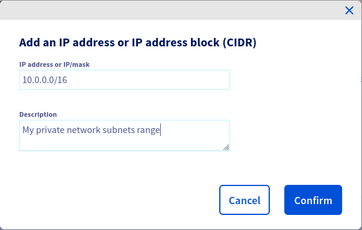

**Last updated October 26, 2022**

## Objective

The OVHcloud vRack is a private network solution that enables our customers to route traffic between OVHcloud dedicated servers as well as other OVHcloud services, such as databases. The vRack also allows you to add Public Cloud instances to your private network to create an infrastructure of physical and virtual resources.

**This guide explains how to connect a Public Cloud Instance, hosted in a datacenter, to a Public Cloud Database, hosted in another datacenter, like this:**

{.thumbnail}

## Requirements

- Access to the [OVHcloud Control Panel](https://ca.ovh.com/auth/?action=gotomanager&from=https://www.ovh.com/sg/&ovhSubsidiary=sg)
- A [Public Cloud project](https://www.ovhcloud.com/en-sg/public-cloud/) in your OVHcloud account.

## Instructions

### Step 1 - Creating a virtual network

The first step is to create the virtual network that will be used in your vRack.

To proceed, from the `Public cloud`{.action} tab, click on the `Private Network`{.action} menu, then click on the `Add Private Network`{.action} button.

{.thumbnail}

You can define yourself a **VLAN ID** for your virtual network. Value must be between 2 and 4,000.

Define your own range or let dynamic address distribution if you want to use DHCP.

By default, the 10.0.0.0/16 CIDR address is defined. Different subnets can be added later.

{.thumbnail}

Choose the regions where you want your virtual network to operate.

The subnets addresses are automatically ajusted, depending on the number of regions you choose.

{.thumbnail}

Give a name to your virtual network.

{.thumbnail}

Your vRack is ready!

> [!primary]
>
> Learn more about vRack [here](https://docs.ovh.com/sg/en/public-cloud/public-cloud-vrack/)
>

### Step 2 - Creating a Public Cloud Database connected to the private network


Follow this [guide](https://docs.ovh.com/sg/en/publiccloud/databases/getting-started/) to create a new Public Cloud Database.

> [!primary]
>
> Choose the plan that best fits your needs. The use of private networking with databases is available with all plans.
>
> {.thumbnail}
>

> [!primary]
>
> - Select **Private** from the Network Type list, then select **XXXX - my-private-nw**.
> *The XXX value is the ID of the vRack.*
>
> - From the Subnetwork list, select the **10.0.0.0/16 - YYY**.
> *The YYY value is the name of the datacenter you chose.*
>
> {.thumbnail}
>


### Step 3 - Configure your Public Cloud database instance to accept incoming connections

Follow the *Configure your \<database> instance to accept incoming connections* guide of your selected database type available [here](https://docs.ovh.com/sg/en/publiccloud/databases/) to configure your service after installation.

> [!primary]
>
> Authorize the whole private network, as defined on previous steps.
>
>{.thumbnail}
>

The database is now connected to the virtual network, we can use it from any component that is connected to the same vRack.

### Step 4 - Adding a Public Cloud Instance to the vRack

Follow this [guide](https://docs.ovh.com/sg/en/public-cloud/public-cloud-first-steps/#create-instance) to create a new Public Cloud Instance


> [!primary]
>
> At the fourth step, select the desired virtual network **XXXX - my-private-network**.
>
> {.thumbnail}
>

> [!primary]
>
>If you want to test the access from an existing instance, read this tutorial to connect it to the vRack: [Configuring vRack for Public Cloud](https://docs.ovh.com/sg/en/public-cloud/public-cloud-vrack/#in-case-of-an-existing-instance_2).
>

### Step 5 - Example of verification with a Public Cloud Databases for Redis

We assume that you have an already set SSH key on your project. For more details, read the [Creating and connecting to your first Public Cloud instance](https://docs.ovh.com/sg/en/public-cloud/public-cloud-first-steps/) page.

Connect to the instance via SSH:

```bash
ssh debian@141.95.107.2
```

Now install the Redis client by installing the Redis server package:

```bash
sudo apt-get update && sudo apt-get install redis-server -y
```

Now connect to the Redis database using the URL retrieved from the OVHcloud Control Panel, with a command such as:

```bash
redis-cli --tls -u "rediss://my-redis-user@redis-2612345abc-abcd1234defg.database.cloud.ovh.net:20185"
```

Authenticate yourself with the AUTH command:

```bash
AUTH my-redis-user myRedisUserPassword
```

Test the overall operation with these sample commands:

```bash
redis-2612345abc-abcd1234defg.database.cloud.ovh.net:20185> ping
PONG
redis-2612345abc-abcd1234defg.database.cloud.ovh.net:20185> SET mykey.test test
OK
redis-2612345abc-abcd1234defg.database.cloud.ovh.net:20185> GET mykey.test
"test"
```

## We want your feedback!

We would love to help answer questions and appreciate any feedback you may have.

Are you on Discord? Connect to our channel at <https://discord.gg/ovhcloud> and interact directly with the team that builds our databases service!
