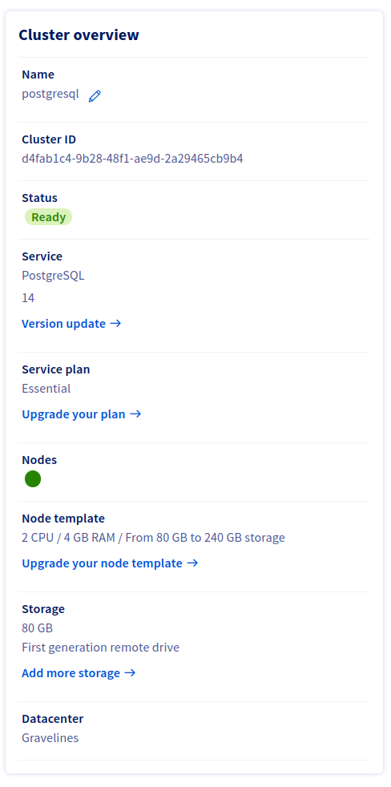

**Last updated 15th February 2023**

## Objective

Learn how to adjust the storage space of your cluster according to your needs.

> [!primary]
>
> This feature is available for engines that use storage space.
>

## Requirements

- Access to the [OVHcloud Control Panel](https://www.ovh.com/auth/?action=gotomanager&from=https://www.ovh.es/&ovhSubsidiary=es)
- A [Public Cloud project](https://www.ovhcloud.com/es-es/public-cloud/) in your OVHcloud account.

## Instructions

To adjust the storage space of your cluster, you must first log in to the OVHcloud Control Panel and open your Public Cloud project. Click `Databases`{.action} in the left navigation bar, select your engine instance then click the `General Information`{.action} tab.

Click `Add more storage`{.action} and adjust the storage space of your cluster.

## We want your feedback!

We would love to help answer questions and appreciate any feedback you may have.

Are you on Discord? Connect to our channel at <https://discord.gg/PwPqWUpN8G> and interact directly with the team that builds our databases service!
