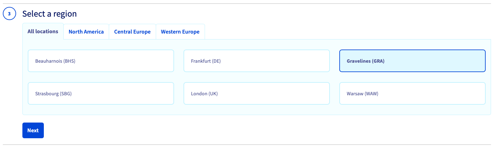
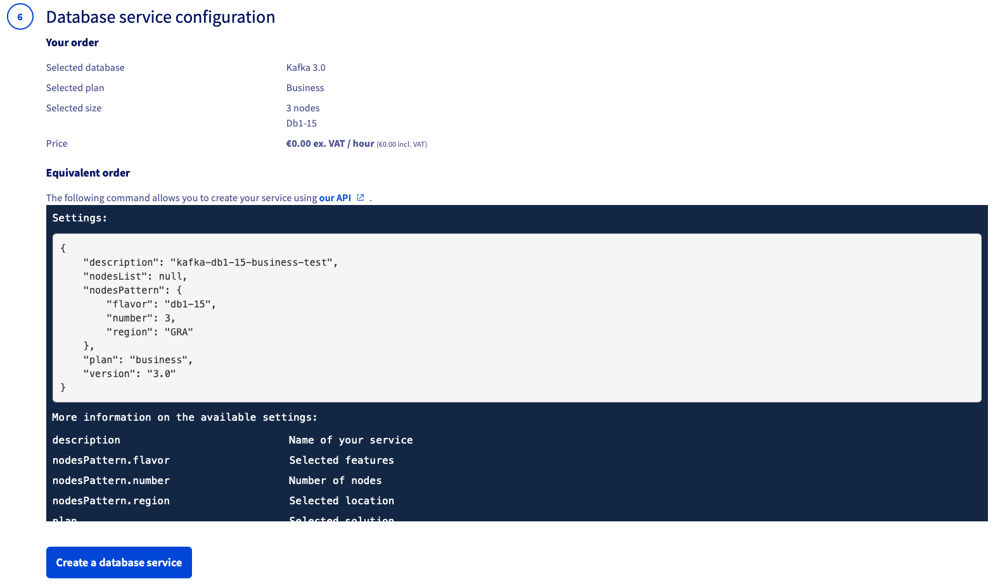
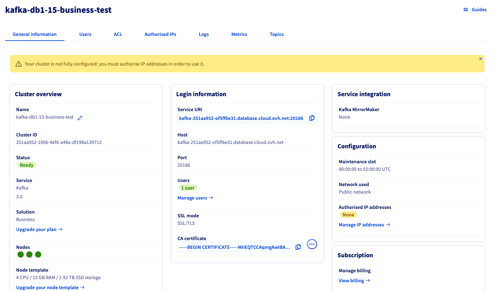
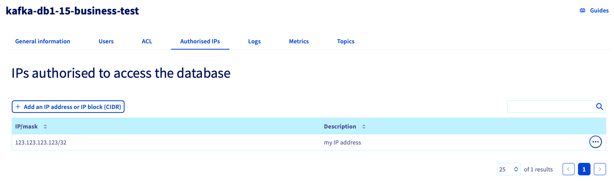
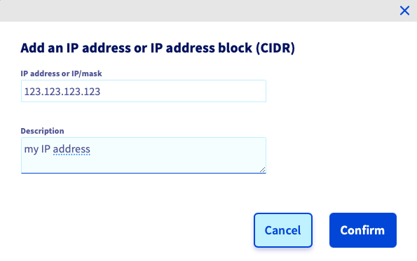
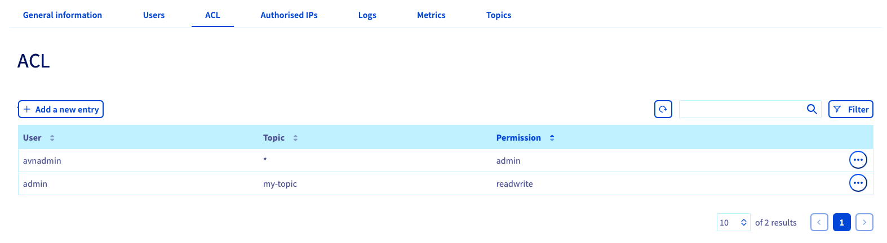

**Last updated 5<sup>th</sup> January 2022**

## Objectives

Apache Kafka is an open-source and highly resilient event streaming platform based on 3 main capabilities:

- write or read data to/from stream events;
- store streams of events;
- process streams of events.

You can get more information on Kafka from the [official Kafka website](https://kafka.apache.org/intro){.external).

This guide explains how to successfully configure Public Cloud Databases for Kafka via the OVHcloud Control Panel. 

## Requirements

- access to the [OVHcloud Control Panel](https://www.ovh.com/auth/?action=gotomanager&from=https://www.ovh.de/&ovhSubsidiary=de)
- a [Public Cloud project](https://www.ovhcloud.com/de/public-cloud/) in your OVHcloud account

## Instructions

### Subscribe to the service

Log in to your [OVHcloud Control Panel](https://www.ovh.com/auth/?action=gotomanager&from=https://www.ovh.de/&ovhSubsidiary=de) and switch to `Public Cloud`{.action} in the top navigation bar. After selecting your Public Cloud project, click on `Databases`{.action} in the left-hand navigation bar under **Storage**.

Click the `Create a database instance`{.action} button. (`Create a service`{.action} if your project already contains databases.)

#### Step 1: Select your database type

Click on the type of database you want to use and then select the version to install from the respective drop-down menu. Click `Next`{.action} to continue.

{.thumbnail}

#### Step 2: Select a solution

In this step, choose an appropriate service plan. If needed, you will be able to upgrade the plan after creation.

{.thumbnail}

Please visit the [capabilities page](https://docs.ovh.com/de/publiccloud/databases/) of your selected database type for detailed information on each plan's properties.

Click `Next`{.action} to continue.

#### Step 3: Select a location

Choose the geographical region of the datacenter where your service will be hosted.

{.thumbnail}

Click `Next`{.action} to continue.

#### Step 4: Size the database nodes

You can increase the number of nodes and choose the node template in this step. The minimum and maximum amount of nodes depends on the solution chosen in step 2.

{.thumbnail}

Please visit the [capabilities page](https://docs.ovh.com/de/publiccloud/databases/) of your selected database type for detailed information on hardware resources and other properties of the database installation.

Take note of the pricing information and click `Next`{.action} to continue.

#### Step 5: Configure your options

You can name your database in this step and decide to attach a public or private network. 
Please note that attaching a private network is a feature not yet available at this time.

{.thumbnail}

#### Step 6: Review and confirm

The final section will display a summary of your order as well as the API equivalent of creating this database instance with the [OVHcloud API](https://docs.ovh.com/de/api/first-steps-with-ovh-api/).

{.thumbnail}

In a matter of minutes, your new Apache Kafka service will be deployed. Messages in the OVHcloud Control Panel will inform you when the streaming tool is ready to use.

### Configure the Apache Kafka service

Once the Public Cloud Databases for Kafka service is up and running, you will have to define at least one user and one authorised IP in order to fully connect to the service (as producer or consumer).

{.thumbnail}

The `General information`{.action} tab should inform you to create users and authorized IPs.

{.thumbnail}

#### Step 1 (mandatory): Set up a user

Switch to the `Users`{.action} tab. An admin user is preconfigured during the service installation. You can add more users by clicking the `Add user`{.action} button.

{.thumbnail}

Enter a username, then click `Create User`{.action}.

Once the user is created, the password is generated. Please keep it securely as it will not be shown again.

Passwords can be reset for the admin user or changed afterwards for other users in the `Users`{.action} tab.

{.thumbnail}

#### Step 2 (mandatory): Configure authorised IPs

> [!warning]
> For security reasons the default network configuration doesn't allow any incoming connections. It is thus critical to authorize the suitable IP addresses in order to successfully access your Kafka cluster.

Switch to the `Authorized IPs`{.action} tab. At least one IP address must be authorised here before you can connect to your database.
It can be your laptop IP for example.

{.thumbnail}

Clicking on `Add an IP address or IP address block (CIDR)`{.action} opens a new window in which you can add single IP addresses or blocks to allow access to the database.

{.thumbnail}

You can edit and remove database access via the `...`{.action} button in the IP table.

If you don't know how to get your IP, please visit a website like [www.WhatismyIP.com](https://www.whatismyip.com/){.external}.
Copy the IP address shown on this website and keep it for later.

Your Apache Kafka service is now fully accessible!

Optionally, you can configure access control lists (ACL) for granular permissions and create something called topics, as shown below.

#### Optional: Create Kafka topics

Topics can be seen as categories, allowing you to organize your Kafka records. Producers write to topics, and consumers read from topics.

To create Kafka topics, click on the `Add a topic`{.action} button:

{.thumbnail}

In advanced configuration you can change the default value for the following parameters:

- Replication (3 brokers by default)
- Partitions (1 partition by default)
- Retention size in bytes (-1: no limitation by default)
- Retention time in hours (-1: no limitation by default)
- Minimum in-sync replica (2 by default)
- Deletion policy

{.thumbnail}

#### Optional: Configure ACLs on topics

Public Cloud Databases for Kafka supports access control lists (ACLs) to manage permissions on topics. This approach allows you to limit the operations that are available to specific connections and to restrict access to certain data sets, which improves the security of your data.

By default the admin user has access to all topics with admin privileges. You can define some additional ACLs for all users / topics, click on `Add a new entry`{.action} button:

{.thumbnail}

For a particular user, and one topic (or all with '*'), define the ACL with the the following permissions:

- **admin**: full access to APIs and topic
- **read**: allow only searching and retrieving data from a topic
- **write**: allow updating, adding, and deleting data from a topic
- **readwrite**: full access to the topic

{.thumbnail}

*Note*: Write permission allows the service user to create new indexes that match the pattern, but it does not allow deletion of those indexes.

When multiple rules match, they are applied in the order listed above. If no rules match, access is denied.

### First CLI connection to your Kafka service

> [!warning]
> Verify that the IP address visible from your browser application is part of the "Authorised IPs" defined for this Kafka service.
>
> Check also that the user has granted ACLs for the target topics.

#### Download server and user certificates

In order to connect to the Apache Kafka service, it is required to use server and user certificates.

##### **1 - Server certificate**

The server CA (*Certificate Authority*) certificate can be downloaded from the **General information** tab:

{.thumbnail}

##### **2 - User certificate**

The user certificate can be downloaded from the **Users** tab:

{.thumbnail}
{.thumbnail}

##### **3 - User access key**

Also download the user access key.

{.thumbnail}

#### Install an Apache Kafka CLI

As part of the Apache Kafka official installation, you will get different scripts that will also allow you to connect to Kafka in a Java 8+ environment: [Apache Kafka Official Quickstart](https://kafka.apache.org/quickstart){.external}.

We propose to use a generic producer and consumer client instead: Kcat (formerly known as kafkacat). Kcat is more lightweight since it does not require a JVM.

##### **Install Kcat**

For this client installation, please follow the instructions available at: [Kafkacat Official Github](https://github.com/edenhill/kcat){.external}.

##### **Kcat configuration file**

Let's create a configuration file to simplify the CLI commands to act as Kafka Producer and Consumer:

kafkacat.conf :

```text
bootstrap.servers=kafka-f411d2ae-f411d2ae.database.cloud.ovh.net:20186
enable.ssl.certificate.verification=false
ssl.ca.location=/home/user/kafkacat/ca.pem
security.protocol=ssl
ssl.key.location=/home/user/kafkacat/service.key
ssl.certificate.location=/home/user/kafkacat/service.cert
```

In our example, the cluster address and port are **kafka-f411d2ae-f411d2ae.database.cloud.ovh.net:20186** and the previously downloaded CA certificates are in the **/home/user/kafkacat/** folder.

Change theses values according to your own configuration.

##### **Kafka producer**

For this first example let's push the "test-message-key" and its "test-message-content" to the "my-topic" topic.

```bash
echo test-message-content | kcat -F kafkacat.conf -P -t my-topic -k test-message-key
```

*Note*: depending on the installed binary, the CLI command can be either **kcat** or **kafkacat**.

##### **Kafka consumer**

The data can be retrieved from "my-topic".

```bash
kcat -F kafkacat.conf -C -t my-topic -o -1 -e
```

*Note*: depending on the installed binary, the CLI command can be either **kcat** or **kafkacat**.

## Conclusion

Congratulations, you now have an up and running Apache Kafka cluster, fully managed and secured. You are able to push and retrieve data easily via CLI.

## Go further

[Kafka capabilities](https://docs.ovh.com/de/publiccloud/databases/kafka/capabilities/)

[Kafka Official documentation](https://kafka.apache.org/documentation/){.external}

[Kafka clients](https://cwiki.apache.org/confluence/display/KAFKA/Clients){.external}

Some UI tools for Kafka are also available:

- [Lenses](https://lenses.io){.external}
- [Xeotek](https://www.xeotek.com/){.external}
- [Conduktor](https://www.conduktor.io/){.external}

Visit the [Github examples repository](https://github.com/ovh/public-cloud-databases-examples/tree/main/databases/kafka) to find how to connect to your database with several languages.

Visit our dedicated Discord channel: <https://discord.gg/PwPqWUpN8G>. Ask questions, provide feedback and interact directly with the team that builds our databases services.
