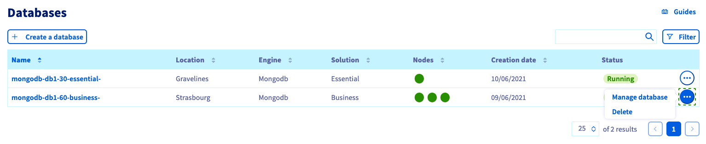
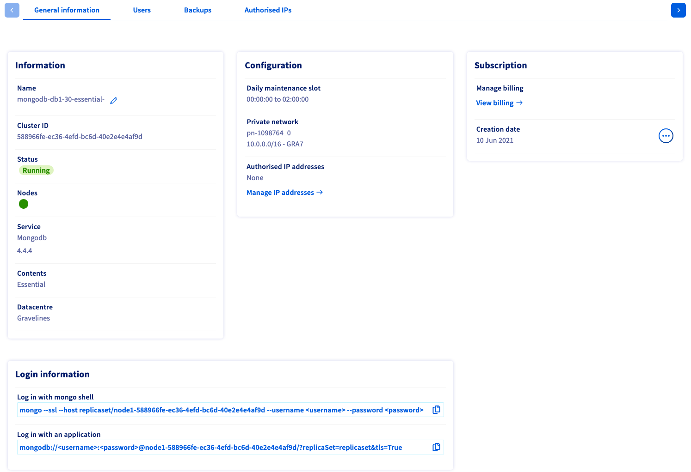
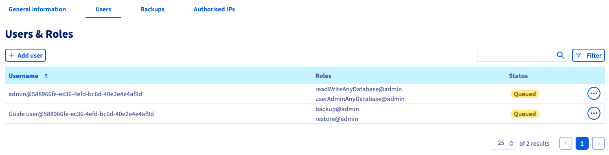
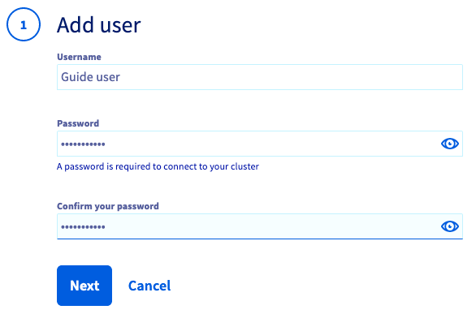
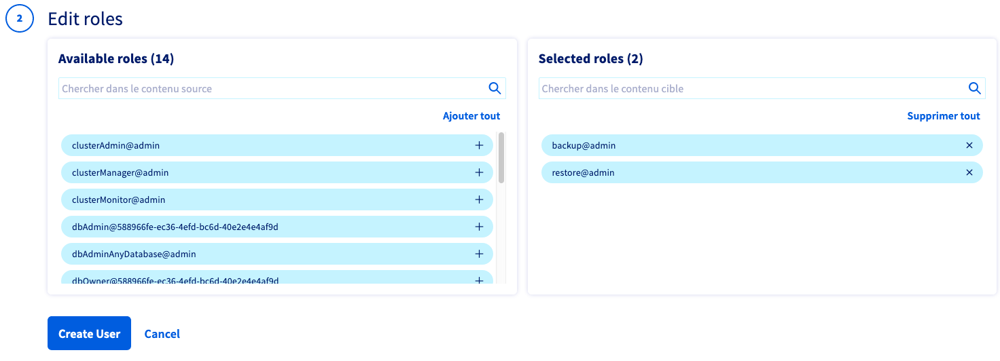
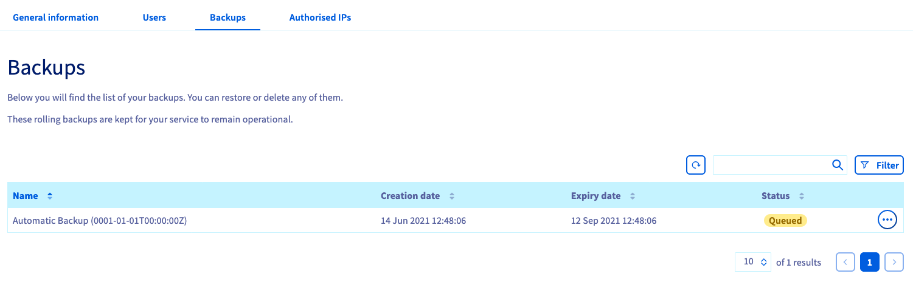
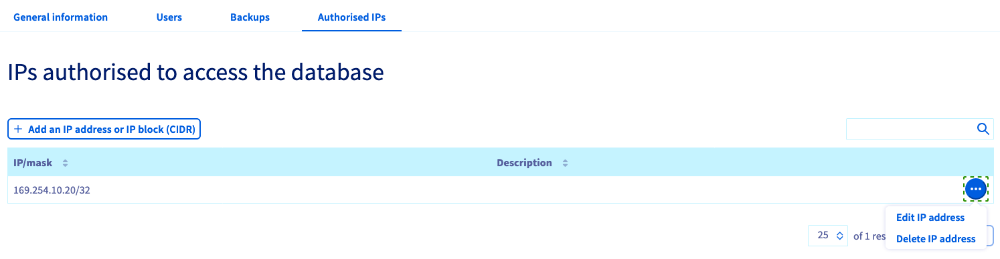
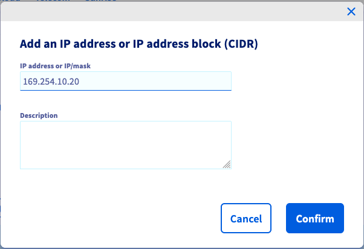

**Last updated 1st February 2022**

## Objective

The subscription and configuration details of your MongoDB databases can be managed in the OVHcloud Control Panel.

**This guide explains how to configure a MongoDB service in the OVHcloud Control Panel.**

## Requirements

- A MongoDB database service in your OVHcloud account (find the details in [this guide](https://docs.ovh.com/gb/en/publiccloud/databases/getting-started/))
- Access to the [OVHcloud Control Panel](https://www.ovh.com/auth/?action=gotomanager&from=https://www.ovh.co.uk/&ovhSubsidiary=GB)

## Instructions

Log in to your [OVHcloud Control Panel](https://www.ovh.com/auth/?action=gotomanager&from=https://www.ovh.co.uk/&ovhSubsidiary=GB) and switch to the `Public Cloud`{.action} section. After selecting your Public Cloud project, click on `Databases`{.action} in the left-hand navigation bar under **Storage**.

> [!primary]
> Note that the configuration options might be different for other database types.

### Databases overview

On the **Databases** home page, a table will list your services and their attributes.

{.thumbnail}

The button `Create a database`{.action} starts the process of ordering a [new database service](https://docs.ovh.com/gb/en/publiccloud/databases/getting-started/).

You can remove a service by clicking on the `...`{.action} button and then on `Delete`{.action}.

### General information

After selecting your service, the `General information`{.action} tab displays the technical details of your plan as well as some subscription information.

{.thumbnail}

At the bottom of the page you can find **Login information** for your database; click on the respective links to copy/paste the strings for *mongo shell* or for use with an application.

#### **Adding nodes**

Click on `Add nodes`{.action} in the **Information** box. The number of nodes you can add depends on the service plan. Please visit the [MongoDB capabilities page](https://docs.ovh.com/gb/en/publiccloud/databases/mongodb/capabilities/) for detailed information on each plan's properties.

### Managing users and roles

Switch to the tab `Users`{.action}. An admin user is pre-configured during the service installation.

{.thumbnail}

You can add more users by clicking on the button `Add user`{.action}.

{.thumbnail}

Enter a username and a password, then click `Next`{.action}. Passwords can be changed afterwards in the `Users`{.action} tab.

{.thumbnail}

In the second step, select the roles for this user from the left-hand section. Click on `Create user`{.action} when all desired roles are listed on the right-hand side.

### Using backups

Switch to the tab `Backups`{.action}. Backups will be created automatically, using a scheme based on the service plan. Please visit the [MongoDB capabilities page](https://docs.ovh.com/gb/en/publiccloud/databases/mongodb/capabilities/) for detailed information on each plan's properties.

{.thumbnail}

You can restore and delete backups via the `...`{.action} button.

### Configuring authorised IPs

> [!warning]
> For security reasons the default network configuration doesn't allow any incoming connections. It is thus critical you authorise the suitable IP addresses in order to successfully access your database.

Switch to the tab `Authorised IPs`{.action}. IP addresses must be authorised here before they can connect to your database.

{.thumbnail}

Clicking on `Add an IP address or IP address block (CIDR)`{.action} opens a new window in which you can add single IP addresses or blocks to allow access to the database.

{.thumbnail}

You can edit and retract database access via the `...`{.action} button in the IP table.

## Go further

[MongoDB capabilities](https://docs.ovh.com/gb/en/publiccloud/databases/mongodb/capabilities/)

Visit our dedicated Discord channel: <https://discord.gg/PwPqWUpN8G>. Ask questions, provide feedback and interact directly with the team that builds our databases services.

Join our community of users on <https://community.ovh.com/en/>.
