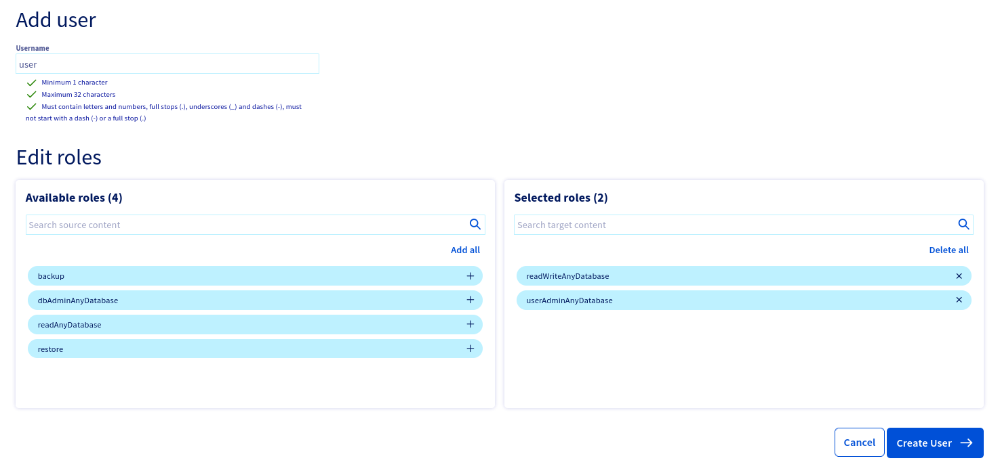
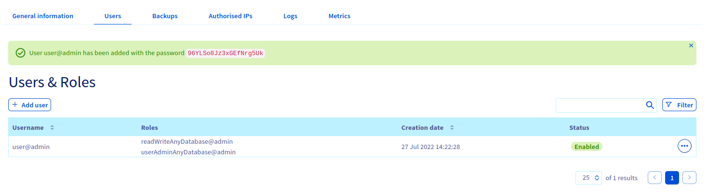
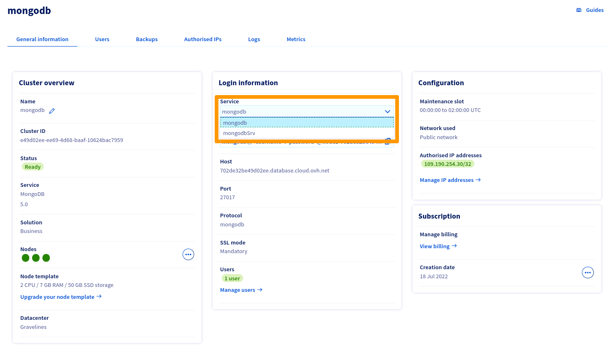
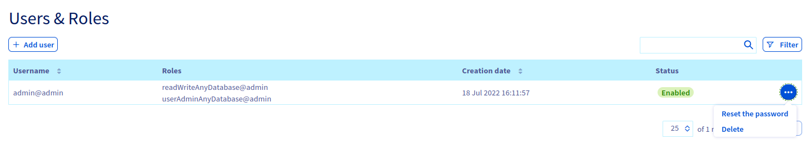

**Last updated 27<sup>th</sup> July 2022**

## Objective

Public Cloud Databases allow you to focus on building and deploying cloud applications while OVHcloud takes care of the database infrastructure and maintenance in operational conditions.

**This guide explains how to configure your MongoDB instance to accept incoming connections.**

## Requirements

- A [Public Cloud project](https://www.ovhcloud.com/es/public-cloud/) in your OVHcloud account
- Access to the [OVHcloud Control Panel](https://ca.ovh.com/auth/?action=gotomanager&from=https://www.ovh.com/world/&ovhSubsidiary=ws)
- A MongoDB database running on your OVHcloud Public Cloud Databases ([this guide](https://docs.ovh.com/us/es/publiccloud/databases/getting-started/) can help you to meet this requirement)

## Instructions

### Configure your MongoDB instance to accept incoming connections

Before making a connection, we need to verify that our MongoDB instance is correctly configured.

Log in to your [OVHcloud Control Panel](https://ca.ovh.com/auth/?action=gotomanager&from=https://www.ovh.com/world/&ovhSubsidiary=ws) and open your `Public Cloud`{.action} project. Click on `Databases`{.action} in the left-hand navigation bar and select your MongoDB instance.

#### Step 1: Verify your user roles and password

Select the `Users`{.action} tab. Verify that you have a user with sufficient rights and a configured password. If you don't remember the user's password, you can either create a new user or regenerate the password of an existing user. Be careful! By doing so you will need to update all the places where you already use this user/password pair.

We provide official MongoDB built-in roles. Please read the [official MongoDB documentation](https://docs.mongodb.com/manual/reference/built-in-roles/){.external} to select the right roles for your use case.

In our example, we will create a user called *user* with the roles *readWriteAnyDatabase* and *userAdminAnyDatabase*.

{.thumbnail}

Once created or updated, note the password then after a few seconds check to verify the user is ready and with the "Enabled" status in the OVHcloud Control Panel.

{.thumbnail}

#### Step 2: Authorise incoming connections from the MongoDB client

In this step, select the `Authorised IP's`{.action} tab (Access Control List).
By default, a Public Cloud Database does not accept any form of connection from the outside world.
This way we can help prevent intrusive connection attempts.

Click to authorise a new IP. In our case we will enter 109.190.200.59:

{.thumbnail}

> [!primary]
>
> If you want to allow any connections from the outside, you can enter the IP 0.0.0.0/0. Please use it carefully. Every IP will be authorised.
>

### Get your connection information (URI)

Select the `General Information`{.action} tab. In the **Login Information** section, copy the Service URI.

You can specify the MongoDB connection string using either:

- the Standard Connection String Format *(service: mongodb)*.
- the DNS Seed List Connection Format *(service: mongodbSrv)*.

{.thumbnail}

> [!primary]
>
> MongoDB 3.6 introduced the concept of a seed list that is specified using DNS records, specifically SRV and TXT records. This allows a client to connect to a replica set even if one of the nodes that the client specifies is unavailable.
>
> The use of SRV records eliminates the requirement for every client to pass in a complete set of state information for the cluster. Instead, a single SRV record identifies all the nodes associated with the cluster (and their port numbers) and an associated TXT record defines the options for the URI.
>
> *Learn more [here](https://www.mongodb.com/docs/manual/reference/connection-string/)*.
>

> [!tabs]
> mongodb
>> It should be similar to this when you have a single node (Essential service plan):
>> ```
>> mongodb://<username>:<password>@<hostname>/admin?tls=true
>> ```
>> And like this when you have a MongoDB cluster with multiple nodes, called a replica set (Business or Enterprise service plans):
>> ```
>> mongodb://<username>:<password>@<hostname node1>,<hostname node 2>,<hostname node 3>/admin?replicaSet=replicaset&tls=true
>> ```
> mongodbSrv
>> It should be similar to this:
>> ```
>> mongodb+srv://<username>:<password>@mongodb-d5674315-o2626ab53.database.cloud.ovh.net/admin?replicaSet=replicaset
>> ```

Select the `Users`{.action} tab to get the username or reset a user password.

{.thumbnail}

## Go further

[MongoDB capabilities](https://docs.ovh.com/us/es/publiccloud/databases/mongodb/capabilities/)

Visit the [Github examples repository](https://github.com/ovh/public-cloud-databases-examples/tree/main/databases/mongodb) to find how to connect to your database with several languages.

Visit our dedicated Discord channel: <https://discord.gg/ovhcloud>. Ask questions, provide feedback and interact directly with the team that builds our databases services.

Join our community of users on <https://community.ovh.com/en/>.
