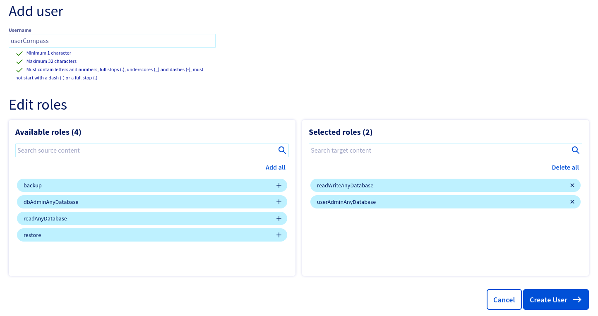
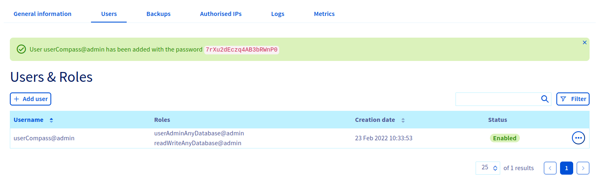
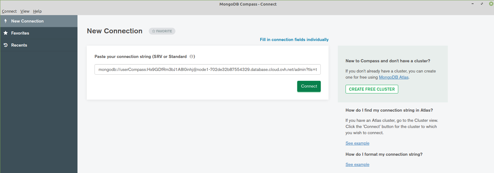
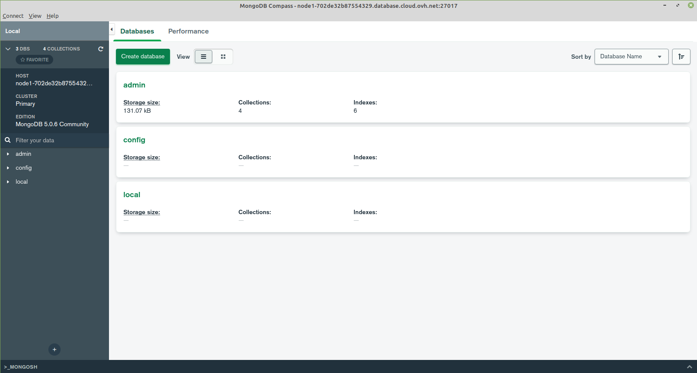

**Last updated July 18, 2022**

## Objective

Public Cloud Databases allow you to focus on building and deploying cloud applications while OVHcloud takes care of the database infrastructure and maintenance in operational conditions.

**This guide explains how to connect to a MongoDB database instance with one of the world's most famous Open Source (SSPL) management tool for MongoDB: MongoDB Compass.**

## Requirements

- Access to the [OVHcloud Control Panel](https://www.ovh.com/auth/?action=gotomanager&from=https://www.ovh.es/&ovhSubsidiary=es).
- A [Public Cloud project](https://www.ovhcloud.com/es-es/public-cloud/) in your OVHcloud account.
- An up and running Public Cloud Database for MongoDB. This guide was made with MongoDB.
- A MongoDB Compass stable version installed and public network connectivity (Internet). This guide was made in MongoDB Compass version 1.30.1.

## Concept

A MongoDB instance can be managed through multiple ways.
One of the easiest, yet powerful, is to use a Command Line Interface (CLI), as shown in our guide: [Connect to MongoDB with CLI](https://docs.ovh.com/es/publiccloud/databases/mongodb/connect-cli/) or by using programming languages, such as [PHP](https://docs.ovh.com/es/publiccloud/databases/mongodb/connect-php/) or [Python](https://docs.ovh.com/es/publiccloud/databases/mongodb/connect-python/).

Another way is to interact directly using a management tool for MongoDB: MongoDB Compass.

In order to do so, we will need to install MongoDB Compass, then configure our Public Cloud Databases for MongoDB instances to accept incoming connections, and finally configure MongoDB.

## Instructions

### Installation

Pleese follow the [official documentation](https://docs.mongodb.com/compass/current/install/) to install MongoDB Compass.

We are now ready to learn how to connect to our MongoDB instance.

### Configure your MongoDB instance to accept incoming connections

Before making a connection, we need to verify that our MongoDB instance is correctly configured.

Log in to your [OVHcloud Control Panel](https://www.ovh.com/auth/?action=gotomanager&from=https://www.ovh.es/&ovhSubsidiary=es) and open your `Public Cloud`{.action} project. Click on `Databases`{.action} in the left-hand navigation bar and select your MongoDB instance.

#### Step 1: Verify your user roles and password

Select the `Users`{.action} tab. Verify that you have a user with sufficient rights and a configured password. If you don't remember the user's password, you can either create a new user or regenerate the password of an existing user. Be careful! By doing so you will need to update all the places where you already use this user/password pair.

We provide official MongoDB built-in roles. Please read the [official MongoDB documentation](https://docs.mongodb.com/manual/reference/built-in-roles/){.external} to select the right roles for your use case.

In our example, we will create a user called *userCompass* with the roles *readWriteAnyDatabase* and *userAdminAnyDatabase*.

{.thumbnail}

Once created or updated, note the password then after a few seconds check to verify the user is ready and with the "Enabled" status in the OVHcloud Control Panel.

{.thumbnail}

#### Step 2: Authorise incoming connections from the MongoDB client

In this step, select the `Authorised IP's`{.action} tab (Access Control List).
By default, a Public Cloud Database does not accept any form of connection from the outside world.
This way we can help prevent intrusive connection attempts.

Click to authorise a new IP. In our case we will enter 109.190.200.59:

{.thumbnail}

> [!primary]
>
> If you want to allow any connections from the outside, you can enter the IP 0.0.0.0/0. Please use it carefully. Every IP will be authorised.
>

### Get your connection information (URI)

Select the `General Information`{.action} tab. In the **Login Information** section, copy the Service URI.

It should be similar to this when you have a single node (Essential service plan):

```
mongodb+srv://<username>:<password>@<service hostname>/admin?tls=true
```

And like this when you have a MongoDB cluster with multiple nodes, called a replica set (Business or Enterprise service plans):

```
mongodb+srv://<username>:<password>@<service hostname>/admin?replicaSet=replicaset&tls=true
```

### Connect with MongoDB Compass

In MongoDB Compass fill in the connection field with the `Service URI`:

{.thumbnail}

Now you are now interact with your Public Cloud Databases for MongoDB:

{.thumbnail}

> [!primary]
>
> Explore the [documentation](https://docs.mongodb.com/compass/current/) to view all the features and how to interact with your data.
>

## Go further

[MongoDB capabilities](https://docs.ovh.com/es/publiccloud/databases/mongodb/capabilities/)

[Managing a MongoDB service from the OVHcloud Control Panel](https://docs.ovh.com/es/publiccloud/databases/mongodb/managing-service/)

[Configuring vRack for Public Cloud](https://docs.ovh.com/es/public-cloud/public-cloud-vrack/)

Join our community of users on <https://community.ovh.com/en/>.

## We want your feedback!

We would love to help answer questions and appreciate any feedback you may have.

Are you on Discord? Connect to our channel at [https://discord.gg/PwPqWUpN8G](https://discord.gg/PwPqWUpN8G) and interact directly with the team that builds our databases service!
