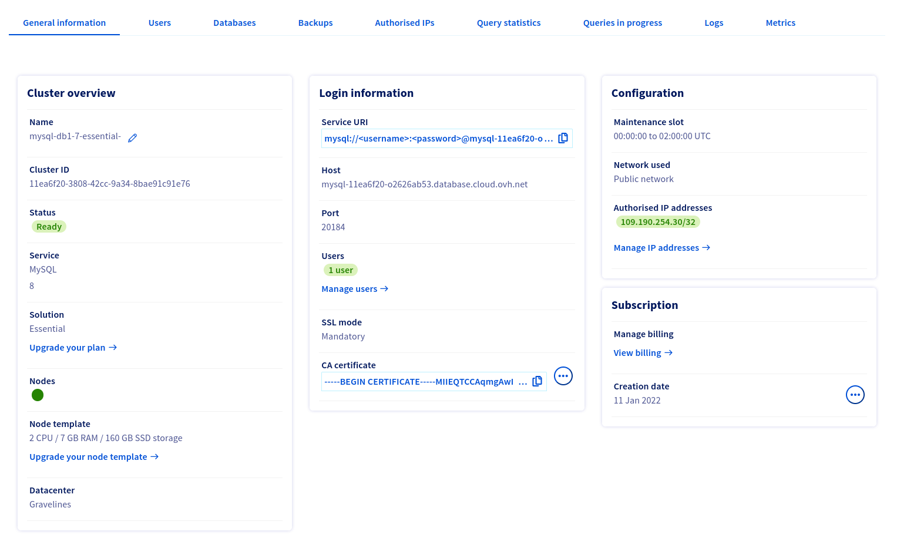

**Last updated January 14th 2022**

## Objective

Public Cloud Databases allow you to focus on building and deploying cloud applications while OVHcloud takes care of the database infrastructure and maintenance in operational conditions.

**This guide explains how to connect to a MySQL database instance with one of the world's most famous programming language: Python.**

## Requirements

- Access to the [OVHcloud Control Panel](https://ca.ovh.com/auth/?action=gotomanager&from=https://www.ovh.com/sg/&ovhSubsidiary=sg).
- A [Public Cloud project](https://www.ovhcloud.com/en-sg/public-cloud/) in your OVHcloud account.
- An up and running Public Cloud Database for MySQL.
- A Python environment with a stable version and public network connectivity (Internet). This guide was made using Python 3.9.7.

## Concept

A MySQL instance can be managed through multiple ways.
One of the easiest, yet powerful, is to use a Command Line Interface (CLI), as shown in our guide : [Connect to MySQL with CLI](https://docs.ovh.com/sg/en/publiccloud/databases/mysql/connect-cli).

Another way is to interact directly using a programming language, such as Python.
Python is one of the major programming languages in the world, especially in the Data ecosystem.

In order to do so, we will need to set up our Python environment with MySQL drivers, then configure our Public Cloud Databases for MySQL instances to accept incoming connections, and finally code in Python to perform a few example actions.

## Instructions

### Set up your Python environment

To interact with your MySQL instance using Python, your development environment needs to be configured with:

- A compatible version of Python.
- Mysql connector.


Please follow the official [MySQL Connector/Python](https://dev.mysql.com/doc/connector-python/en/){.external}. to get the latest information.


Once your Python environment is set up and you begin executing a **python --version** in your command line interface (CLI), you should see information about the version as shown below :

```python
laptop$ python3 --version
Python 3.9.7
```

In the same console, by typing a **pip list** check if **mysql-connector-python** is correctly installed :

```python
laptop$  pip list           
Package                Version
---------------------- -------
mysql-connector-python 8.0.27
pip                    20.3.4
protobuf               3.19.3
setuptools             52.0.0
wheel                  0.34.2
(...)
```

Finally, copy the IP address of your Python environment and save it for later.
If you don't know how to get your IP, please visit a website like [www.WhatismyIP.com](https://www.whatismyip.com/){.external} from your station hosting the Python environment.
In our example, we will use the (fake) IP 109.190.200.59.

We are now ready to learn how to connect to our MySQL instance !

### Configure your MySQL instance to accept incoming connections

Before making a connection, we need to verify that our MySQL instance is correctly configured.

Log in to your [OVHcloud Control Panel](https://ca.ovh.com/auth/?action=gotomanager&from=https://www.ovh.com/sg/&ovhSubsidiary=sg) and switch to `Public Cloud`{.action} in the top navigation bar. After selecting your Public Cloud project, click on `Databases`{.action} in the left-hand navigation bar, and select your MySQL instance.

#### Step 1: Verify your user roles and password

Select the `Users`{.action} tab. Verify that you have a user with sufficient rights and a configured password. If you don't remember the user's password, you can either create a new user or regenerate the password of an existing user. Be careful! By doing so you will need to update all the places where you already use this user + password pair.

This first user **avnadmin** comes with the following grants:

```sql
GRANT SELECT, INSERT, UPDATE, DELETE, CREATE, DROP, RELOAD, PROCESS, REFERENCES, INDEX, ALTER, SHOW DATABASES, CREATE TEMPORARY TABLES, LOCK TABLES, EXECUTE, REPLICATION SLAVE, REPLICATION CLIENT, CREATE VIEW, SHOW VIEW, CREATE ROUTINE, ALTER ROUTINE, CREATE USER, EVENT, TRIGGER ON *.* TO "avnadmin"@"%" WITH GRANT OPTION

GRANT REPLICATION_APPLIER,ROLE_ADMIN ON *.* TO "avnadmin"@"%" WITH GRANT OPTION
```

We rely on official MySQL grants and privileges. You can manage them yourself via CLI or code.
So far, **user grants and privileges management is not supported via OVHcloud Control Panel neither OVHcloud API**.

Please read the [official MySQL documentation](https://dev.mysql.com/doc/refman/8.0/en/privileges-provided.html){.external} to select the right grants and privileges for your use-case.


In our example, we will simply reset the **avnadmin** password.

Once created or updated, the user has to be ready and have the status "Enabled" in the Control Panel.

{.thumbnail}


#### Step 2: Authorize incoming connections from the MySQL client

In this step, select the `Authorised IP's`{.action} tab (Access Control List).
By default, a Public Cloud Database does not accept any form of connection from the outside world.
This way we can help prevent intrusive connection attempts.

Click to authorize a new IP, and enter the previously found IP of your Python environment. In our case we will enter 109.190.200.59.

{.thumbnail}

> [!primary]
>
> If you want to allow any connections from the outside, you can enter the IP 0.0.0.0/0. Please use it carefully. Every IP will be authorized.
>

### Connect with Python

#### Collect required informations

Select the `General information`{.action} tab to find the required login information



#### Using MySQL Connector

MySQL Connector/Python enables Python programs to access MySQL databases, using an API that is compliant with the [Python Database API Specification v2.0 (PEP 249)](http://www.python.org/dev/peps/pep-0249/){.external}.

In your Python environment, let's try a connection.

```python
# Note this example is valid for Python v2 and v3

from __future__ import print_function
import sys
import mysql.connector
from mysql.connector.constants import ClientFlag

config = {
    'user':'avnadmin',
    'password':'K93xxxxxxxxxxaBp',
    'host':'mysql-11xxxx20-o2xxxxb53.database.cloud.ovh.net',
    'port':'20184'
}

cnx = mysql.connector.connect(**config)
cur = cnx.cursor(buffered=False)
cur.execute("SHOW GLOBAL STATUS LIKE 'Ssl_cipher'")
print(cur.fetchone())
cur.close()
cnx.close()
```

After executing your Python code, result shown in the CLI should be like this :

```python
('Ssl_cipher', 'TLS_AES_256_GCM_SHA384')
```

If not, your CLI should give you more details about the issue, for example :

- *Authentication failed* : could be an error with your user login or password;
- *nodename nor servname provided, or not known* : could be a wrongly typed hostname;
- *Connection reset by peer* : usually due to connection without secure TLS mode. use *tls=true* parameter.

## Go further

Visit our dedicated Discord channel: <https://discord.gg/PwPqWUpN8G>. Ask questions, provide feedback and interact directly with the team that builds our databases services.

Join our community of users on <https://community.ovh.com/en/>.
