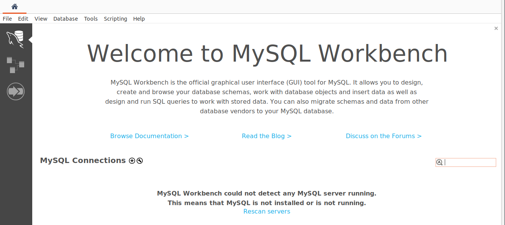
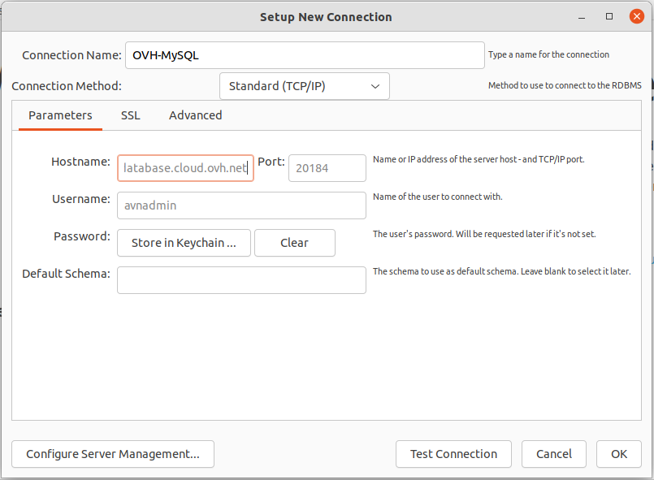
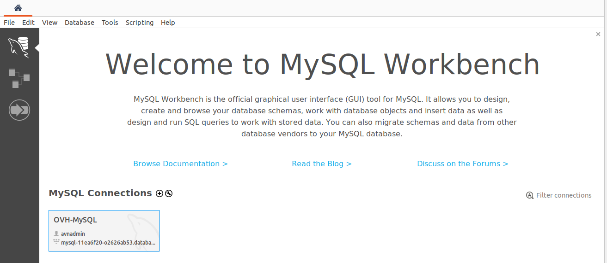

**Last updated 8th March 2022**

## Objective

Public Cloud Databases allow you to focus on building and deploying cloud applications while OVHcloud takes care of the database infrastructure and maintenance in operational conditions.

**This guide explains how to connect to a MySQL database instance with MySQL Workbench.**

## Requirements

- Access to the [OVHcloud Control Panel](https://ca.ovh.com/auth/?action=gotomanager&from=https://www.ovh.com.au/&ovhSubsidiary=au)
- A [Public Cloud project](https://www.ovhcloud.com/en-au/public-cloud/) in your OVHcloud account
- A MySQL database running on your OVHcloud Public Cloud Databases ([this guide](https://docs.ovh.com/au/en/publiccloud/databases/getting-started/) can help you to meet this requirement)
- [Configure your MySQL instance](https://docs.ovh.com/au/en/publiccloud/databases/mysql/configure-mysql-instance/) to accept incoming connections
- A MySQL Workbench stable version installed and public network connectivity (Internet). *This guide was made with MySQL Workbench version 8.0.28*.

## Concept

A MySQL instance can be managed through multiple ways.
One of the easiest, yet powerful, is to use a Command Line Interface (CLI), as shown in our guide: [Connect to MySQL with CLI](https://docs.ovh.com/au/en/publiccloud/databases/mysql/connect-cli/) or by using programming languages, such as [PHP](https://docs.ovh.com/au/en/publiccloud/databases/mysql/connect-php/) or [Python](https://docs.ovh.com/au/en/publiccloud/databases/mysql/connect-python/).

Another way is to interact directly using a management tool like MySQL Workbench.

## Instructions

### Installation

MySQL Workbench can be downloaded for free at the following link: <https://dev.mysql.com/downloads/workbench/>.

Once you have downloaded and installed it, follow the steps below to set up a remote connection to your MySQL instance.

### Connect with MySQL Workbench

#### Configuration

Click `New Connection`{.action}.

In the **Setup New Connection** dialog box, fill in the `Parameters`{.action} tab form with the previously collected information.

Store the password for connection in keychain.

Switch to `SSL`{.action} tab and set `Use SSL` to `Require`.

Once done, select your new connection.

Congratulations, in the `Schemas`{.action} tab, you will see your databases.

> [!primary]
>
> Once connected, MySQL Workbench facilitates many actions such as querying your databases and managing used or even import data. Please read the official documentation to discover the whole feature list: <https://www.mysql.com/products/workbench/features.html>.
>

## Go further

Visit our dedicated Discord channel: <https://discord.gg/PwPqWUpN8G>. Ask questions, provide feedback and interact directly with the team that builds our databases services.

Join our community of users on <https://community.ovh.com/en/>.
