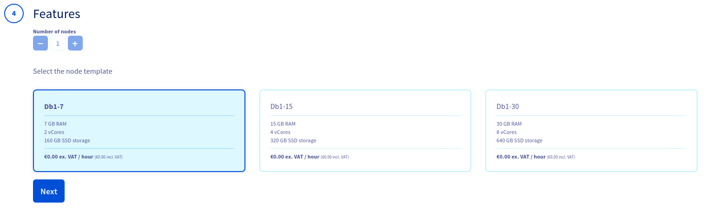
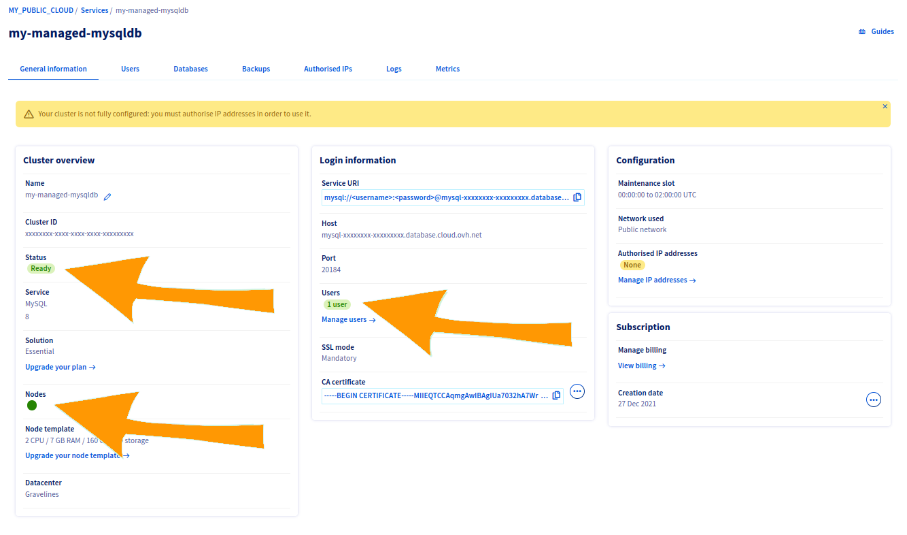

<style>
 pre {
     font-size: 14px;
 }
 pre.console {
   background-color: #300A24;
   color: #ccc;
   font-family: monospace;
   padding: 5px;
   margin-bottom: 5px;
 }
 pre.console code {
   border: solid 0px transparent;
   font-family: monospace !important;
   font-size: 0.75em;
   color: #ccc;
 }
 .small {
     font-size: 0.75em;
 }
</style>

**Last updated 30th December 2021.**

## Objective

In this tutorial, we are going to show you how to connect your OVHcloud Managed Kubernetes Service to an OVHcloud Managed MySQL database.

> [!warning]
>
> OVHcloud provides services for which you are responsible for their configuration and management. You are therefore responsible for their proper functioning.
>
> This tutorial is designed to help you as much as possible with common tasks. If you are having difficulty performing these actions, please contact a specialized service provider and/or discuss it with our community of users on <https://community.ovh.com/en/>. OVHcloud can't provide you with technical support in this regard.
>

## Before you begin

This tutorial presupposes that you already have a working OVHcloud Managed Kubernetes cluster, and some basic knowledge of how to operate it. If you want to know more on those topics, please look at the [OVHcloud Managed Kubernetes Service Quickstart](https://docs.ovh.com/gb/en/kubernetes/deploying-hello-world/).

You need to have [Helm](https://docs.helm.sh/){.external} installed on your workstation and your cluster. Please refer to the [How to install Helm on OVHcloud Managed Kubernetes Service](https://docs.ovh.com/gb/en/kubernetes/installing-helm/) tutorial.

Finally, you need to be able to order a database solution in the OVHcloud Control Panel, as explained in our [Getting started with Public Cloud Databases](https://docs.ovh.com/gb/en/publiccloud/databases/getting-started/) guide.

## Instructions

### Create a MySQL database

#### Subscribing to the service

Log in to your [OVHcloud Control Panel](https://www.ovh.com/auth/?action=gotomanager&from=https://www.ovh.co.uk/&ovhSubsidiary=GB) and switch to `Public Cloud`{.action} in the top navigation bar. After selecting your Public Cloud project, click on `Databases`{.action} in the left-hand navigation bar under **Storage**.

Click on the `Create a database instance`{.action} button. (`Create a service`{.action} if your project already contains databases.)

#### Step 1: Select MySQL database

Click on the MySQL database and then select the version to install from the drop-down menu. Click `Next`{.action} to continue.

{.thumbnail}

#### Step 2: Select a solution

In this step, choose an appropriate service plan. You will be able to upgrade the plan after creation.

{.thumbnail}

Please visit the [capabilities page](https://docs.ovh.com/gb/en/publiccloud/databases/mysql/capabilities/) for detailed information on each plan's properties.

Click `Next`{.action} to continue.

#### Step 3: Select a location

Choose the geographical region of the data center in which your database will be hosted.

{.thumbnail}

Click `Next`{.action} to continue.

#### Step 4: Configure database nodes

You can choose the node model in this step. The initial and maximum numbers of nodes depend on the chosen solution in step 2.

{.thumbnail}

Please visit the [capabilities page](https://docs.ovh.com/gb/en/publiccloud/databases/mysql/capabilities/) for detailed information on the hardware resources and other properties of the MySQL database installation.

Take note of the pricing information and click `Next`{.action} to continue.

#### Step 5: Configure your options

You can name your database in this step.

{.thumbnail}

#### Step 6: Summary and confirmation

The last section will show a summary of your order as well as the API equivalent of creating this database instance with the [OVHcloud API](https://docs.ovh.com/gb/en/api/first-steps-with-ovh-api/).

{.thumbnail}

Within a few minutes your new database service will be deployed. Messages in the OVHcloud Control Panel will inform you when the database is ready to use.

Your database is ready when cluster status is "Ready", node status is green, and number of users is set to "1 user".

{.thumbnail}

### Authorise your OVHcloud Managed Kubernetes cluster

> [!warning]
> For security reasons the default network configuration doesn't allow any incoming connections.
> To allow access from your OVHcloud Managed Kubernetes service to the database, cluster nodes IPs have to be authorised.
> Adding Kubernetes cluster nodes IPs to the authorised list is not recommended on production environnment, and must only be done for testing.
> Soon, we will write a guide on using vrack, and how to interconnect your various managed services.

#### Add Kubernetes cluster nodes IPs to the DB authorised list

Get your Kubernetes cluster nodes IP addresses from the Compute / Instances menu on the left.

{.thumbnail}

Following the related documentation on how to [authorise the suitable IP addresses](https://docs.ovh.com/gb/en/publiccloud/databases/mongodb/managing-service/#configuring-authorised-ips), add your Kubernetes cluster node IPs to the authorised list.

{.thumbnail}

### Test connection from Kubernetes cluster to MySQL DataBase

An easy and quick way to test the connection is to start a MySQL client inside a pod, and use the Command Line Interface (CLI) to connect to the db.

#### Start a MySQL client inside a pod

```sh
kubectl run mysql-client --image=mysql:8 -it --rm --restart=Never -- /bin/bash
```

You are now inside the pod you just created on your cluster, you can simply use the MySQL CLI to connect to your managed MySQL database.

The useful parameters are:

- The db Host, the db Port
    - Get them from the "General Information tab"

- The db Name
    - Get it from the "Databases" tab, usually "defaultdb"

- The db User
    - Get it from the "Users" tab, usually "avnadmin"

- The db Password
    - Get it after you reset it.

{.thumbnail}

Now connect to the database with the following command

```sh
mysql -uavnadmin -pxxxxxxxxxxxxxx -hmysql-xxxxxxxx-xxxxxxxxx.database.cloud.ovh.net -P20184 defaultdb
```

<pre class="console"><code>root@mysql-client:/# mysql -uavnadmin -pxxxxxxxxxxxxxx -hmysql-xxxxxxxx-xxxxxxxxx.database.cloud.ovh.net -P20184 defaultdb
mysql: [Warning] Using a password on the command line interface can be insecure.
Welcome to the MySQL monitor.  Commands end with ; or \g.
Your MySQL connection id is 3603
Server version: 8.0.26 Source distribution

Copyright (c) 2000, 2021, Oracle and/or its affiliates.

Oracle is a registered trademark of Oracle Corporation and/or its
affiliates. Other names may be trademarks of their respective
owners.

Type 'help;' or '\h' for help. Type '\c' to clear the current input statement.

mysql></code></pre>

Setup is done, your Managed MySQL database is fully operational, let's go further and use it with WordPress hosted in Kubernetes.

### Installing the WordPress Helm chart

For this tutorial we are using the [WordPress Helm chart](https://github.com/bitnami/charts/tree/master/bitnami/wordpress){.external} found on [Bitnami repository](https://github.com/bitnami/charts/){.external}. The chart is fully configurable, but here we are using the default configuration, with only the minimal set of customization to make it work well on OVHcloud Managed Kubernetes Service.

#### Pre-requisites

As described in the [Installing WordPress on OVHcloud Managed Kubernetes](https://docs.ovh.com/gb/en/kubernetes/installing-wordpress/#installing-the-wordpress-helm-chart) tutorial, remove the default storage class and install the new one.

```sh
kubectl delete storageclasses.storage.k8s.io csi-cinder-high-speed

kubectl apply -f https://raw.githubusercontent.com/ovh/docs/develop/pages/platform/kubernetes-k8s/fix-persistent-volumes-permissions/files/fixed-cinder-high-speed-storage-class.yaml
```

#### Customizing your install

By default, the Helm chart installs the WordPress and a MariaDB on the Kubernetes cluster. As you want to use your OVHcloud Managed MySQL database, you need to customize the Helm installation by setting the URL, user and password of your database.

In order to customize your install, without having to leave the simplicity of using Helm and the WordPress Helm chart, you can simply set some of the [WordPress chart configurable parameters](https://github.com/helm/charts/tree/master/stable/wordpress#configuration){.external}.

Then you can add it to your `helm install` command with the `--set` option (`--set param1=value1,param2=value2`)

Options to set for accessing the Managed MySQL database are:

```sh
mariadb.enabled=false
externalDatabase.host=mysql-abcdefgh-ijklmnopq.database.cloud.ovh.net
externalDatabase.user=avnadmin
externalDatabase.password=mYStrongPasswOrdHere
externalDatabase.database=defaultdb
externalDatabase.port=20184
```

This will install the needed elements (a WordPress pod for the webserver with the Worpdress PHP code),
allocate the persistent volumes and initialize the services. And at the end, it will give you the connection parameters for your new WordPress:

<pre class="console"><code>$ helm install my-wordpress bitnami/wordpress --set allowOverrideNone=true,mariadb.enabled=false,externalDatabase.host=mysql-abcdefgh-ijklmnopq.database.cloud.ovh.net,externalDatabase.user=avnadmin,externalDatabase.password=mYStrongPasswOrdHere,externalDatabase.database=defaultdb,externalDatabase.port=20184
NAME: my-wordpress
LAST DEPLOYED: Thu Dec 23 15:49:33 2021
NAMESPACE: default
STATUS: deployed
REVISION: 1
TEST SUITE: None
NOTES:
CHART NAME: wordpress
CHART VERSION: 12.2.7
APP VERSION: 5.8.2

** Please be patient while the chart is being deployed **

Your WordPress site can be accessed through the following DNS name from within your cluster:

    my-wordpress.default.svc.cluster.local (port 80)

To access your WordPress site from outside the cluster follow the steps below:

1. Get the WordPress URL by running these commands:

  NOTE: It may take a few minutes for the LoadBalancer IP to be available.
        Watch the status with: 'kubectl get svc --namespace default -w my-wordpress'

   export SERVICE_IP=$(kubectl get svc --namespace default my-wordpress --template "{{ range (index .status.loadBalancer.ingress 0) }}{{.}}{{ end }}")
   echo "WordPress URL: http://$SERVICE_IP/"
   echo "WordPress Admin URL: http://$SERVICE_IP/admin"

2. Open a browser and access WordPress using the obtained URL.  

3. Login with the following credentials below to see your blog:

  echo Username: user
  echo Password: $(kubectl get secret --namespace default my-wordpress -o jsonpath="{.data.wordpress-password}" | base64 --decode)

</code></pre>

> [!warning]
> Make sure your MySQL defaultdb database is clean before running the helm install command. If a previous installation is detected, settings such as user and password will not be updated, so the configuration inside of the Kubernetes cluster will not match that of the database.

As the instructions say, you will need to wait a few moments to get the `LoadBalancer` URL.
You can test if the `LoadBalancer` is ready using:

```sh
kubectl get svc --namespace default -w my-wordpress
```

After some minutes, you will get the `LoadBalancer` URL:

<pre class="console"><code>$ kubectl get svc --namespace default -w my-wordpress
NAME           TYPE           CLUSTER-IP     EXTERNAL-IP      PORT(S)                      AGE
my-wordpress   LoadBalancer   10.3.193.143   135.125.83.116   80:32027/TCP,443:32293/TCP   4m30s
</code></pre>

Then you can follow the instructions to get the Admin URL:

<pre class="console"><code>$ export SERVICE_IP=$(kubectl get svc --namespace default my-wordpress --template "{{ range (index .status.loadBalancer.ingress 0) }}{{.}}{{ end }}")
$ echo "WordPress URL: http://$SERVICE_IP/"
WordPress URL: http://135.125.83.116/
$ echo "WordPress Admin URL: http://$SERVICE_IP/admin"
WordPress Admin URL: http://135.125.83.116/admin
</code></pre>

And putting the URL in your browser will take you to the new blog:

{.thumbnail}

You can also use the instructions given by the `helm install` command to get the default username and password for your blog.

<pre class="console"><code>$ echo Username: user
Username: user
$ echo Password: $(kubectl get secret --namespace default my-wordpress -o jsonpath="{.data.wordpress-password}" | base64 --decode)
Password: GSPSIXwGok
</code></pre>

{.thumbnail}

You now have a working WordPress on your OVHcloud Managed Kubernetes Service, storing data on your OVHcloud Managed MySQL, congratulations!

### Cleaning up

To clean up your cluster, simply use Helm to delete your WordPress blog.

```sh
helm uninstall my-wordpress
```

It will delete your WordPress and its associated resources from your cluster:

<pre class="console"><code>$ helm delete my-wordpress
release "my-wordpress" uninstalled
</code></pre>

## We want your feedback!

We would love to help answer questions and appreciate any feedback you may have.

Are you on Discord? Connect to our channel at <https://discord.gg/PwPqWUpN8G> and interact directly with the team that builds our databases service!
