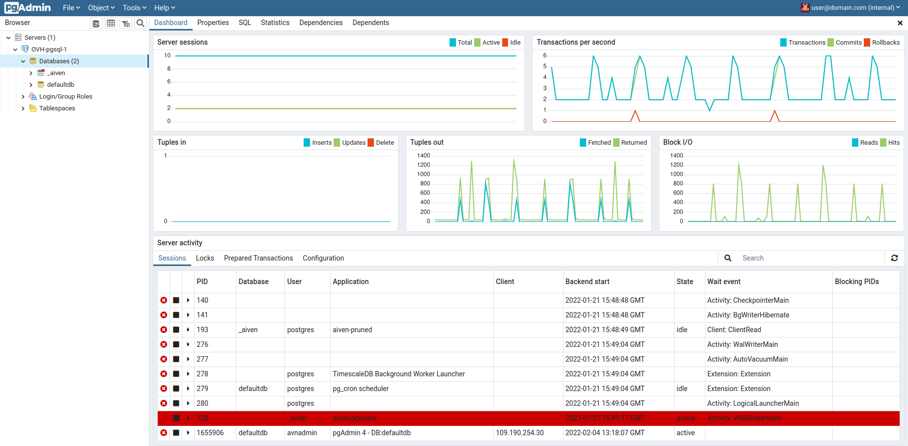

**Last updated 4th April, 2022**

## Objective

Public Cloud Databases allow you to focus on building and deploying cloud applications while OVHcloud takes care of the database infrastructure and maintenance in operational conditions.

**This guide explains how to connect to a PostgreSQL database instance with one of the world's most famous Open Source management tool for PostgreSQL: pgAdmin.**

## Requirements

- Access to the [OVHcloud Control Panel](https://www.ovh.com/auth/?action=gotomanager&from=https://www.ovh.com/fr/&ovhSubsidiary=fr).
- A [Public Cloud project](https://www.ovhcloud.com/fr/public-cloud/) in your OVHcloud account.
- A PostgreSQL database running on your OVHcloud Public Cloud Databases ([this guide](https://docs.ovh.com/fr/publiccloud/databases/getting-started/) can help you to meet this requirement)
- [Configure your PostgreSQL instance](https://docs.ovh.com/fr/publiccloud/databases/postgresql/configure-postgresql-instance/) to accept incoming connections
- A pgAdmin stable version installed and public network connectivity (Internet). This guide was made in pgAdmin 4 version 6.4.

## Concept

A PostgreSQL instance can be managed through multiple ways.
One of the easiest, yet powerful, is to use a Command Line Interface (CLI), as shown in our guide: [Connect to PostgreSQL with CLI](https://docs.ovh.com/fr/publiccloud/databases/postgresql/connect-cli/) or by using programming languages, such as [PHP](https://docs.ovh.com/fr/publiccloud/databases/postgresql/connect-php/) or [Python](https://docs.ovh.com/fr/publiccloud/databases/postgresql/connect-python/).

Another way is to interact directly using a management tool for PostgreSQL: pgAdmin.

In order to do so, we will need to install pgAdmin, then configure our Public Cloud Databases for PostgreSQL instances to accept incoming connections, and finally configure pgAdmin 4.

## Instructions

### Installation

To interact with your PostgreSQL instance with pgAdmin 4 you need to install it.

Please follow the official [pgAdmin](https://www.pgadmin.org/download/){.external} to get the latest information.

We are now ready to learn how to connect to our PostgreSQL instance.

### Connect with pgAdmin 4

#### Configuration

Once logged in pgAdmin, from the Servers dashboard view select `Add new server`{.action}.

In the **Create - Server** dialog of the `General`{.action} tab, fill in the Name field.

Then select the `Connection`{.action} tab and fill in the following fields with the collected credentials:

- Host
- Port
- Maintenance database
- Username
- Password

Finally, select the `SSL`{.action} tab and set the **SSL Mode** to **Require**.

> [!primary]
>
> If needed you can adjust the connection timeout in the `Advanced`{.action} tab.
>

Once saved, select your server in the servers list on the left. In the Dashboard view, you can observe that the connection is active:

> [!primary]
>
> pgAdmin has [useful functions](https://pgadmin.org/features){.external} such as:
>
> - [Backup & Restore](https://www.pgadmin.org/docs/pgadmin4/latest/backup_and_restore.html){.external} a single table, a schema, or a complete database
> - [Manage Roles](https://www.pgadmin.org/docs/pgadmin4/latest/role_dialog.html){.external}
>

## Go further

Visit the [Github examples repository](https://github.com/ovh/public-cloud-databases-examples/tree/main/databases/postgresql) to find how to connect to your database with several languages.

Visit our dedicated Discord channel: <https://discord.gg/PwPqWUpN8G>. Ask questions, provide feedback and interact directly with the team that builds our databases services.

Join our community of users on <https://community.ovh.com/en/>.
