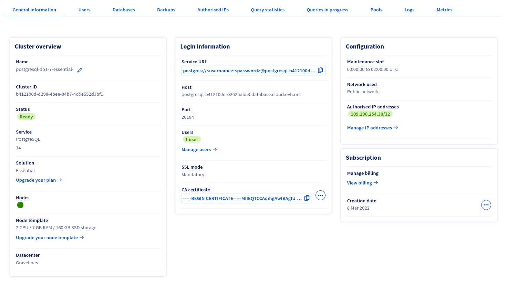
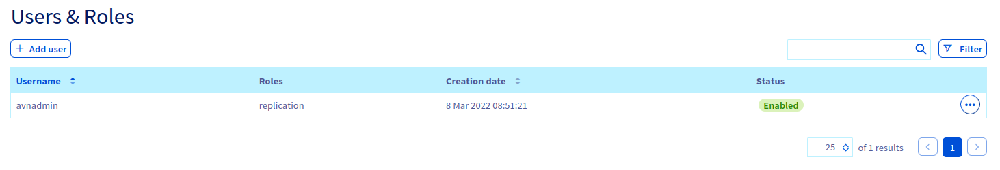

**Last updated 4<sup>th</sup> April, 2022**

## Objective

Public Cloud Databases allow you to focus on building and deploying cloud applications while OVHcloud takes care of the database infrastructure and maintenance in operational conditions.

**This guide explains how to configure your PostgreSQL instance to accept incoming connections.**

## Requirements

- A [Public Cloud project](https://www.ovhcloud.com/asia/public-cloud/) in your OVHcloud account
- Access to the [OVHcloud Control Panel](https://ca.ovh.com/auth/?action=gotomanager&from=https://www.ovh.com/asia/&ovhSubsidiary=asia)
- A PostgreSQL database running on your OVHcloud Public Cloud Databases ([this guide](https://docs.ovh.com/asia/en/publiccloud/databases/getting-started/) can help you to meet this requirement)

## Instructions

### Configure your PostgreSQL instance to accept incoming connections

Before making a connection, we need to verify that our PostgreSQL instance is correctly configured.

Log in to your [OVHcloud Control Panel](https://ca.ovh.com/auth/?action=gotomanager&from=https://www.ovh.com/asia/&ovhSubsidiary=asia) and open your `Public Cloud`{.action} project. Click on `Databases`{.action} in the left-hand navigation bar and select your PostgreSQL instance.

#### Step 1: Verify your user roles and password

Select the `Users`{.action} tab. Verify that you have a user with sufficient rights and a configured password. If you don't remember the user's password, you can either create a new user or regenerate the password of an existing user. Be careful! By doing so you will need to update all the places where you already use this user/password pair.

This first user **avnadmin** comes with the following privileges:

```console
  LOGIN
  NOSUPERUSER
  INHERIT
  CREATEDB
  CREATEROLE
  REPLICATION
```

We rely on official PostgreSQL roles and privileges. You can manage them yourself via CLI or code.
So far, **user grants and privileges management are not supported via the OVHcloud Control Panel or the OVHcloud API**.

Please read the [official PostgreSQL documentation](https://www.postgresql.org/docs/current/database-roles.html){.external} to select the right roles for your use case.

To simply reset the **avnadmin** password, click on the `...`{.action} on the right of user, then on `Reset the password`{.action}.

{.thumbnail}

To create a new user, click on `Add User`{.action}, fill the form, then click on the `Create User`{.action}

{.thumbnail}

Once created or updated, the user has to be ready and have the status "Enabled" in the Control Panel.

#### Step 2: Authorise incoming connections from the PostgreSQL client

In this step, select the `Authorised IP's`{.action} tab (Access Control List).
By default, a Public Cloud Database does not accept any form of connection from the outside world.
This way we can help prevent intrusive connection attempts.

Click to authorise a new IP, and enter the IP of your pgAdmin environment. In our case we will enter 109.190.200.59.

{.thumbnail}

> [!primary]
>
> If you want to allow connections from the outside, you can enter the IP 0.0.0.0/0. Please use it carefully.
>


#### Collect required information

Select the `General information`{.action} tab to find the required login credentials in the `Login informations` section.

{.thumbnail}

Select the `Databases`{.action} tab to get the database name.

{.thumbnail}

Select the `Users`{.action} tab to get the username.

{.thumbnail}

## Go further

Visit the [Github examples repository](https://github.com/ovh/public-cloud-databases-examples/tree/main/databases/postgresql) to find how to connect to your database with several languages.

Visit our dedicated Discord channel: <https://discord.gg/ovhcloud>. Ask questions, provide feedback and interact directly with the team that builds our databases services.

Join our community of users on <https://community.ovh.com/en/>.
