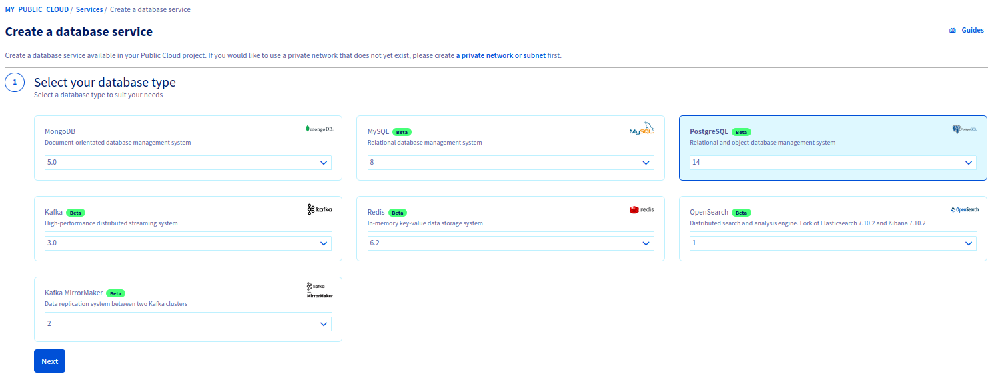
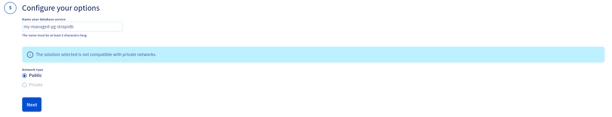

<style>
 pre {
     font-size: 14px;
 }
 pre.console {
   background-color: #300A24;
   color: #ccc;
   font-family: monospace;
   padding: 5px;
   margin-bottom: 5px;
 }
 pre.console code {
   border: solid 0px transparent;
   font-family: monospace !important;
   font-size: 0.75em;
   color: #ccc;
 }
 .small {
     font-size: 0.75em;
 }
</style>

**Last updated 11th January 2021.**

## Objective

In this tutorial, we are going to show you how to build a [Strapi](https://strapi.io/){.external} application using the OVHcloud managed [PostgreSQL](https://www.postgresql.org/){.external} database [service](https://www.ovhcloud.com/fr-ca/public-cloud/postgresql/).

> [!warning]
>
> OVHcloud provides services for which you are responsible for their configuration and management. You are therefore responsible for their proper functioning.
>
> This tutorial is designed to help you as much as possible with common tasks. If you are having difficulty performing these actions, please contact a specialized service provider and/or discuss it with our community of users on <https://community.ovh.com/>. OVHcloud can't provide you with technical support in this regard.
>

## Before you begin

You need to be able to order a database solution in the OVHcloud Control Panel, as explained in our [Getting started with Public Cloud Databases](https://docs.ovh.com/ca/fr/publiccloud/databases/getting-started/) guide.

As [Strapi](https://strapi.io/){.external} is written in Javascript, packages like [nodejs](https://nodejs.org/){.external}, [nvm](https://github.com/nvm-sh/nvm){.external} and [yarn](https://classic.yarnpkg.com/en/){.external} are necessary for this tutorial.

## Instructions

### Create a PostgreSQL database

#### Subscribing to the service

Log in to your [OVHcloud Control Panel](https://ca.ovh.com/auth/?action=gotomanager&from=https://www.ovh.com/ca/fr/&ovhSubsidiary=qc) and switch to `Public Cloud`{.action} in the top navigation bar. After selecting your Public Cloud project, click on `Databases`{.action} in the left-hand navigation bar under **Storage**.

Click on the `Create a database instance`{.action} button. (`Create a service`{.action} if your project already contains databases.)

#### Step 1: Select PostgreSQL database

Click on the PostgreSQL database and then select the version to install from the drop-down menu.

{.thumbnail}

Click `Next`{.action} to continue.

#### Step 2: Select a solution

In this step, choose an appropriate service plan. You will be able to upgrade the plan after creation.

{.thumbnail}

Please visit the [capabilities page](https://docs.ovh.com/ca/fr/publiccloud/databases/postgresql/capabilities/) for detailed information on each plan's properties.

Click `Next`{.action} to continue.

#### Step 3: Select a location

Choose the geographical region of the data center in which your database will be hosted.

{.thumbnail}

Click `Next`{.action} to continue.

#### Step 4: Configure database nodes

You can choose the node model in this step. The initial and maximum numbers of nodes depend on the chosen solution in step 2.

{.thumbnail}

Please visit the [capabilities page](https://docs.ovh.com/ca/fr/publiccloud/databases/postgresql/capabilities/) for detailed information on the hardware resources and other properties of the MySQL database installation.

Take note of the pricing information and click `Next`{.action} to continue.

#### Step 5: Configure your options

You can name your database in this step.

{.thumbnail}

Click `Next`{.action} to continue.

#### Step 6: Summary and confirmation

The last section will show a summary of your order as well as the API equivalent of creating this database instance with the [OVHcloud API](https://docs.ovh.com/ca/fr/api/first-steps-with-ovh-api/).

{.thumbnail}

Click `Create a database service`{.action} to continue.

Within a few minutes your new database service will be deployed. Messages in the OVHcloud Control Panel will inform you when the database is ready to use.

Your database is ready when cluster status is "Ready", node status is green, and number of users is set to "1 user".

{.thumbnail}

### Authorize your IP address

> [!warning]
> For security reasons the default network configuration doesn't allow any incoming connections.
> To allow access from your application or development environment to your PostgreSQL database service, you must add your IP addresses to the service authorized list.

#### Add your IPs to the DB authorized list

Following the related documentation on how to [authorize the suitable IP addresses](https://docs.ovh.com/ca/fr/publiccloud/databases/mongodb/managing-service/#configuring-authorized-ips), add your IPs to the authorized list.

{.thumbnail}

### Test connection to the PostgreSQL DataBase

A quick and easy way to test the connection is to use the Postgre Command Line Interface (CLI) [psql](https://docs.postgresql.fr/14/app-psql.html){.external}.

> 💡 Tip : If you are familiar with [Docker](https://www.docker.com/){.external} or [Kubernetes](https://kubernetes.io/){.external}, you can use the psql tool inside a postgres Docker [image](https://hub.docker.com/_/postgres){.external} instead of installing the tool locally.
>
> Examples :
>
> ```
> kubectl run postgres-client --image=postgres:latest -it --rm --restart=Never -- /bin/bash
> ```
>
> or
>
> ```
> docker run -it --rm postgres /bin/bash
> ```
>

#### Connect to the database

The useful parameters are:

- The db Host, the db Port
    - Get them from the "General Information tab"
- The db Name
    - Get it from the "Databases" tab, usually "defaultdb"
- The db User
    - Get it from the "Users" tab, usually "avnadmin"
- The db Password
    - Get it after you reset it.

{.thumbnail}

Now connect to the database with the following command

```sh
psql --dbname=defaultdb  --host=postgresql-ab1cd2ef-gh1ij2kl3.database.cloud.ovh.net --port=20184 --username=avnadmin  --password
```

Enter the password and press `Enter`{.action}.

<pre class="console"><code>$ psql --dbname=defaultdb  --host=postgresql-ab1cd2ef-gh1ij2kl3.database.cloud.ovh.net --port=20184 --username=avnadmin  --password
Password:
psql (14.1 (Debian 14.1-1.pgdg110+1))
SSL connection (protocol: TLSv1.3, cipher: TLS_AES_256_GCM_SHA384, bits: 256, compression: off)
Type "help" for help.

defaultdb=>
</code></pre>

Setup is done, your Managed PostgreSQL database is fully operational, let's go further and use it with [Strapi](https://strapi.io/){.external}.

### Before you begin, prepare your environment

What you need here is to check your `nodejs` and `yarn` versions.
According to the official documention on [GitHub](https://github.com/strapi/strapi){.external}, check that your existent nodejs installation matches with "NodeJS >= 12 <= 16".

> [!warning]
> No specific version of yarn is specified, this tutorial was made with the 1.22.17 one.

You can follow these different tutorials if you need to install some of the tools:

- [nodejs](https://nodejs.org/en/download/package-manager/){.external}
- [nvm](https://github.com/nvm-sh/nvm){.external}
- [yarn](https://classic.yarnpkg.com/lang/en/docs/install/){.external}

### Declare the nodejs version

We want to use the latest LTS version of nodejs, so inside your development environment, use this command:

```sh
nvm use 16.13.1
```

<pre class="console"><code>$ nvm use 16.13.1
Now using node v16.13.1 (npm v8.1.2)
</code></pre>

### Setup a new instance of Strapi

Strapi offers a simple way to install its product, with yarn.
Run the following command in a terminal:

```sh
yarn create strapi-app my-strapi
```

You will be prompted to choose between the Quickstart or Custom method, select `Custom`{.action} and press `Enter`{.action}.
If you choose the Quickstart one, default parameters will be applied and a server will automatically start.

<pre class="console"><code>$ yarn create strapi-app my-strapi
yarn create v1.22.17
warning package.json: No license field
[1/4] Resolving packages...
[2/4] Fetching packages...
[3/4] Linking dependencies...
[4/4] Building fresh packages...
success Installed "create-strapi-app@4.0.2" with binaries:
      - create-strapi-app
? Choose your installation type
  Quickstart (recommended)
❯ Custom (manual settings)
</code></pre>

On the next step, select `postgres` and press `Enter`{.action}.

<pre class="console"><code>
? Choose your installation type Custom (manual settings)
? Choose your default database client
  sqlite
❯ postgres
  mysql
</code></pre>

Then, enter your PostgreSQL database parameters, and select `Yes`{.action} when prompted for enabling SSL connection.

<pre class="console"><code>
? Choose your installation type Custom (manual settings)
? Choose your default database client postgres
? Database name: defaultdb
? Host: postgresql-ab1cd2ef-gh1ij2kl3.database.cloud.ovh.net
? Port: 20184
? Username: avnadmin
? Password: ********************
? Enable SSL connection: Yes

Creating a project with custom database options.
Creating a new Strapi application at /home/my/app/path/my-strapi.
Creating files.
Dependencies installed successfully.

Your application was created at /home/my/app/path/my-strapi.

Available commands in your project:

  yarn develop
  Start Strapi in watch mode. (Changes in Strapi project files will trigger a server restart)

  yarn start
  Start Strapi without watch mode.

  yarn build
  Build Strapi admin panel.

  yarn strapi
  Display all available commands.

You can start by doing:

  cd /home/my/app/path/my-strapi
  yarn develop

Done in 662.54s.
</code></pre>

If you prefer to choose `No` when prompted to enable SSL connection, this is what happens:

<pre class="console"><code>$ yarn develop
yarn run v1.22.17
warning ../../../package.json: No license field
$ strapi develop
Building your admin UI with development configuration ...
Admin UI built successfully
[2021-12-31 13:16:32.632] debug: ⛔️ Server wasn't able to start properly.
[2021-12-31 13:16:32.633] error: no pg_hba.conf entry for host "109.190.xxx.xxx", user "avnadmin", database "defaultdb", no encryption
error: no pg_hba.conf entry for host "109.190.xxxx.xxxx", user "avnadmin", database "defaultdb", no encryption
    at Parser.parseErrorMessage (/home/my/app/path/my-strapi/node_modules/pg-protocol/dist/parser.js:287:98)
    at Parser.handlePacket (/home/my/app/path/my-strapi/node_modules/pg-protocol/dist/parser.js:126:29)
    at Parser.parse (/home/my/app/path/my-strapi/node_modules/pg-protocol/dist/parser.js:39:38)
    at Socket.<anonymous> (/home/my/app/path/my-strapi/node_modules/pg-protocol/dist/index.js:11:42)
    at Socket.emit (node:events:390:28)
    at Socket.emit (node:domain:475:12)
    at addChunk (node:internal/streams/readable:315:12)
    at readableAddChunk (node:internal/streams/readable:289:9)
    at Socket.Readable.push (node:internal/streams/readable:228:10)
    at TCP.onStreamRead (node:internal/stream_base_commons:199:23)
error Command failed with exit code 1.
info Visit https://yarnpkg.com/en/docs/cli/run for documentation about this command.
</code></pre>

This is a known bug, you can follow the issue here: <https://github.com/strapi/strapi/issues/12058>.

We can fix it by manually modifying the database configuration file.<br>
Open the `config/database.js` file.

It should be similar to that:

<pre class="console"><code>
module.exports = ({ env }) => ({
  connection: {
    client: 'postgres',
    connection: {
      host: env('DATABASE_HOST', 'postgresql-ab1cd2ef-gh1ij2kl3.database.cloud.ovh.net'),
      port: env.int('DATABASE_PORT', 20184),
      database: env('DATABASE_NAME', 'defaultdb'),
      user: env('DATABASE_USERNAME', 'avnadmin'),
      password: env('DATABASE_PASSWORD', 'MyStrongPassword'),
      ssl: env.bool('DATABASE_SSL', false),
    },
  },
});
</code></pre>

Replace the line:

<pre class="console"><code>ssl: env.bool('DATABASE_SSL', false),
</code></pre>

with this line:

<pre class="console"><code>ssl: { rejectUnauthorized: env.bool('DATABASE_SSL_SELF', false), },
</code></pre>

Save and exit the file.

Now, if you choose `Yes` when prompted to enable SSL connection, get the CA certificate from the OVHcloud Control Panel:

{.thumbnail}

Save the generated file into the `config` folder, just beside the `database.js` file, and rename it as `ca-certificate.crt`
Now open the `config/database.js` file and modify the `ssl` block as follows:

<pre class="console"><code>
const fs = require('fs');

module.exports = ({ env }) => ({
  connection: {
    client: 'postgres',
    connection: {
      host: env('DATABASE_HOST', 'postgresql-ab1cd2ef-gh1ij2kl3.database.cloud.ovh.net'),
      port: env.int('DATABASE_PORT', 20184),
      database: env('DATABASE_NAME', 'defaultdb'),
      user: env('DATABASE_USERNAME', 'avnadmin'),
      password: env('DATABASE_PASSWORD', 'MyStrongPassword'),
      ssl: {
	      ca: fs.readFileSync(`${__dirname}/ca-certificate.crt`).toString(),
      }
    },
  },
});
</code></pre>

where `${__dirname}` is the `config` folder location.
Save and exit the file, the configuration is done!

### Start Strapi

Launch the strapi application with the yarn command:

```sh
yarn develop
```

<pre class="console"><code>$ yarn develop
yarn run v1.22.17
warning ../../../package.json: No license field
$ strapi develop
Building your admin UI with development configuration ...
Admin UI built successfully

 Project information                                                          

┌────────────────────┬──────────────────────────────────────────────────┐
│ Time               │ Fri Dec 31 2021 13:26:35 GMT+0100 (Central Euro… │
│ Launched in        │ 13253 ms                                         │
│ Environment        │ development                                      │
│ Process PID        │ 1861833                                          │
│ Version            │ 4.0.2 (node v16.13.1)                            │
│ Edition            │ Community                                        │
└────────────────────┴──────────────────────────────────────────────────┘

 Actions available                                                            

One more thing...
Create your first administrator 💻 by going to the administration panel at:

┌─────────────────────────────┐
│ http://localhost:1337/admin │
└─────────────────────────────┘

[2021-12-31 13:26:35.437] http: GET /admin (24 ms) 200
[2021-12-31 13:26:35.497] http: GET /admin/runtime~main.2d8596f7.js (7 ms) 200
[2021-12-31 13:26:35.498] http: GET /admin/main.dfa22c7a.js (3 ms) 200
[2021-12-31 13:26:35.775] http: GET /admin/project-type (1 ms) 200
[2021-12-31 13:26:35.808] http: GET /admin/497.726adbfa.chunk.js (2 ms) 200
[2021-12-31 13:26:35.813] http: GET /admin/2664.f33f619d.chunk.js (1 ms) 200
[2021-12-31 13:26:35.822] http: GET /admin/4362.c65ab24b.chunk.js (1 ms) 200
[2021-12-31 13:26:35.855] http: GET /admin/fontawesome-css.32df0f91.chunk.js (1 ms) 200
[2021-12-31 13:26:35.860] http: GET /admin/en-json.4c3c1c95.chunk.js (4 ms) 200
[2021-12-31 13:26:35.861] http: GET /admin/fr-json.c75e1a2e.chunk.js (2 ms) 200
[2021-12-31 13:26:35.870] http: GET /admin/fontawesome-css-all.90be2358.chunk.js (1 ms) 200
[2021-12-31 13:26:35.878] http: GET /admin/content-type-builder-translation-en-json.81257d0d.chunk.js (2 ms) 200
[2021-12-31 13:26:35.881] http: GET /admin/content-type-builder-translation-fr-json.2156f48c.chunk.js (4 ms) 200
[2021-12-31 13:26:35.885] http: GET /admin/email-translation-en-json.ef8208e3.chunk.js (5 ms) 200
[2021-12-31 13:26:35.886] http: GET /admin/email-translation-fr-json.76afb1c3.chunk.js (3 ms) 200
[2021-12-31 13:26:35.893] http: GET /admin/i18n-translation-en-json.a90b9dc5.chunk.js (5 ms) 200
[2021-12-31 13:26:35.894] http: GET /admin/upload-translation-en-json.d205cecd.chunk.js (5 ms) 200
[2021-12-31 13:26:35.897] http: GET /admin/i18n-translation-fr-json.482f6933.chunk.js (6 ms) 200
[2021-12-31 13:26:35.898] http: GET /admin/upload-translation-fr-json.0f4b3839.chunk.js (6 ms) 200
[2021-12-31 13:26:35.902] http: GET /admin/users-permissions-translation-en-json.3e650c44.chunk.js (7 ms) 200
[2021-12-31 13:26:35.904] http: GET /admin/users-permissions-translation-fr-json.12f3c930.chunk.js (4 ms) 200
[2021-12-31 13:26:35.906] http: GET /admin/fontawesome-js.2639263c.chunk.js (1 ms) 200
[2021-12-31 13:26:35.989] http: GET /admin/cropper-css.b71d1229.chunk.js (3 ms) 200
[2021-12-31 13:26:36.006] http: GET /admin/init (40 ms) 200
[2021-12-31 13:26:36.173] http: GET /admin/fde9b1ad0670d29a2516.png (1 ms) 200
</code></pre>

Congratulations! You have just finished the setup, the server starts end open your browser on the admin login creation page http://localhost:1337/admin/auth/register-admin.

{.thumbnail}

Fill the form fields as requested, and press the `Let's start`{.action} button.

{.thumbnail}

You are now using a Strapi app connected to an OVHcloud managed PostgreSQL database.

### Controls

#### Add an entry to Strapi

Using the admin interface, click on the `Content Manager`{.action} menu, and add a user, such as:

{.thumbnail}

Then press the `Save`{.action} button.

#### Check the database

As described above, connect to the PosgreSQL database with `psql` command line interface.

```sh
$ psql --dbname=defaultdb  --host=postgresql-ab1cd2ef-gh1ij2kl3.database.cloud.ovh.net --port=20184 --username=avnadmin  --password
```

Then find, in the `up_users` table, our previously created entry. Here the user is named "demo":

<pre class="console"><code>defaultdb=> SELECT id,username,email,created_at FROM public.up_users WHERE username='demo';
 id | username |      email      |       created_at       
----+----------+-----------------+------------------------
  1 | demo     | demo@mymail.com | 2021-12-31 13:46:08.04
(1 row)
</code></pre>


### Cleaning up

To clean your Strapi, make sure it is closed by pressing `CTRL+C`{.action} in the terminal you used to launch it, then delete your installation folder.

```sh
rm -rf /home/my/app/path/my-strapi/
```

To clean your PostgreSQL, use the OVHcloud Control Panel to delete your managed PostgreSQL service:

{.thumbnail}

## We want your feedback!

We would love to help answer questions and appreciate any feedback you may have.

Are you on Discord? Connect to our channel at <https://discord.gg/ovhcloud> and interact directly with the team that builds our databases service!
