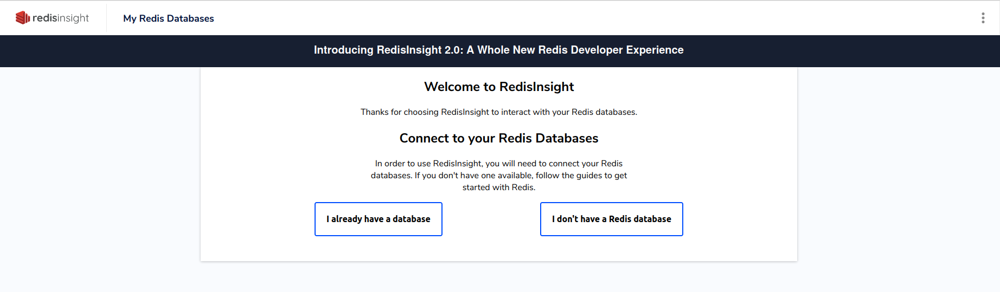

**Last updated 24th March 2022**

## Objective

Public Cloud Databases allow you to focus on building and deploying cloud applications while OVHcloud takes care of the database infrastructure and maintenance in operational conditions.

**This guide explains how to connect to a Redis database instance with the free GUI: RedisInsight.**

## Requirements

- Access to the [OVHcloud Control Panel](https://www.ovh.com/auth/?action=gotomanager&from=https://www.ovh.co.uk/&ovhSubsidiary=GB)
- A [Public Cloud project](https://www.ovhcloud.com/en-gb/public-cloud/) in your OVHcloud account
- A Redis database running on your OVHcloud Public Cloud Databases ([this guide](https://docs.ovh.com/gb/en/publiccloud/databases/getting-started/) can help you to meet this requirement)
- [Configure your Redis instance](https://docs.ovh.com/fr/publiccloud/databases/redis/configure-redis-instance/) to accept incoming connections
- A RedisInsight stable version installed and public network connectivity (Internet). This guide was made in RedisInsight 1.11.1

## Concept

A Redis instance can be managed through multiple ways.
One of the easiest, yet powerful, is to use a Command Line Interface (CLI), as shown in our guide: [Redis - Connect with CLI](https://docs.ovh.com/gb/en/publiccloud/databases/redis/connect-cli/) or by using programming languages, such as [PHP](https://docs.ovh.com/gb/en/publiccloud/databases/redis/connect-php/).

Another way is to interact directly using the GUI: RedisInsight.

In order to do so, we will need to install RedisInsight, then configure our Public Cloud Databases for Redis instances to accept incoming connections, and finally configure RedisInsight.

## Instructions

### Installation

To interact with your Redis instance with RedisInsight you need to install it.

Please follow the official [RedisInsight](https://docs.redis.com/latest/ri/installing){.external} to get the latest information.

We are now ready to learn how to connect to our Redis instance.

### Connect with RedisInsight

#### Collect required informations

Select the `General information`{.action} tab to find the required login information:

{.thumbnail}

#### Configuration

Once connected to the RedisInsight interface, click on the `I already have a database`{.action} link:

{.thumbnail}

Then on Connect to a Redis database`{.action} :

{.thumbnail}

Fill in the form with the previously collected credentials. Check the `Use TLS` check box and uncheck the `Verify TLS Certificate` check box. Then click on `ADD REDIS DATABASE`{.action} :

{.thumbnail}

Finally, select your Redis database:

{.thumbnail}

Congratulations! You are now connected to your Redis instance!

{.thumbnail}

> [!primary]
>
> RedisInsight has useful features.
> Learn more about them [here](https://redis.com/redis-enterprise/redis-insight/).
>

## Go further

Visit our dedicated Discord channel: <https://discord.gg/PwPqWUpN8G>. Ask questions, provide feedback and interact directly with the team that builds our databases services.

Join our community of users on <https://community.ovh.com/en/>.
