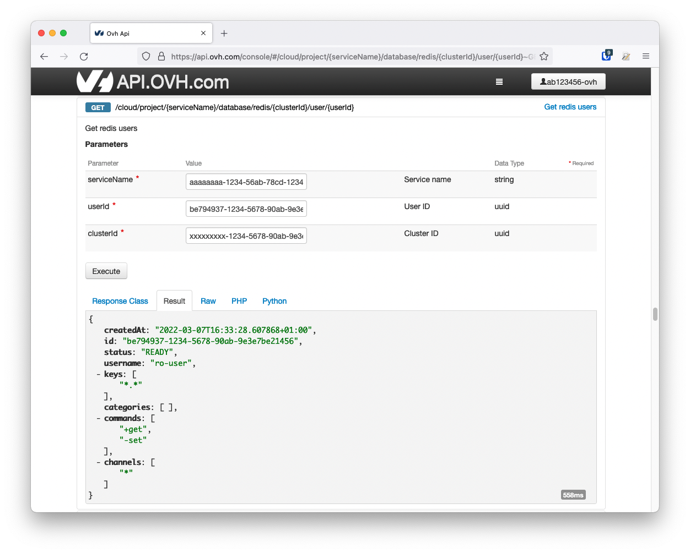

**Last updated March 8th, 2022**

## Objective

This page shows you how to update your Redis user ACLs with the OVHcloud API.

## Users and roles

As explained on this page: [Redis Capabilities, Users & roles](https://docs.ovh.com/fr/publiccloud/databases/redis/capabilities/#users-and-roles), the users' ACLs can not be updated via the OVHcloud Control Panel.

You must therefore use the [OVHcloud API](https://docs.ovh.com/fr/api/first-steps-with-ovh-api/).

## Requirements

- A [Public Cloud project](https://www.ovhcloud.com/fr/public-cloud/) in your OVHcloud account.
- An up and running Public Cloud Database for Redis.

If you have never used the OVHcloud API before, then follow this tutorial: [First Steps with the OVHcloud APIs](https://docs.ovh.com/fr/api/first-steps-with-ovh-api/).

For this tutorial, we consider that your are logged on the relevant API (Europe: <https://api.ovh.com>, Canada/Asia:  <https://ca.api.ovh.com>). We will use Europe API for this tutorial.

## Instructions

### Get your service, Redis cluster and user IDs

You first need to identify the service, the Redis cluster and the user you want to apply the changes to.

#### Get the desired service ID

Execute the following API call:

> [!api]
>
> @api {GET} /cloud/project
>

From the resulting list, select and copy the service identifier corresponding to the desired service, also known as **serviceName**.

{.thumbnail}

#### Get the desired Redis cluster ID

Open the following API call, paste your service ID into the **serviceName** input field and click `Execute`{.action}:

> [!api]
>
> @api {GET} /cloud/project/{serviceName}/database/redis
>

From the resulting list, select and copy the Redis cluster ID, also known as **clusterId**.

{.thumbnail}

#### Get the desired user ID

Open the following API call and do the following steps:

- paste your service ID into the **serviceName** input field
- paste the cluster ID into the **clusterId** input field
- click `Execute`{.action}

> [!api]
>
> @api {GET} /cloud/project/{serviceName}/database/redis/{clusterId}/user
>

From the resulting list, find and select the desired **user**.

{.thumbnail}

To get more details on a user, open the following API call and do the following steps:

- paste your service ID into the **serviceName** input field
- the user ID into the **userId** input field
- the cluster ID into the **clusterId** input field
- click `Execute`{.action}

> [!api]
>
> @api {GET} /cloud/project/{serviceName}/database/redis/{clusterId}/user/{userId}
>

Example:

{.thumbnail}

The result shows four string arrays, which represent the ACLs defined for the given user.

- Keys: Allow and disallow certain keys and key permissions.
- Categories: Add all the commands in such category to be called by the user, with valid categories being like @admin, @set, @sortedset,...
- Commands: Add or remove the command to the list of commands the user can call.
- Channels: Allow and disallow Pub/Sub channels.

You can follow the official Redis documentation about users and ACL: [https://redis.io/topics/acl](https://redis.io/topics/acl){.external}.

### Update an ACL with the API

Open the following API call and paste the corresponding inputs (**serviceName**, **clusterId**, **user**).

> [!api]
>
> @api {PUT} /cloud/project/{serviceName}/database/redis/{clusterId}/user/{userId}
>

Now, according the strategy you choosed, set the different values into the string arrays, such as in the example below:

{.thumbnail}

When ready, click `Execute`{.action} to update the ACL.

The result should be displayed similarly to the example below.

{.thumbnail}

## We want your feedback!

We would love to help answer questions and appreciate any feedback you may have.

Are you on Discord? Connect to our channel at <https://discord.gg/PwPqWUpN8G> and interact directly with the team that builds our databases service!
