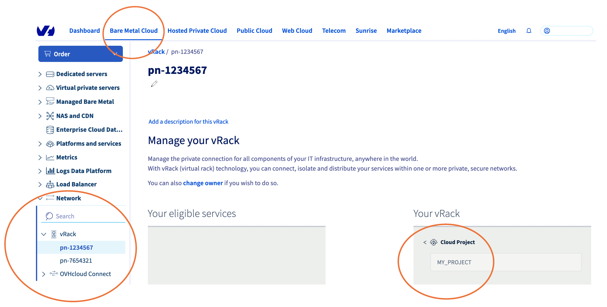
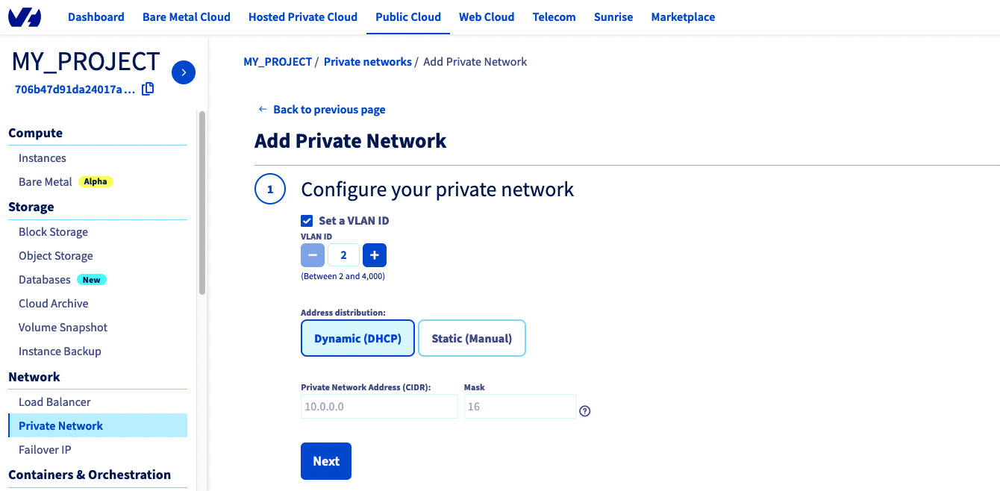
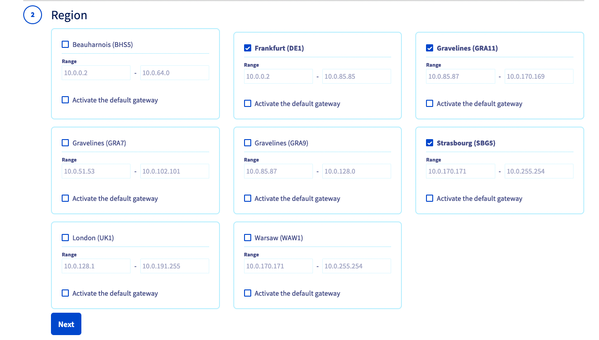
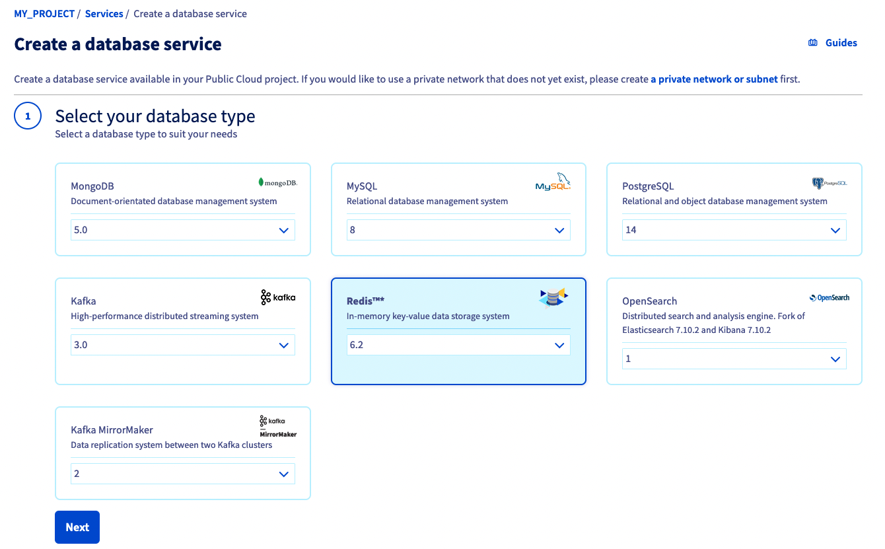
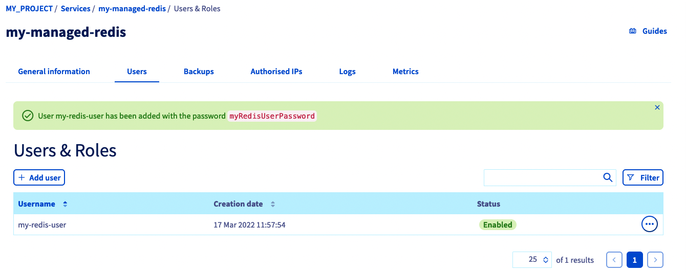

**Last updated March 17<sup>th</sup>, 2022**

## Objective

This page shows you how to create and use a managed Redis cluster with vrack.

We are going to connect a cloud instance, hosted in a datacenter, to a [Redis](https://redis.io/){.external} database, hosted in another datacenter, like this:

{.thumbnail}

Which will be, from a configuration point of view, the equivalent of this:

{.thumbnail}

## Requirements

- A [Public Cloud project](https://www.ovhcloud.com/en/public-cloud/) in your OVHcloud account.


- An [Activated Vrack](https://docs.ovh.com/us/en/public-cloud/public-cloud-vrack/).

The OVHcloud vRack is a private network solution that enables our customers to route traffic between OVHcloud dedicated servers as well as other OVHcloud services, like databases. At the same time, it allows you to add Public Cloud instances to your private network to create an infrastructure of physical and virtual resources.

Your Vrack must be configured to be accessible from all the services of your Public cloud project

{.thumbnail}

## Instructions

### Create a virtual network

The first step is to create the virtual network that will be used in our Vrack.

To proceed, from the **Public cloud** tab, click on the **Private Network** menu, then click on the [Add Private Network] button.

{.thumbnail}

You can define yourself a **Vlan id** for your virtual network. Value must be between 2 and 4,000.

Define your own range or let Dynamic address distribution if you want to use DHCP.

By default, the 10.0.0.0/16 CIDR address is defined. Differents subnets can be added later.

{.thumbnail}

Give a name to your virtual network.

{.thumbnail}

Choose the regions where you want your virtual network operate.

The subnets addresses are automaticly ajusted, depends on the number of regions you choose.

{.thumbnail}

Your Vrack is ready!

### Create a Redis database connected to the private network

Create a new Redis database service:

{.thumbnail}

Choose the **Business** solution.

According the [Redis capabilities page](https://docs.ovh.com/us/en/publiccloud/databases/redis/capabilities/#plans), the use of private networks with databases is allowed for **business** or **enterprise** plans. 

{.thumbnail}

Choose the region in which you want to create your database.

{.thumbnail}

Select the instances model.

{.thumbnail}

Give a name to the database.

Select **Private** from the Network Type list, then select **XXXX - my-private-network**. The XXX value is the Id of the vrack.

From the Subnetwork list, select the **10.0.0.0/16 - YYY**. The YYY value is the name of the datacenter you choosed.

{.thumbnail}

The final section will display a summary of your order as well as the API equivalent of creating this database instance with the [OVHcloud API](https://docs.ovh.com/us/en/api/first-steps-with-ovh-api/).

{.thumbnail}

Wait a few minutes before the end of the creation of all nodes. When this is done, status changes to **ready**.

{.thumbnail}

Now you can add users and rôles to interract with the database.

From the **Users** tab, click on the [+ Add user] button.

{.thumbnail}

Name the Redis user and give him some rights.

Example:

- Keys: *.*
- Categories: +@all
- Commands: +ping, +get, +set
- Channels: *

You can follow the official Redis documentation about users and ACL: [https://redis.io/topics/acl](https://redis.io/topics/acl){.external}.

{.thumbnail}

Once the user is created, the password is displayed in plain text, save it somewhere, there is no way to get it back again later.

{.thumbnail}

The last step is to authorize access from IPs you want.

From the **Authorised IPs** tab, click on the [+ Add an IP address or IP block (CIDR)] button.

{.thumbnail}

The simpliest way is to authorize the whole private network, as defined on previous steps.

{.thumbnail}

Check that everything is fine:

- Status is ready.
- At least one user is defined.
- Some IPs added to the white list.

{.thumbnail}

That's it! Your managed Redis database is ready to be accessed with the vrack virtual network.

### Create another instance to the vrack

The database is now connected to the virtual network, we can use it from any component that is connected to the same vrack.

If you want to test the access from an existing instance, read this tutorial to connect it to the vrack: [Configuring vRack for Public Cloud](https://docs.ovh.com/us/en/public-cloud/public-cloud-vrack/#in-case-of-an-existing-instance_2).

For this tutorial, create a new instance by following the next steps.

Start by selecting a model.

{.thumbnail}

Choose another region than the database one.

{.thumbnail}

Select **Debian** from the images list.

{.thumbnail}

Adjust the number of instances to be created, give a name, then select the desired virtual network **XXXX - my-private-network**.

{.thumbnail}

Choose your billing option.

{.thumbnail}

Wait for the **Activated** status.

{.thumbnail}

### Connect and install the Redis client

We assume that you have a parameted SSH key on your project. For more details, read the [Creating and connecting to your first Public Cloud instance](https://docs.ovh.com/us/en/public-cloud/public-cloud-first-steps/) page.

Connect to the instance via SSH

```bash
ssh debian@141.95.107.2
```

Install the redis client

The best method to install the Redis client is installing the Redis server package.

```bash
sudo apt-get update && sudo apt-get install redis-server -y
```

Now connect to the Redis database using the given url from the OVHcloud manager, with a command like:

```bash
redis-cli --tls -u "rediss://my-redis-user@redis-2612345abc-abcd1234defg.database.cloud.ovh.net:20185"
```

Authenticate yourself with the AUTH command:

```bash
AUTH my-redis-user myRedisUserPassword
```

Test the overall operation with this sample commands:

```bash
redis-2612345abc-abcd1234defg.database.cloud.ovh.net:20185> ping
PONG
redis-2612345abc-abcd1234defg.database.cloud.ovh.net:20185> SET mykey.test test
OK
redis-2612345abc-abcd1234defg.database.cloud.ovh.net:20185> GET mykey.test
"test"
```

## We want your feedback!

We would love to help answer questions and appreciate any feedback you may have.

Are you on Discord? Connect to our channel at <https://discord.gg/PwPqWUpN8G> and interact directly with the team that builds our databases service!
