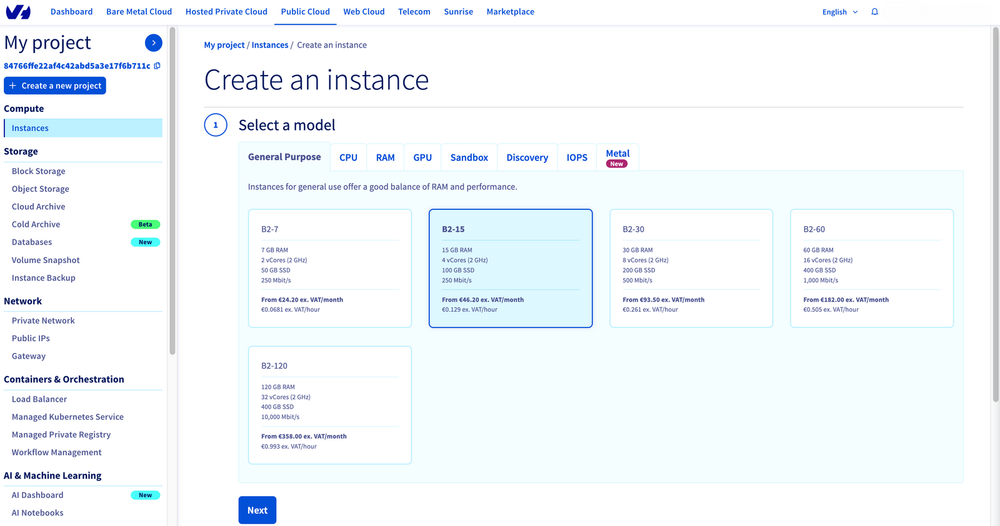
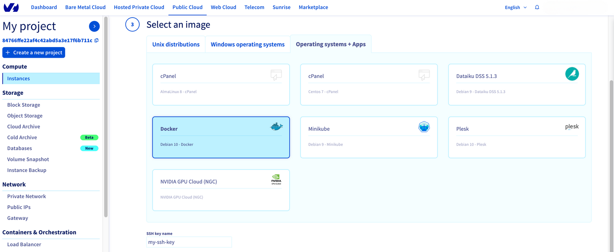
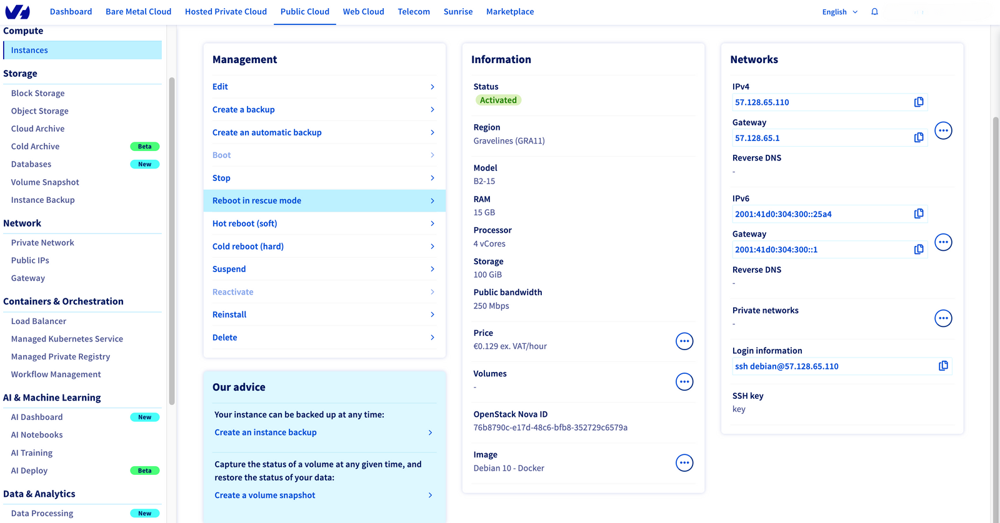
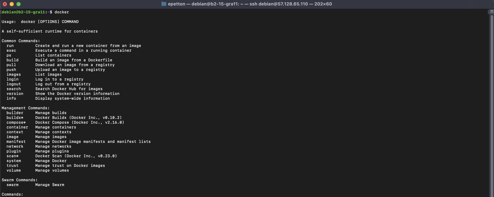
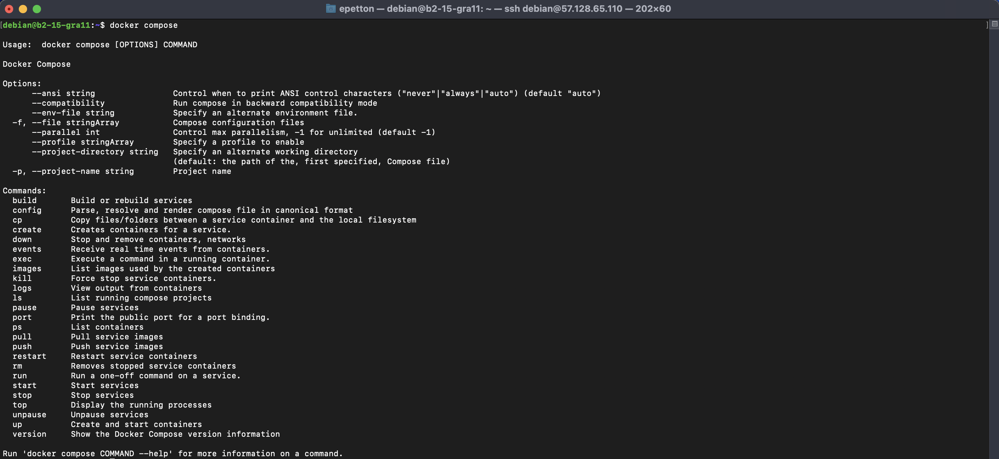

**Last updated 27th March, 2023.**

## Objective

The purpose of this guide is to see how it is possible to run [AirFlow](https://airflow.apache.org/) with [Docker](https://www.docker.com/) easily.

For this you will use the [Public Cloud](https://www.ovhcloud.com/fr/public-cloud/) instances of OVHcloud.

You will see that it is a very simple way to launch AirFlow and keep it running.

## Requirements

- Access to the [OVHcloud Control Panel](https://www.ovh.com/auth/?action=gotomanager&from=https://www.ovh.co.uk/&ovhSubsidiary=GB)
- A [Public Cloud project](https://www.ovhcloud.com/en-gb/public-cloud/)

## Instructions

This guide is divided into several steps:
1. Launch a Docker instance from OVHcloud Public Cloud
2. Set up the environment for AirFlow
3. Initialize the environment
4. Run AirFlow with Docker
5. Access to AirFlow webserver

### Launch a Docker instance from OVHcloud Public Cloud

First of all, access the [OVHcloud Control Panel](https://www.ovh.com/auth/?action=gotomanager&from=https://www.ovh.co.uk/&ovhSubsidiary=GB) and go to your [Public Cloud project](https://www.ovhcloud.com/en-gb/public-cloud/). Then select `Instances` in the `Compute` tab.

You are now able to create a new instance!

#### Create a new instance with Docker

Start by selecting the model you want:

{.thumbnail}

You will then have to choose the region where your instance will be hosted and select the **Docker image** in step 3: `Select an image`.

{.thumbnail}

> [!warning]
>
> Don't forget to add your **SSH key**. For more information on this subject, please refer to this [documentation](https://docs.ovh.com/gb/en/public-cloud/public-cloud-first-steps/).
>

Finish creating your instance and wait for it to start. You can now see the following information:

{.thumbnail}

> [!primary]
>
> To learn more about how to **manage your Public Cloud instances**, refer to this [guide](https://docs.ovh.com/gb/en/public-cloud/get-started-with-a-public-cloud-instance/).
>

You can now copy the **Login information** `ssh debian@x.x.x.x` in your terminal and enter your passphrase.

#### Check Docker availability

Now that you are connected to your instance, you can check the availability of `docker` and `docker compose`.

- docker

{.thumbnail}

- docker compose

{.thumbnail}

### Set up the environment for AirFlow

#### Create a dedicated directory for Airflow

- mkdir airflow-folder

- cd airflow-folder

#### Fetch docker-compose.yaml file

To deploy Airflow on Docker Compose, you should fetch docker-compose.yaml.

- curl -LfO 'https://airflow.apache.org/docs/apache-airflow/2.5.2/docker-compose.yaml'

### Initialize the environment

#### Setting the right Airflow user

- mkdir -p ./dags ./logs ./plugins

- echo -e "AIRFLOW_UID=$(id -u)" > .env

#### Initialize the database

- docker compose up airflow-init
few minutes

airflow-folder-airflow-init-1  | User "airflow" created with role "Admin"
airflow-folder-airflow-init-1  | 2.5.2
airflow-folder-airflow-init-1 exited with code 0

### Run AirFlow with Docker

- docker compose up -d

[+] Running 7/7
 ⠿ Container airflow-folder-redis-1              Healthy                                                                                                                                            12.1s
 ⠿ Container airflow-folder-postgres-1           Healthy                                                                                                                                            12.1s
 ⠿ Container airflow-folder-airflow-init-1       Exited                                                                                                                                             32.1s
 ⠿ Container airflow-folder-airflow-worker-1     Started                                                                                                                                            32.8s
 ⠿ Container airflow-folder-airflow-webserver-1  Started                                                                                                                                            32.9s
 ⠿ Container airflow-folder-airflow-triggerer-1  Started                                                                                                                                            32.7s
 ⠿ Container airflow-folder-airflow-scheduler-1  Started  

- docker ps

CONTAINER ID   IMAGE                  COMMAND                  CREATED         STATUS                             PORTS                                       NAMES
3b96788e12dd   apache/airflow:2.5.2   "/usr/bin/dumb-init …"   7 minutes ago   Up 13 seconds (health: starting)   8080/tcp                                    airflow-folder-airflow-triggerer-1
f1ab964d853a   apache/airflow:2.5.2   "/usr/bin/dumb-init …"   7 minutes ago   Up 13 seconds (health: starting)   8080/tcp                                    airflow-folder-airflow-worker-1
6ea5b93d0612   apache/airflow:2.5.2   "/usr/bin/dumb-init …"   7 minutes ago   Up 13 seconds (health: starting)   0.0.0.0:8080->8080/tcp, :::8080->8080/tcp   airflow-folder-airflow-webserver-1
032c3d265b3e   apache/airflow:2.5.2   "/usr/bin/dumb-init …"   7 minutes ago   Up 13 seconds (health: starting)   8080/tcp                                    airflow-folder-airflow-scheduler-1
f9ab16d13786   postgres:13            "docker-entrypoint.s…"   9 minutes ago   Up 45 seconds (healthy)            5432/tcp                                    airflow-folder-postgres-1
8b3359a1d1cd   redis:latest           "docker-entrypoint.s…"   9 minutes ago   Up 45 seconds (healthy)            6379/tcp                                    airflow-folder-redis-1

### Access to AirFlow webserver

- ipv4:8080 (airflow webserver)

#### Login

- login:password => airflow:airflow

#### Test the example DAGs

#### Execution of the DAG in Webserver interface

To see the file running, start your AirFlow **webserver** and **scheduler**. Go to http://localhost:8080/home (or your dedicated port for airflow), and you should see the following user interface.

{.thumbnail}

The DAG `ovh_ai_training_preprocessing_training` should run successfully. You can check the **Graph** view or **Grid** view by hovering over links and selecting options.

{.thumbnail}

You can also click on the `Log` button to check AI Training job logs during data preprocessing part.

{.thumbnail}

Finally, you can follow the evolution of Machine Learning model in the second task logs. You are also able to access to Weights & Biases by clicking on the link printed in the logs.

{.thumbnail}

Congratulations! You have processed your data and trained your model in AI Training jobs with **AirFlow**.

## Feedback

Please feel free to send us your questions, feedback and suggestions to help our team improve the service on the OVHcloud [Discord server](https://discord.com/invite/KbrKSEettv)!
