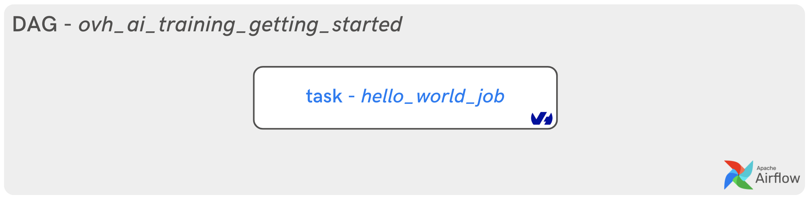
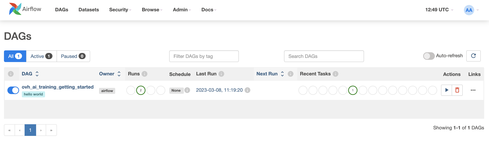
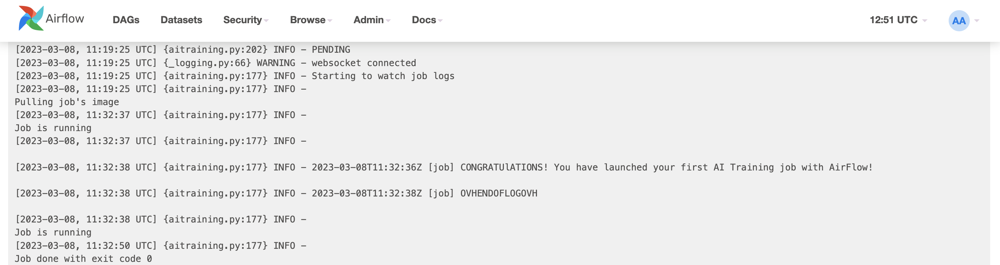

**Last updated 27th March, 2023.**

## Objective

You can now use the **AirFlow** `AiTrainingRunJobOperator` to run an OVHcloud AI Training job.

This guide explains how to run your first "Hello World" AI Training job with [AirFlow](https://airflow.apache.org/).

{.thumbnail}

## Requirements

- Access to the [OVHcloud Control Panel](https://www.ovh.com/auth/?action=gotomanager&from=https://www.ovh.co.uk/&ovhSubsidiary=GB)
- An AI project created inside a [Public Cloud project](https://www.ovhcloud.com/en-gb/public-cloud/) in your OVHcloud account
- A user for [AI Tools](https://docs.ovh.com/gb/en/publiccloud/ai/users/)
- Apache AirFlow [installed](https://airflow.apache.org/docs/apache-airflow/stable/installation/index.html) and operational
- An access [token](https://docs.ovh.com/gb/en/publiccloud/ai/cli/app-token-cli/) for your OVHcloud AI user

## Instructions

In this guide, you will see how to launch your first AI Training job from AirFlow in the form of a "Hello World".

First, you will see how to create a token for your OVHcloud AI user and then you will create your first AirFlow DAG.

### Create an access token for your OVHcloud AI user

To be able to launch AI Training jobs with AirFlow, you have to [create token](https://docs.ovh.com/gb/en/publiccloud/ai/cli/app-token-cli/) bearer for your OVHcloud AI user.

```console
ovhai token create <token-name> --role operator
```

You can replace `<token-name>` with the name of your choice in the above command.

> [!warning]
>
> To be able to launch AI Training jobs and interact with the API, don't forget to give the `operator` role.
>

> [!primary]
>
> If you wish, you can also add a `--label-selector` to your token. Follow this [documentation](https://docs.ovh.com/gb/en/publiccloud/ai/cli/app-token-cli/#create-an-app-token).
>

### Deploy your first AirFlow DAG for AI Training jobs

An Apache AirFlow provider package for `ovhcloud` provider has been created. All classes for this provider package are in `airflow.providers.ovhcloud` Python package.

> [!primary]
>
> You can install this package on top of an existing `airflow 2.2+` installation via: `pip install apache-airflow-providers-ovhcloud`
>
> The package supports the following Python versions: `3.7`, `3.8`, `3.9`.
>

In the next few steps you will see the basic concepts to keep in mind when writing a **DAG** for use in [AI Training](https://www.ovhcloud.com/fr/public-cloud/ai-training/).

#### Create a Python file

Once AirFlow is installed, go to your dedicated `airflow` directory containing the `dags` folder and some other files.

Go to the `/dags` folder and create a new Python file: `ovh_ai_training_getting_started.py`.

You are in the following state: `../your-airflow-directory/dags/ovh_ai_training_getting_started.py`

#### Import dependencies

To create a **pipeline** in AirFlow, we need to import several modules.

- `DAG` module from `airflow` package
- `AiTrainingRunJobOperator` which is the OVHcloud AI Training operator from `airflow.providers.ovhcloud.operators.ai.aitraining` module
- `os` module to interact with the operating system
- `datetime` module to schedule the dags

```python
from airflow import DAG
from airflow.providers.ovhcloud.operators.ai.aitraining import AiTrainingRunJobOperator
import os
from datetime import datetime
```

#### Provide your OVHcloud access token

Replace `your_bearer` by your previously created token:

```python
os.environ["OVH_BEARER"] = "your_bearer"
```

#### Create a DAG object

We will now instantiate a **DAG object** to nest the tasks in the pipeline.

We pass the following as parameters:

- `dag_id`: it is string which is the unique identifier of the dag.
- `schedule_interval`: it sets the interval of the next DAG runs created by the scheduler. For more information, refer to this [documentation](https://airflow.apache.org/docs/apache-airflow/stable/core-concepts/dag-run.html).
- `start_date`: it indicates the timestamp from which the scheduler will attempt to backfill.
- `tags`: it allows you to tag your DAGs and use it for filtering in the UI.

```python
with DAG(
    dag_id='ovh_ai_training_getting_started',
    schedule_interval=None,
    start_date=datetime(2023, 3, 6),
    tags=['hello world'],
) as dag:
```

#### Create a task

According to **AirFlow**, an object instantiated from an *operator* is called a *task*.

The operator allowing you to launch OVHcloud AI Training jobs is the following: `AiTrainingRunJobOperator`.

An AiTrainingRunJobOperator is used to launch AI Training jobs inside your DAG. We will create an AiTrainingRunJobOperator object that launches an OVHcloud Docker image and print a simple "Hello World" sentence.

Several parameters can be set as follows:

- `task_id`: like a DAG object has `dag_id`, an AiTrainingRunJobOperator object has an identifier called `task_id`.
- `bearer`: corresponds to your OVHcloud AI token bearer.
- `region`: you can choose between 2 regions, Gravelines `GRA` or Beauharnois `BHS`.
- `image`: precise the Docker image URL you want to use from shared or private registry.
- `name`: you can define the name of your AI Training job.
- `job_resources`: you can choose between CPU **or** GPU (not both).
- `command`: give the command to run in the AI Training job.
- `asynchronous`: optional flag to get `job_id` after submitting the job to the OVHcloud API. At `False`, a websocket retrieves the logs from the AI Training job and displays them in the AirFlow DAG logs.

```python
hello_world_job = AiTrainingRunJobOperator(
      task_id='hello_world_job',
      bearer = os.environ.get('OVH_BEARER', 'bearer'),
      region = 'gra',
      image = 'ovhcom/ai-training-one-for-all',
      name = 'hello-world-ai-training-airflow',
      job_resources = {'cpu': 1,'gpu':0 },
      command = ["python",  "-c", "print('CONGRATUlATIONS! You have launched your first AI Training job with AirFlow!')"],
      asynchronous = False
    )
```

#### Call the basic_training_job task

```python
hello_world_job
```

#### Final DAG

After compiling all the elements of the DAG, the final code should look like this:

```python
from airflow import DAG
from airflow.providers.ovhcloud.operators.ai.aitraining import AiTrainingRunJobOperator
import os
from datetime import datetime

os.environ["OVH_BEARER"] = "your_bearer"

with DAG(
    dag_id='ovh_ai_training_getting_started',
    schedule_interval=None,
    start_date=datetime(2023, 3, 6),
    tags=['hello world'],
) as dag:
    hello_world_job = AiTrainingRunJobOperator(
      task_id='hello_world_job',
      bearer = os.environ.get('OVH_BEARER', 'bearer'),
      region = 'gra',
      image = 'ovhcom/ai-training-one-for-all',
      name = 'hello-world-ai-training-airflow',
      job_resources = {'cpu': 1,'gpu':0 },
      command = ["python",  "-c", "print('CONGRATUlATIONS! You have launched your first AI Training job with AirFlow!')"],
      asynchronous = False
    )

    hello_world_job
```

#### Execution of the DAG in Webserver interface

To see the file running, start your AirFlow **webserver** and **scheduler**. Go to http://localhost:8080/home (or your dedicated port for airflow), and you should see the following user interface.

{.thumbnail}

The DAG `ovh_ai_training_getting_started` should run successfully. You can check the **Graph** view or **Grid** view by hovering over links and selecting options.

{.thumbnail}

You can also click on the `Log` button to check AI Training job logs.

{.thumbnail}

Congratulations! You have launched your first AI Training job with **AirFlow**.

## Feedback

Please feel free to send us your questions, feedback and suggestions to help our team improve the service on the OVHcloud [Discord server](https://discord.com/invite/KbrKSEettv)!
