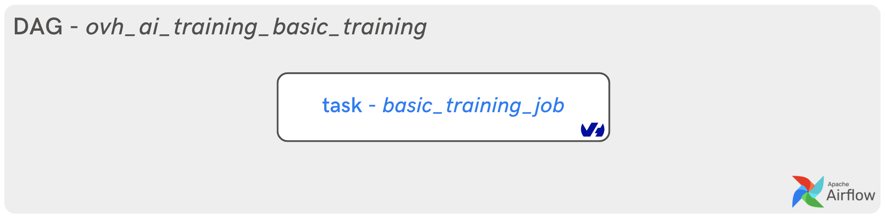
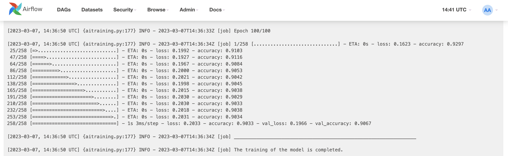

**Last updated 27th March, 2023.**

## Objective

You can now use the **AirFlow** `AiTrainingRunJobOperator` to run an OVHcloud AI Training job.

This guide explains how to run your first training of a Machine Learning model in an AI Training job with [AirFlow](https://airflow.apache.org/).

{.thumbnail}

> [!primary]
>
> If you have never used the `AiTrainingRunJobOperator`, please refer to the following documentation: [Apache AirFlow - Getting Started](LINK WHEN PUBLISHED)
>

## Requirements

- Access to the [OVHcloud Control Panel](https://www.ovh.com/auth/?action=gotomanager&from=https://www.ovh.co.uk/&ovhSubsidiary=GB)
- An AI project created inside a [Public Cloud project](https://www.ovhcloud.com/en-gb/public-cloud/) in your OVHcloud account
- A user for [AI Tools](https://docs.ovh.com/gb/en/publiccloud/ai/users/)
- Apache AirFlow [installed](https://airflow.apache.org/docs/apache-airflow/stable/installation/index.html) and operational
- An access [token](https://docs.ovh.com/gb/en/publiccloud/ai/cli/app-token-cli/) for your OVHcloud AI user

## Instructions

The tutorial is divided into two steps:
- the development of a Python script to process data and define Machine Learning model
- the creation and launching of the AirFlow DAG to train the model in an AI Training job

{.thumbnail}

### Define the AI model to be implemented

This example is based on the [Bank Marketing Dataset](https://archive.ics.uci.edu/ml/datasets/bank+marketing). These data are related to the direct marketing campaigns of a Portuguese banking institution. The objective is to predict whether the customer will take out a term deposit (variable `y` in the `bank-additional-full.csv` file).

The first step is to create the Python script that will process the data and train the Machine Learning model.

#### Create a Python file

First, you have to create a Python file named `train-prediction-bank-term-deposit.py`. Find more information about the full Python code [here](LINK GIT HUB) to get ready to use it.

Inside that file, import your required modules:

```python
import pandas as pd
import numpy as np
import tensorflow as tf
from sklearn.preprocessing import StandardScaler
from sklearn.model_selection import train_test_split
```

Then, you can define the data processing function.

```python
def dataProcessing(df):

    df['job'] = df['job'].apply(lambda x: 0 if x == 'unknown' or x == 'unemployed' else (
        12 if x == 'entrepreneur' else (8 if x == 'blue-collar' else (
        6 if x == 'technician' or x == 'services' or x == 'admin.' or x == 'management' else (
        4 if x == 'self-employed' or x == 'student' else (
        2 if x == 'housemaid' or x == 'retired' else None))))))
    df['housing'] = df['housing'].apply(lambda x: 0 if x == 'no' else (1 if x == 'yes' else -1))
    df['loan'] = df['loan'].apply(lambda x: 0 if x == 'no' else (1 if x == 'yes' else -1))
    df['y'] = df['y'].apply(lambda x: 0 if x == 'no' else (1 if x == 'yes' else -1))
    df['default'] = df['default'].apply(lambda x: 0 if x == 'no' else (1 if x == 'yes' else -1))
    df['poutcome'] = df['poutcome'].apply(lambda x: 0 if x == 'failure' else (1 if x == 'success' else -1))
    df['pdays'] = df['pdays'].apply(lambda x: 0 if x == 999 else (20 if x <= 10 else (6 if x <= 20 else 3)))

    df.drop(['day_of_week', 'contact', 'month'], axis=1, inplace=True)

    df = pd.get_dummies(df, drop_first=True)

    input_parameters = df.drop("y", axis=1)
    scaler = StandardScaler()
    X = scaler.fit_transform(np.array(input_parameters))

    y = df['y']

    return X, y
```

Once your data has been processed and adapted, it is time to create the function that defines and trains your AI model.

```python
def modelTraining(epochs, optimizer):

    model = tf.keras.models.Sequential([
        tf.keras.layers.Dense(6, activation='relu', input_shape=(X_train.shape[1],)),
        tf.keras.layers.Dropout(0.2),
        tf.keras.layers.Dense(6, activation='relu'),
        tf.keras.layers.Dropout(0.2),
        tf.keras.layers.Dense(1, activation='sigmoid'),
    ])

    print(model.summary())

    model.compile(optimizer=optimizer, loss='binary_crossentropy', metrics='accuracy')

    print("_________________________________________________________________")
    print("The training of the model starts... \n")

    return model.fit(X_train, y_train, validation_data=(X_val, y_val), epochs=epochs, batch_size=128)
```

Finally, define the *main* and to start processing and training stages.

```python
if __name__ == '__main__':

    print("_________________________________________________________________")
    print("Your AI Training job is RUNNING. The following device is available:", tf.test.gpu_device_name(), "\n")

    df = pd.read_csv('bank-additional-full.csv', sep=';')
    print(df.head())

    X, y = dataProcessing(df)
    print("_________________________________________________________________")
    print("Data processing is finished \n")

    X_train, X_val, y_train, y_val = train_test_split(X, y, test_size=0.2)

    model_history = modelTraining(epochs=100, optimizer='adam')
    print("_________________________________________________________________")
    print("The training of the model is completed. \n")
```

We will now look at the creation of the Docker image.

> [!primary]
>
> If you want to know how to build a custom Docker image and deploy your own container, you need to comply with a few rules like adding a specific user. Follow our [Build and use custom images](https://docs.ovh.com/gb/en/publiccloud/ai/training/build-use-custom-image/) guide.
>

> [!primary]
>
> If you don't want to follow the Docker image building phase, don't worry. We make it available to you.
> In this case, go to the **Deploy your first AirFlow DAG for AI Training jobs**.
>

#### Write the requirements.txt file for the application

The `requirements.txt` file will allow us to write all the modules needed to make our application work. This file will be useful when writing the [Dockerfile](LINK GIT HUB).

```bash
tensorflow==2.11.0
scikit-learn==1.2.1
pandas==1.5.3
```

#### Write the Dockerfile for the application

Your `Dockerfile` should start with the the `FROM` instruction indicating the parent image to use. In our case we choose to start from a `python:3.8` image:

```console
FROM python:3.8
```

Create the home directory and add your files to it:

```console
WORKDIR /workspace
ADD . /workspace
```

Install the `requirements.txt` file which contains your needed Python modules using a `pip install ...` command:

```console
RUN pip install -r requirements.txt
```

Define your default launching command to start the application:

```console
CMD [ "python" , "/workspace/train-prediction-bank-term-deposit.py" ]
```

Give correct access rights to **ovhcloud user** (`42420:42420`):

```console
RUN chown -R 42420:42420 /workspace
ENV HOME=/workspace
```

#### Build the Docker image from the Dockerfile

Launch the following command from the **Dockerfile** directory to build your application image:

```console
docker build . -t airflow-basic-training:latest
```

> [!primary]
>
> The dot `.` argument indicates that your build context (place of the **Dockerfile** and other needed files) is the current directory.
>
> The `-t` argument allows you to choose the identifier to give to your image. Usually image identifiers are composed of a **name** and a **version tag** `<name>:<version>`. For this example we chose **airflow-basic-model:latest**.
>

> [!warning]
>
> Please make sure that the docker image you will push in order to run containers using AI products respects the **linux/AMD64** target architecture. You could, for instance, build your image using **buildx** as follows:
>
> `docker buildx build --platform linux/amd64 ...`
>

#### Test it locally (optional)

Launch the following **Docker command** to launch your application locally on your computer:

```console
docker run --rm -it --user=42420:42420 airflow-basic-training:latest
```

> [!warning]
>
> Don't forget the `--user=42420:42420` argument if you want to simulate the exact same behaviour that will occur on **AI Training jobs**. It executes the Docker container as the specific OVHcloud user (user **42420:42420**).
>

#### Push the image into the shared registry

> [!warning]
>
> The shared registry of AI Training should only be used for testing purposes. Please consider attaching your own Docker registry. More information about this can be found [here](https://docs.ovh.com/gb/en/publiccloud/ai/training/add-private-registry/).
>

Find the address of your shared registry by launching this command:

```console
ovhai registry list
```

Log in on the shared registry with your usual OpenStack credentials:

```console
docker login -u <user> -p <password> <shared-registry-address>
```

Push the compiled image into the shared registry:

```console
docker tag airflow-basic-training:latest <shared-registry-address>/airflow-basic-training:latest
docker push <shared-registry-address>/airflow-basic-training:latest
```

> [!primary]
>
> We have made the Docker image available to you on a dedicated registry. You can use it in the following way: `priv-registry.gra.training.ai.cloud.ovh.net/ai-training-tutorials/airflow-basic-training`
>

Let's get to the heart of the matter: **Apache AirFlow**.

### Deploy your first AirFlow DAG for AI Training jobs

An Apache AirFlow provider package for `ovhcloud` provider has been created. All classes for this provider package are in `airflow.providers.ovhcloud` Python package.

> [!primary]
>
> You can install this package on top of an existing `airflow 2.2+` installation via: `pip install apache-airflow-providers-ovhcloud`
>
> The package supports the following Python versions: `3.7`, `3.8`, `3.9`.
>

In the next few steps you will see the basic concepts to keep in mind when writing a **DAG** for use in [AI Training](https://www.ovhcloud.com/fr/public-cloud/ai-training/).

#### Create a Python file

Once AirFlow is installed, go to your dedicated `airflow` directory containing the `dags` folder and some other files.

Go to the `/dags` folder and create a new Python file: `ovh_ai_training_basic_training.py`.

You are in the following state: `../your-airflow-directory/dags/ovh_ai_training_basic_training.py`

#### Import dependencies

To create a **pipeline** in AirFlow, we need to import several modules.

- `DAG` module from `airflow` package
- `AiTrainingRunJobOperator` which is the OVHcloud AI Training operator from `airflow.providers.ovhcloud.operators.ai.aitraining` module
- `os` module to interact with the operating system
- `datetime` module to schedule the dags

```python
from airflow import DAG
from airflow.providers.ovhcloud.operators.ai.aitraining import AiTrainingRunJobOperator
import os
from datetime import datetime
```

#### Provide your OVHcloud access token

Replace `your_bearer` by your previously created token:

```python
os.environ["OVH_BEARER"] = "your_bearer"
```

#### Create a DAG object

We will now instantiate a **DAG object** to nest the tasks in the pipeline.

We pass the following as parameters:

- `dag_id`: it is string which is the unique identifier of the dag.
- `schedule_interval`: it sets the interval of the next DAG runs created by the scheduler. For more information, refer to this [documentation](https://airflow.apache.org/docs/apache-airflow/stable/core-concepts/dag-run.html).
- `start_date`: it indicates the timestamp from which the scheduler will attempt to backfill.
- `tags`: it allows you to tag your DAGs and use it for filtering in the UI.

```python
with DAG(
    dag_id='ovh_ai_training_basic_training',
    schedule_interval=None,
    start_date=datetime(2023, 3, 6),
    tags=['first training'],
) as dag:
```

#### Create a task

According to **AirFlow**, an object instantiated from an *operator* is called a *task*.

The operator allowing you to launch OVHcloud AI Training jobs is the following: `AiTrainingRunJobOperator`.

An AiTrainingRunJobOperator is used to launch AI Training jobs inside your DAG. We will create an AiTrainingRunJobOperator object that launches a basic AI Training job to train our AI model.

Several parameters can be set as follows:

- `task_id`: like a DAG object has `dag_id`, an AiTrainingRunJobOperator object has an identifier called `task_id`.
- `bearer`: corresponds to your OVHcloud AI token bearer.
- `region`: you can choose between 2 regions, Gravelines `GRA` or Beauharnois `BHS`.
- `image`: precise the Docker image URL you want to use from shared or private registry.
- `name`: you can define the name of your AI Training job.
- `job_resources`: you can choose between CPU **or** GPU (not both).
- `asynchronous`: optionnal flag to get `job_id` after submitting the job to the OVHcloud API. At `False`, a websocket retrieves the logs from the AI Training job and displays them in the AirFlow DAG logs.

```python
basic_training_job = AiTrainingRunJobOperator(
      task_id='basic_training_job',
      bearer = os.environ.get('OVH_BEARER', 'bearer'),
      region = 'gra',
      image = 'priv-registry.gra.training.ai.cloud.ovh.net/ai-training-tutorials/airflow-basic-training',
      name = 'basic-training-ai-training-airflow',
      job_resources = {'cpu': 0,'gpu':1 },
      asynchronous = False
    )
```

#### Call the basic_training_job task

```python
basic_training_job
```

#### Final DAG

After compiling all the elements of the DAG, the final code should look like this:

```python
from airflow import DAG
from airflow.providers.ovhcloud.operators.ai.aitraining import AiTrainingRunJobOperator
import os
from datetime import datetime

os.environ["OVH_BEARER"] = "your_bearer"

with DAG(
    dag_id='ovh_ai_training_basic_training',
    schedule_interval=None,
    start_date=datetime(2023, 3, 6),
    tags=['first training'],
) as dag:
    basic_training_job = AiTrainingRunJobOperator(
      task_id='basic_training_job',
      bearer = os.environ.get('OVH_BEARER', 'bearer'),
      region = 'gra',
      image = 'priv-registry.gra.training.ai.cloud.ovh.net/ai-training-tutorials/airflow-basic-training',
      name = 'basic-training-ai-training-airflow',
      job_resources = {'cpu': 0,'gpu':1 },
      asynchronous = False
    )

    basic_training_job
```

#### Execution of the DAG in Webserver interface

To see the file running, start your AirFlow **webserver** and **scheduler**. Go to http://localhost:8080/home (or your dedicated port for airflow), and you should see the following user interface.

{.thumbnail}

The DAG `ovh_ai_training_basic_training` should run successfully. You can check the **Graph** view or **Grid** view by hovering over links and selecting options.

{.thumbnail}

You can also click on the `Log` button to check AI Training job logs and Machine Learning model evolution.

{.thumbnail}

Congratulations! You have trained your first model in an AI Training job with **AirFlow**.

## Go further

- Do you want to process your data before training your model into two dependent AI Training jobs? Do it with AirFlow by following this [tutorial](PUT THE LINK_TUTO_3).
- To train ML model and track it with TensorBoard thanks to AI Training and AirFlow, refer to this [documentation](PUT THE_LINK_TUTO_4).

## Feedback

Please feel free to send us your questions, feedback and suggestions to help our team improve the service on the OVHcloud [Discord server](https://discord.com/invite/KbrKSEettv)!
