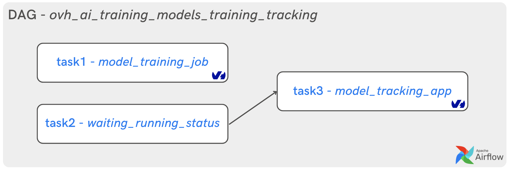
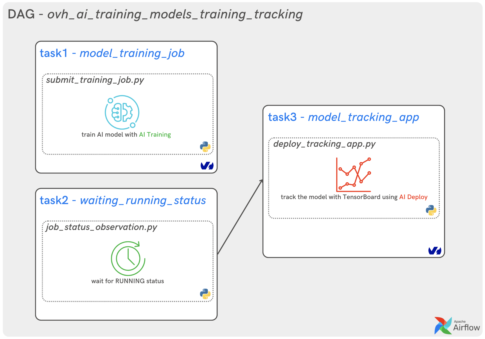
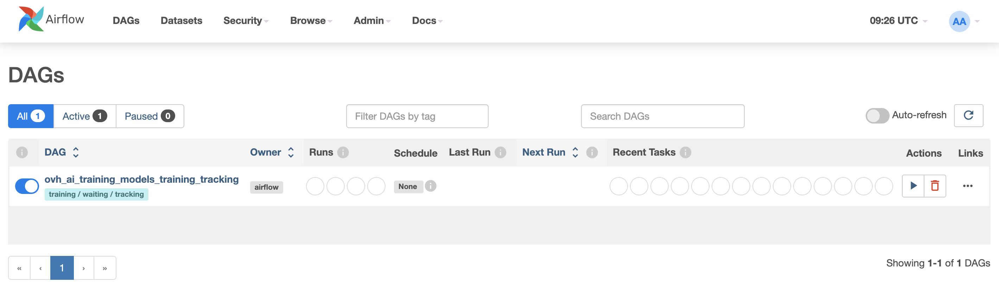

**Last updated 27th March, 2023.**

## Objective

You can now use the **AirFlow** to manage OVHcloud AI tasks.

This guide explains how to use AirFlow](https://airflow.apache.org/) to orchestrate your OVHcloud AI tasks. You will be able to create a DAG with three tasks:
- train an AI model inside an **AI Training job**
- wait for the training job running status
- track the model evolution inside an **AI Deploy app** with TensorBoard

{.thumbnail}

> [!primary]
>
> For all this tutorial, the `PythonOperator` will be used. You can however manage your **AI Training jobs** with the dedicated `AiTrainingRunJobOperator`.
>

## Requirements

- Access to the [OVHcloud Control Panel](https://www.ovh.com/auth/?action=gotomanager&from=https://www.ovh.co.uk/&ovhSubsidiary=GB)
- An AI project created inside a [Public Cloud project](https://www.ovhcloud.com/en-gb/public-cloud/) in your OVHcloud account
- A user for [AI Tools](https://docs.ovh.com/gb/en/publiccloud/ai/users/)
- Apache AirFlow [installed](https://airflow.apache.org/docs/apache-airflow/stable/installation/index.html) and operational
- An access [token](https://docs.ovh.com/gb/en/publiccloud/ai/cli/app-token-cli/) for your OVHcloud AI user

## Instructions

The tutorial is divided into three steps:
- development of Python script to train Machine Learning model
- creation of Object Storage containers to store Python script and training metrics
- creation and launching of the AirFlow DAG to process the data and train the model in AI Training jobs

### Develop your Python code for model training

This example is based on an existing AI Training tutorial to [launch TensorBoard inside a job](https://docs.ovh.com/gb/en/publiccloud/ai/training/tuto-tensorboard-inside-job/).

> [!primary]
>
> Find out the full Python code [here](https://github.com/ovh/ai-training-examples/blob/main/jobs/tensorboard/train-tensorflow-model.py).
>

The goal is to classify image of numbers (0 to 9) from the [MNIST dataset](http://yann.lecun.com/exdb/mnist/).

This [Python script](https://github.com/ovh/ai-training-examples/blob/main/jobs/tensorboard/train-tensorflow-model.py) is very simple. It will allow you to load the split dataset with **Keras** and train the model with **TensorFlow**.

> [!primary]
>
> The training of this model will be done in an **AI Training job**. The evolution of this training can be visualized with TensorBoard which will be launched in an **AI Deploy app**.
>

You have to add the Python code *'train-tensorflow-model.py'* in an object container before launching the training.

### Create Object Storage containers

You have to create two Object Storage containers:
- `ai_model` - add the following python code `train-tensorflow-model.py`.
- `training_metrics` - the training metrics will be saved there.

If you want to create it from the [OVHcloud Control Panel](https://www.ovh.com/auth/?action=gotomanager&from=https://www.ovh.co.uk/&ovhSubsidiary=GB), go to the Object Storage section and [create a new object container](https://docs.ovh.com/gb/en/storage/object-storage/pcs/create-container/) by clicking `Object Storage` > `Create an object container`.

If you want to do it with the CLI, just follow [this guide](https://docs.ovh.com/gb/en/publiccloud/ai/cli/access-object-storage-data/).

#### Upload Python file to Object Storage

Create the Object Storage container for your Python script:

```console
ovhai data upload GRA ai_model train-tensorflow-model.py
```

#### Create an empty Object Storage container for metrics

Create the container for metrics:

```console
ovhai data upload GRA training_metrics
```

> [!primary]
>
> The container `training_metrics` should stay empty at first.
>

Let's get to the heart of the matter: **Apache AirFlow**.

### Develop the AirFlow DAG

The **AirFlow DAG** will be composed of three tasks based on the `PythonOperator`.

{.thumbnail}

In the next few steps, you will see the principal concepts to keep in mind when writing a **DAG** for **OVHcloud AI Tools** management.

#### Create a Python file

Once AirFlow is installed, go to your dedicated `airflow` directory containing the `dags` folder and some other files.

Go to the `/dags` folder and create a new Python file: `ovh_ai_training_models_training_tracking.py`.

You are in the following state: `../your-airflow-directory/dags/ovh_ai_training_models_training_tracking.py`

#### Import dependencies

To create a **pipeline** in AirFlow, we need to import several modules.

- `DAG` module from `airflow` package
- `AiTrainingRunJobOperator` which is the OVHcloud AI Training operator from `airflow.providers.ovhcloud.operators.ai.aitraining` module
- `os` module to interact with the operating system
- `datetime` module to schedule the dags

```python
import os
import time
from datetime import datetime
from airflow import DAG
from airflow.operators.python import PythonOperator
import requests
import json
import websocket
```

#### Provide your OVHcloud access token

Replace `your_bearer` by your previously created token:

```python
os.environ["OVH_BEARER"] = "your_bearer"
```

#### Create Python functions

- **Display training logs**

Define `on_message` function to display training logs continuously.

```python
def on_message(wsapp, message):
    logs = message.decode()
    if logs == '.':
        pass
    else:
        print(logs)
```

- **Submit model training job**

Create a Python function to submit an **OVHcloud AI Training job**. It will be used in the first task to train the ML model.

> [!primary]
>
> This task consists in calling the [OVHcloud API](https://gra.training.ai.cloud.ovh.net/) to launch an AI training job.
>

```python
def submit_training_job(**kwargs):

    data = json.dumps(kwargs['dag_run'].conf.get('data'))

    job_url = 'https://gra.training.ai.cloud.ovh.net/v1/job'

    headers = {'content-type': 'application/json',
               'Authorization': 'Bearer ' + os.environ.get("OVH_BEARER", 'bearer')}

    new_job = requests.post(job_url, headers = headers, data = data).json()
    kwargs['ti'].xcom_push(key='ai_job_id', value=new_job['id'])

    infos_url = f'{job_url}/{new_job["id"]}'
    logs_url = f'wss://gra.training.ai.cloud.ovh.net/v1/job/{new_job["id"]}/log?follow=true'

    while True:
        response = requests.get(infos_url, headers=headers).json()
        if response['status']['history'][-1]['state'] != "DONE":
            wsapp = websocket.WebSocketApp(logs_url, on_message=on_message, header=headers)
            wsapp.run_forever()
        else:
            print("Your training job is DONE!")
            return
```

- **Wait for training job RUNNING status**

Create a Python function to check the status of the previous **OVHcloud AI Training job**. It will be used in the first task to train the ML model.

> [!primary]
>
> This task will verify that the training job is in `RUNNING` status. It will also trigger an AI Deploy app to observe the evolution of the model dynamically with **TensorBoard**.
>

To summarize, the necessary and sufficient condition for the deployment of the TensorBoard interface is the `RUNNING` status of the training job.

```python
def job_status_observation(ti) -> None:

    while True:
        training_job_id = ti.xcom_pull(task_ids=['model_training_job'], key='ai_job_id')
        if not training_job_id:
            print("Still waiting for the AI Training job ID...")
            time.sleep(1)
        else:
            print("AI Training job ID:", training_job_id[0])
            break

    infos_url = f'https://gra.training.ai.cloud.ovh.net/v1/job/{training_job_id[0]}'

    headers = {'content-type': 'application/json',
               'Authorization': 'Bearer ' + os.environ.get("OVH_BEARER", 'bearer')}

    while True:
        response = requests.get(infos_url, headers=headers).json()
        if response['status']['history'][-1]['state']!="RUNNING":
            print("Your job is still in", response['status']['history'][-1]['state'], "status...")
            time.sleep(20)
        else:
            print("Your training job is now RUNNING!")
            return
```

- **Launch TensorBoard interface**

Create a Python function to trigger an **OVHcloud AI Deploy app**. It will be used in the third task to launch TensorBoard inside an app.

> [!primary]
>
> This app will be launched once the model training is started. You can imagine launching several trainings in parallel, and then comparing them with TensorBoard.
>

Once the app is in `RUNNING` status, the URL to access **TensorBoard** will be displayed.

```python
def deploy_tracking_app(data: str):

    data = json.dumps(data)

    app_url = 'https://gra.training.ai.cloud.ovh.net/v1/app'

    headers = {'content-type': 'application/json',
               'Authorization': 'Bearer ' + os.environ.get("OVH_BEARER", 'bearer')}

    new_app = requests.post(app_url, headers = headers, data = data).json()
    infos_url = f'{app_url}/{new_app["id"]}'

    while True:
        response = requests.get(infos_url, headers=headers).json()
        if response['status']['history'][-1]['state'] != "RUNNING":
            print("Your app is still in", response['status']['history'][-1]['state'], "status...")
            time.sleep(20)
        else:
            print("Your app is now RUNNING! You can access to TensorBoard:")
            return response['status']['url']
```

#### Create the DAG object

We will now instantiate a **DAG object** to test the tasks in the pipeline.

We pass the following as parameters:

- `dag_id`: it is a string which is the unique identifier of the dag.
- `schedule_interval`: it sets the interval of the next DAG runs created by the scheduler. For more information, refer to this [documentation](https://airflow.apache.org/docs/apache-airflow/stable/core-concepts/dag-run.html).
- `start_date`: it indicates the timestamp from which the scheduler will attempt to backfill.
- `tags`: it allows you to tag your DAGs and use for filtering in the UI.

```python
with DAG(
    dag_id='ovh_ai_training_models_training_tracking',
    schedule_interval=None,
    start_date=datetime(2023, 3, 27),
    tags=['training / waiting / tracking'],
) as dag:
```

#### Create three tasks

According to **AirFlow**, an object instantiated from an *operator* is called a *task*.

You will use the `PythonOperator` to create the three distinct tasks:
- model_training_job
- waiting_running_status
- model_tracking_app

It is now time to define the three tasks to launch:

- **Task 1 - ML model training:**

The first task will call the API and submit a [new AI Training job](https://gra.training.ai.cloud.ovh.net/v1/job).

```python
model_training_job = PythonOperator(
      task_id = 'model_training_job',
      python_callable = submit_training_job,
      provide_context=True
    )
```

> [!primary]
>
> Pay attention to the `provide_context` parameter. When its value is `True`, you will have to submit the DAG with a config.
You can find more details about the json file to provide in the part: **Execution of the DAG in Webserver interface**.
>

- **Task 2 - waiting for RUNNING status:**

This second task will start automatically and will be in **SUCCESS** when the previous AI Training job is in `RUNNING` status.

```python
waiting_running_status = PythonOperator(
      task_id = 'waiting_running_status',
      python_callable = job_status_observation
    )
```

- **Task 3 - ML model tracking:**

The third and final task will be launched once `waiting_running_status` is successful. It will call the API and submit a [new AI Deploy app](https://gra.training.ai.cloud.ovh.net/v1/app).

```python
model_tracking_app = PythonOperator(
        task_id='model_tracking_app',
        python_callable=deploy_tracking_app,
        op_kwargs={ "data" : {
            "command": [
                "tensorboard",
                "--logdir=/runs",
                "--bind_all"
            ],
            "image": "tensorflow/tensorflow",
            "name": "tensorboard_tracking",
            "defaultHttpPort": 6006,
            "resources": {
                "cpu": 1,
                "gpu": 0
            },
            "volumes": [
                {
                    "cache": True,
                    "dataStore": {
                        "alias": "GRA",
                        "container": "training_metrics"
                    },
                    "mountPath": "/runs",
                    "permission": "RW"
                }
            ]
        }
        }
    )
```

> [!primary]
>
> This task takes into account the `op_kwargs` parameter, which is none other than `data`. It corresponds to the **json** containing the information to **launch TensorBoard with AI deploy**.
>

#### Call the three tasks

> [!primary]
>
> The first two tasks will be launched in parallel.
>
> The third one depends on the success of the second one.
>

```python
model_training_job, waiting_running_status >> model_tracking_app
```

#### Final DAG

After compiling all the elements of the DAG, the final code should look like this:

```python
import os
import time
from datetime import datetime
from airflow import DAG
from airflow.operators.python import PythonOperator
import requests
import json
import websocket

os.environ["OVH_BEARER"] = "your_bearer"

def on_message(wsapp, message):
    logs = message.decode()
    if logs == '.':
        pass
    else:
        print(logs)

def submit_training_job(**kwargs):
    data = json.dumps(kwargs['dag_run'].conf.get('data'))
    job_url = 'https://gra.training.ai.cloud.ovh.net/v1/job'
    headers = {'content-type': 'application/json',
               'Authorization': 'Bearer ' + os.environ.get("OVH_BEARER", 'bearer')}
    new_job = requests.post(job_url, headers = headers, data = data).json()
    kwargs['ti'].xcom_push(key='ai_job_id', value=new_job['id'])
    infos_url = f'{job_url}/{new_job["id"]}'
    logs_url = f'wss://gra.training.ai.cloud.ovh.net/v1/job/{new_job["id"]}/log?follow=true'
    while True:
        response = requests.get(infos_url, headers=headers).json()
        if response['status']['history'][-1]['state'] != "DONE":
            wsapp = websocket.WebSocketApp(logs_url, on_message=on_message, header=headers)
            wsapp.run_forever()
        else:
            print("Your training job is DONE!")
            return

def job_status_observation(ti) -> None:
    while True:
        training_job_id = ti.xcom_pull(task_ids=['model_training_job'], key='ai_job_id')
        if not training_job_id:
            print("Still waiting for the AI Training job ID...")
            time.sleep(1)
        else:
            print("AI Training job ID:", training_job_id[0])
            break
    infos_url = f'https://gra.training.ai.cloud.ovh.net/v1/job/{training_job_id[0]}'
    headers = {'content-type': 'application/json',
               'Authorization': 'Bearer ' + os.environ.get("OVH_BEARER", 'bearer')}
    while True:
        response = requests.get(infos_url, headers=headers).json()
        if response['status']['history'][-1]['state']!="RUNNING":
            print("Your job is still in", response['status']['history'][-1]['state'], "status...")
            time.sleep(20)
        else:
            print("Your training job is now RUNNING!")
            return

def deploy_tracking_app(data: str):

    data = json.dumps(data)
    app_url = 'https://gra.training.ai.cloud.ovh.net/v1/app'
    headers = {'content-type': 'application/json',
               'Authorization': 'Bearer ' + os.environ.get("OVH_BEARER", 'bearer')}
    new_app = requests.post(app_url, headers = headers, data = data).json()
    infos_url = f'{app_url}/{new_app["id"]}'
    while True:
        response = requests.get(infos_url, headers=headers).json()
        if response['status']['history'][-1]['state'] != "RUNNING":
            print("Your app is still in", response['status']['history'][-1]['state'], "status...")
            time.sleep(20)
        else:
            print("Your app is now RUNNING! You can access to TensorBoard:")
            return response['status']['url']

with DAG(

    dag_id='ovh_ai_training_models_training_tracking',
    schedule_interval=None,
    start_date=datetime(2023, 3, 27),
    tags=['training / waiting / tracking'],

) as dag:

    model_training_job = PythonOperator(
      task_id = 'model_training_job',
      python_callable = submit_training_job,
      provide_context=True
    )

    waiting_running_status = PythonOperator(
      task_id = 'waiting_running_status',
      python_callable = job_status_observation
    )

    model_tracking_app = PythonOperator(
        task_id='model_tracking_app',
        python_callable=deploy_tracking_app,
        op_kwargs={ "data" : {
            "command": [
                "tensorboard",
                "--logdir=/runs",
                "--bind_all"
            ],
            "image": "tensorflow/tensorflow",
            "name": "tensorboard_tracking",
            "defaultHttpPort": 6006,
            "resources": {
                "cpu": 1,
                "gpu": 0
            },
            "volumes": [
                {
                    "cache": True,
                    "dataStore": {
                        "alias": "GRA",
                        "container": "training_metrics"
                    },
                    "mountPath": "/runs",
                    "permission": "RW"
                }
            ]
        }
        }
    )

    model_training_job, waiting_running_status >> model_tracking_app
```

#### Execution of the DAG in Webserver interface

To see the file running, start your AirFlow **webserver** and **scheduler**. Go to http://localhost:8080/home (or your dedicated port for AirFlow), and you should see the following user interface.

{.thumbnail}

Trigger the DAG `ovh_ai_training_models_training_tracking` with configuration to be able to launch the first task.

{.thumbnail}

Then, you can add the following configuration:

```console
{ "data" : {
"command": [
    "python",
    "/workspace/codes/ai-training-examples/jobs/tensorboard/train-tensorflow-model.py"
  ],
  "image": "tensorflow/tensorflow",
  "name": "model_training_job",
  "resources": {
    "cpu": 4,
    "gpu": 0
  },
  "volumes": [
    {
      "cache": true,
      "dataStore": {
          "alias": "GRA",
          "container": "training_metrics"
      },
      "mountPath": "/workspace/runs",
      "permission": "RW"
    },
    {
      "cache": false,
      "dataStore": {
          "alias": "GRA",
          "container": "ai_model"
      },
      "mountPath": "/workspace/codes",
      "permission": "RO"
    }
  ]
}
}
```

Now, select the `Trigger` button.

{.thumbnail}

You can check the **Graph** view or **Grid** view by hovering over links and selecting options.

{.thumbnail}

You can check if the training job **ID** is available in the `XCom` of the `model_training_job task`.

{.thumbnail}

You can also click on the `Log` button to check the logs of the three tasks.

- **waiting_running_status**:

{.thumbnail}

- **model_tracking_app**:

{.thumbnail}

Congratulations! You have can now access to the app URL to observe the model evolution with **TensorBoard**.

## Go further

- How to process your data before training your model into two dependent AI Training jobs? Do it with AirFlow by following this [tutorial](PUT THE LINK_TUTO_3).
- Do you want to know how to train a ML model inside an AI Training job with Apache Airflow? Refer to this [documentation](PUT THE_LINK_TUTO_2).

## Feedback

Please feel free to send us your questions, feedback and suggestions to help our team improve the service on the OVHcloud [Discord server](https://discord.com/invite/KbrKSEettv)!
