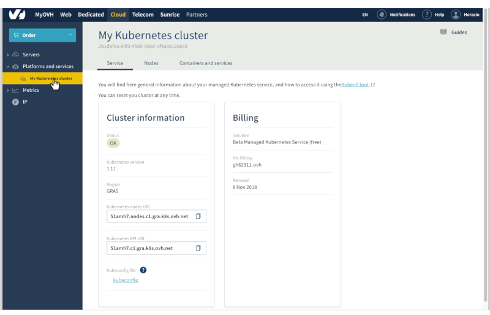
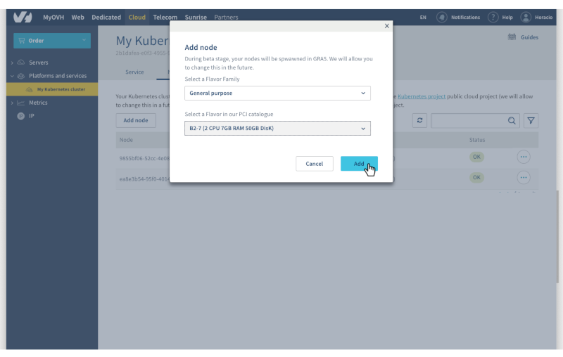
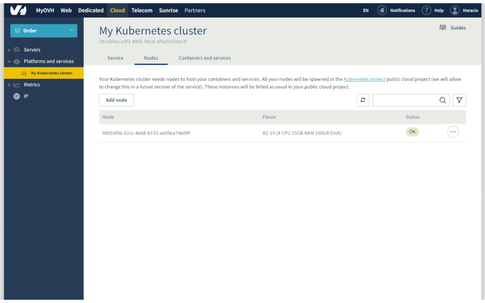

**Last updated 25th February, 2019.**

## Objective

OVH Managed Kubernetes service provides you Kubernetes clusters without the hassle of installing or operating them. This guide will cover the first step after ordering a cluster: adding nodes.

## Requirements

- an OVH Managed Kubernetes cluster

## Instructions

### Step 1 - Add a node using the OVH Cloud Manager 

Access our administration UI for your OVH Managed Kubernetes clusters by clicking on the *Platforms and services* menu in the [OVH Cloud Manager](https://www.ovh.com/manager/cloud/)

{.thumbnail}

In this administration UI you have three tabs:

- *Service*: here you will have a global view of your cluster, with important information like the status, the API URL or the `kubectl` configuration file.

- *Nodes*: you will find here the active nodes of your cluster. You will be able to add, modify or remove nodes.

- *Containers and Services*: Coming soon...

In the *Nodes* tab of the administration UI, click on *Add Node*. For this tutorial choose a general purpose node, like the B2-7 flavor:

{.thumbnail}

> [!primary]
> If you want to know more about the flavors on the current OVH range, [here you have a complete guide](https://docs.ovh.com/gb/en/public-cloud/faq-how-to-understand-the-new-flavor-naming-rules-for-the-2017-range/).

### Step 2 - Verify your node is ready

In the *Nodes* tab  you can inspect the state of your nodes. The node you have just created should be in a *Installing* state now. The node installation can take a minute, so feel free to take a small pause and try again until it's ready.

{.thumbnail}

## Go further

To have an overview of OVH Managed Kubernetes service, you can go to the [OVH Managed Kubernetes site](https://labs.ovh.com/kubernetes-k8s).

Otherwise to skip it and push to deploy your first application on your Kubernetes cluster, we invite you to follow our guide to [configuring default settings for `kubectl`](../configuring_default_settings_for_kubectl/configuring_default_settings_for_kubectl) and [deploying an application](../deploying_an_application/deploying_an_application) .

Join our community of users on https://community.ovh.com/en/.