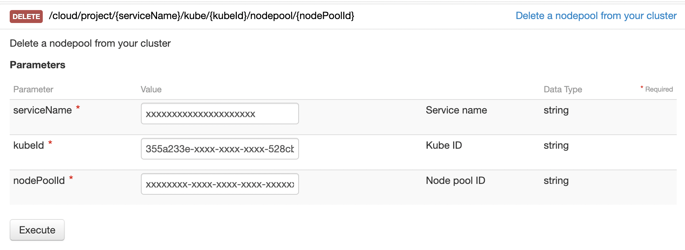

<style>
 pre {
     font-size: 14px;
 }
 pre.console {
   background-color: #300A24;
   color: #ccc;
   font-family: monospace;
   padding: 5px;
   margin-bottom: 5px;
 }
 pre.console code {
   border: solid 0px transparent;
   font-family: monospace !important;
   font-size: 0.75em;
   color: #ccc;
 }
 .small {
     font-size: 0.75em;
 }
</style>

**Last updated 28th July 2022.**

## Objective

We previously showed you how to taint, cordon and drain specific `Nodes` and `Nodes Pools`. It's useful but it's not super efficient in the case of Kubernetes cluster AutoScaling, when your Nodes are created and deleted automatically.
In this new tutorial we will show you how to do some operations (add labels, annotations, taints...) propagated to your `Nodes` thanks to `Node Pools` template, on your OVHcloud Managed Kubernetes Service.

This enables multiple scheduling scenarii, like optimizing the cost of a cluster hosting your application by distributing `Pods` accross two labelled `Node Pools` (one is in monthly billing and the other autoscaled).

Thanks to the `Node Pool's template`, you will:

- add *labels* on Nodes
- add *annotations* on Nodes
- *taint* Nodes
- mark Nodes as *unschedulable*
- ...

## Requirements

- a [Public Cloud project](https://www.ovhcloud.com/en-ca/public-cloud/) in your OVHcloud account
- access to the [OVHcloud Control Panel](https://ca.ovh.com/auth/?action=gotomanager&from=https://www.ovh.com/ca/en/&ovhSubsidiary=ca)

## Instructions

### Create a Kubernetes cluster

You can follow the Kubernetes cluster creation step by step guide if you want to create it through the [Control Panel](../label-nodeaffinity-node-pools/#cluster-creation) or through [Terraform](https://docs.ovh.com/ca/en/kubernetes/creating-a-cluster-through-terraform/).

### Create a Node Pool Template with Terraform

Since the version 0.19+ of our [OVH Terraform provider](https://registry.terraform.io/providers/ovh/ovh/latest/docs) you can add IP restrictions also through Terraform.

#### Getting your cluster/API tokens information

The "OVH provider" needs to be configured with a set of credentials:

* an `application_key`
* an `application_secret`
* a `consumer_key`

**Why?**

Because, behind the scenes, the "OVH Terraform provider" is doing requests to OVHcloud APIs. 

In order to retrieve this necessary information, please follow our [First steps with the OVHcloud APIs](https://docs.ovh.com/ca/en/api/first-steps-with-ovh-api/) tutorial.

Specifically, you have to generate these credentials via the [OVHcloud token generation page](https://api.ovh.com/createToken/?GET=/*&POST=/*&PUT=/*&DELETE=/*) with the following rights:

{.thumbnail}

When you have successfully generated your OVHcloud tokens, please save them as you will have to use them very soon.

The last needed information is the `service_name`: it is the ID of your Public Cloud project.

**How to get it?**

In the Public Cloud section, you can retrieve your service name ID thanks to the `Copy to clipboard`{.action} button.

{.thumbnail}

You will also use this information in Terraform resources definition files.

#### Terraform instructions

First, create a `provider.tf` file with the minimum version, european endpoint ("ovh-eu") and the keys previously retrieved in this guide.

Terraform 0.13 and later:

```bash
terraform {
  required_providers {
    ovh = {
      source  = "ovh/ovh"
    }
  }
}

provider "ovh" {
  endpoint           = "ovh-eu"
  application_key    = "<your_access_key>"
  application_secret = "<your_application_secret>"
  consumer_key       = "<your_consumer_key>"
}
```


Terraform 0.12 and earlier:

```bash
# Configure the OVHcloud Provider
provider "ovh" {
  endpoint           = "ovh-eu"
  application_key    = "<your_access_key>"
  application_secret = "<your_application_secret>"
  consumer_key       = "<your_consumer_key>"
}
```

Alternatively the secret keys can be retrieved from your environment.

- `OVH_ENDPOINT`
- `OVH_APPLICATION_KEY`
- `OVH_APPLICATION_SECRET`
- `OVH_CONSUMER_KEY`

This later method (or a similar alternative) is recommended to avoid storing secret data in a source repository.

Here, we defined the `ovh-eu` endpoint because we want to call the OVHcloud Europe API, but other endpoints exist, depending on your needs:

* `ovh-eu` for OVHcloud Europe API
* `ovh-us` for OVHcloud US API
* `ovh-ca` for OVHcloud North-America API

Then, define the resources you want to create in a new file called `ovh_kube_cluster_nodepool.tf`:

```bash
resource "ovh_cloud_project_kube_nodepool" "pool" {
    service_name  = "<service_name>"
    kube_id       = "<cluster_id>"
    name          = "my-node-pool"
    flavor_name   = "b2-7"
    desired_nodes = 1
    min_nodes     = 0
    max_nodes     = 1
    template {
        metadata {
            annotations = {
                my-annotation = "my-value"
            }
            labels = {
                app = "my-app"
            }
        }
        spec {
            unschedulable = false
            taints = [
            {
                effect = "PreferNoSchedule"
                key    = "k1"
                value  = "v1"
            }
            ]
        }
    }
}
```

> [!primary]
>
> Don't forget to replace `<service_name>` and `<cluster_id>` by the real data.

In this resources configuration, we ask Terraform to add a Node Pool with a template to your Kubernetes cluster.

> [!primary]
>
> Go to the **ovh terraform provider** documentation in order to see the [ovh_cloud_project_kube_nodepool resource definition](https://registry.terraform.io/providers/ovh/ovh/latest/docs/resources/cloud_project_kube_nodepool).

Now we need to initialise Terraform, generate a plan, and apply it.

```bash
$ terraform init

Initializing the backend...

Initializing provider plugins...
- Finding latest version of ovh/ovh...
- Finding latest version of hashicorp/local...
- Installing ovh/ovh v0.19.1...
- Installed ovh/ovh v0.19.1 (signed by a HashiCorp partner, key ID F56D1A6CBDAAADA5)
- Installing hashicorp/local v2.2.3...
- Installed hashicorp/local v2.2.3 (signed by HashiCorp)

Partner and community providers are signed by their developers.
If you'd like to know more about provider signing, you can read about it here:
https://www.terraform.io/docs/cli/plugins/signing.html

Terraform has created a lock file .terraform.lock.hcl to record the provider
selections it made above. Include this file in your version control repository
so that Terraform can guarantee to make the same selections by default when
you run "terraform init" in the future.

Terraform has been successfully initialized!

You may now begin working with Terraform. Try running "terraform plan" to see
any changes that are required for your infrastructure. All Terraform commands
should now work.

If you ever set or change modules or backend configuration for Terraform,
rerun this command to reinitialize your working directory. If you forget, other
commands will detect it and remind you to do so if necessary.
```

The `init` command will initialize your working directory which contains `.tf` configuration files.

It’s the first command to execute for a new configuration, or after doing a checkout of an existing configuration in a given git repository for example.

The `init` command will:

- Download and install Terraform providers/plugins
- Initialise backend (if defined)
- Download and install modules (if defined)

Now, we can generate our plan:

```bash
$ terraform plan

Terraform used the selected providers to generate the following execution plan. Resource actions are indicated with the following symbols:
  + create

Terraform will perform the following actions:

  # ovh_cloud_project_kube_nodepool.pool will be created
  + resource "ovh_cloud_project_kube_nodepool" "pool" {
      + anti_affinity    = false
      + autoscale        = false
      + available_nodes  = (known after apply)
      + created_at       = (known after apply)
      + current_nodes    = (known after apply)
      + desired_nodes    = 1
      + flavor           = (known after apply)
      + flavor_name      = "b2-7"
      + id               = (known after apply)
      + kube_id          = "xxxxxxxx-xxxx-xxxx-xxxx-xxxxxxxxxxx"
      + max_nodes        = 1
      + min_nodes        = 0
      + monthly_billed   = false
      + name             = "my-node-pool"
      + project_id       = (known after apply)
      + service_name     = "xxxxxxxxxxxxx"
      + size_status      = (known after apply)
      + status           = (known after apply)
      + up_to_date_nodes = (known after apply)
      + updated_at       = (known after apply)

      + template {
          + metadata {
              + annotations = {
                  + "my-annotation" = "my-value"
                }
              + finalizers  = []
              + labels      = {
                  + "app" = "my-app"
                }
            }

          + spec {
              + taints        = [
                  + {
                      + "effect" = "PreferNoSchedule"
                      + "key"    = "k1"
                      + "value"  = "v1"
                    },
                ]
              + unschedulable = false
            }
        }
    }

Plan: 1 to add, 0 to change, 0 to destroy.

───────────────────────────────────────────────────────────────────────────────────────────────────────────────────────────────────────────────────────────────────────────────────────────────────────────

Note: You didn't use the -out option to save this plan, so Terraform can't guarantee to take exactly these actions if you run "terraform apply" now.
```

Thanks to the `plan` command, we can check what Terraform wants to create, modify or remove.

The plan is OK for us, so let's apply it:

```bash
$ terraform apply

Terraform used the selected providers to generate the following execution plan. Resource actions are indicated with the following symbols:
  + create

Terraform will perform the following actions:

  # ovh_cloud_project_kube_nodepool.pool will be created
  + resource "ovh_cloud_project_kube_nodepool" "pool" {
      + anti_affinity    = false
      + autoscale        = false
      + available_nodes  = (known after apply)
      + created_at       = (known after apply)
      + current_nodes    = (known after apply)
      + desired_nodes    = 1
      + flavor           = (known after apply)
      + flavor_name      = "b2-7"
      + id               = (known after apply)
      + kube_id          = "xxxxxxxx-xxxx-xxxx-xxxx-xxxxxxxxxxx"
      + max_nodes        = 1
      + min_nodes        = 0
      + monthly_billed   = false
      + name             = "my-node-pool"
      + project_id       = (known after apply)
      + service_name     = "xxxxxxxxxxxxx"
      + size_status      = (known after apply)
      + status           = (known after apply)
      + up_to_date_nodes = (known after apply)
      + updated_at       = (known after apply)

      + template {
          + metadata {
              + annotations = {
                  + "my-annotation" = "my-value"
                }
              + finalizers  = []
              + labels      = {
                  + "app" = "my-app"
                }
            }

          + spec {
              + taints        = [
                  + {
                      + "effect" = "PreferNoSchedule"
                      + "key"    = "k1"
                      + "value"  = "v1"
                    },
                ]
              + unschedulable = false
            }
        }
    }

Plan: 1 to add, 0 to change, 0 to destroy.

Do you want to perform these actions?
  Terraform will perform the actions described above.
  Only 'yes' will be accepted to approve.

  Enter a value: yes

ovh_cloud_project_kube_nodepool.pool: Creating...
ovh_cloud_project_kube_nodepool.pool: Still creating... [10s elapsed]
ovh_cloud_project_kube_nodepool.pool: Still creating... [20s elapsed]
ovh_cloud_project_kube_nodepool.pool: Still creating... [30s elapsed]
ovh_cloud_project_kube_nodepool.pool: Still creating... [40s elapsed]
ovh_cloud_project_kube_nodepool.pool: Still creating... [50s elapsed]
ovh_cloud_project_kube_nodepool.pool: Still creating... [1m0s elapsed]
ovh_cloud_project_kube_nodepool.pool: Still creating... [1m10s elapsed]
ovh_cloud_project_kube_nodepool.pool: Still creating... [1m20s elapsed]
ovh_cloud_project_kube_nodepool.pool: Still creating... [1m30s elapsed]
ovh_cloud_project_kube_nodepool.pool: Still creating... [1m40s elapsed]
ovh_cloud_project_kube_nodepool.pool: Still creating... [1m50s elapsed]
ovh_cloud_project_kube_nodepool.pool: Still creating... [2m0s elapsed]
ovh_cloud_project_kube_nodepool.pool: Still creating... [2m10s elapsed]
ovh_cloud_project_kube_nodepool.pool: Still creating... [2m20s elapsed]
ovh_cloud_project_kube_nodepool.pool: Still creating... [2m30s elapsed]
ovh_cloud_project_kube_nodepool.pool: Still creating... [2m40s elapsed]
ovh_cloud_project_kube_nodepool.pool: Still creating... [2m50s elapsed]
ovh_cloud_project_kube_nodepool.pool: Still creating... [3m0s elapsed]
ovh_cloud_project_kube_nodepool.pool: Still creating... [3m10s elapsed]
ovh_cloud_project_kube_nodepool.pool: Still creating... [3m20s elapsed]
ovh_cloud_project_kube_nodepool.pool: Still creating... [3m30s elapsed]
ovh_cloud_project_kube_nodepool.pool: Still creating... [3m40s elapsed]
ovh_cloud_project_kube_nodepool.pool: Still creating... [3m50s elapsed]
ovh_cloud_project_kube_nodepool.pool: Still creating... [4m0s elapsed]
ovh_cloud_project_kube_nodepool.pool: Still creating... [4m10s elapsed]
ovh_cloud_project_kube_nodepool.pool: Still creating... [4m20s elapsed]
ovh_cloud_project_kube_nodepool.pool: Still creating... [4m30s elapsed]
ovh_cloud_project_kube_nodepool.pool: Still creating... [4m40s elapsed]
ovh_cloud_project_kube_nodepool.pool: Still creating... [4m50s elapsed]
ovh_cloud_project_kube_nodepool.pool: Still creating... [5m0s elapsed]
ovh_cloud_project_kube_nodepool.pool: Creation complete after 5m8s [id=xxxxxxx-xxxx-xxxx-xxxx-xxxxxxxxxx]

Apply complete! Resources: 1 added, 0 changed, 0 destroyed.
```

### Check everything is correctly configured

To do some operations on your Nodes, through `kubectl` CLI, we invite you to follow our guide to [configuring default settings](../configuring-kubectl/).

When you can access the cluster through `kubectl` command, let's display our node pool:

```bash
$ kubectl get nodepool
NAME           FLAVOR   AUTOSCALED   MONTHLYBILLED   ANTIAFFINITY   DESIRED   CURRENT   UP-TO-DATE   AVAILABLE   MIN   MAX   AGE
my-node-pool   b2-7     false        false           false          1         1         1            1           0     1     8m13s
```

Our node pool exist and we can see its configuration.

Now let's see the node pool template:

```bash
$ kubectl describe nodepool my-node-pool
Name:         my-node-pool
Namespace:
Labels:       id=xxxxxxxx-xxxxx-xxxx-xxxx-xxxxxxxxxxx
Annotations:  <none>
API Version:  kube.cloud.ovh.com/v1alpha1
Kind:         NodePool
...
Spec:
  Anti Affinity:  false
  Autoscale:      false
  ...
  Template:
    Metadata:
      Annotations:
        My - Annotation:  my-value
      Finalizers:
      Labels:
        App:  my-app
    Spec:
      Taints:
        Effect:       PreferNoSchedule
        Key:          k1
        Value:        v1
      Unschedulable:  false
Status:
...
```

The template you defined will ask Kubernetes to propagated this configuration to all the Nodes of this Node Pool.

Let's display our node. We should have 1 node running:

```bash
$ kubectl get nodes
NAME                       STATUS   ROLES    AGE     VERSION
my-node-pool-node-5781fa   Ready    <none>   7m55s   v1.22.9
```

Check the label, annotation and taint you defined are well propageted to the node:

```bash
$ kubectl describe node my-node-pool-node-5781fa
```


And if you edit the Node Pool configuration to activate the AutoScaling and scale to 3 nodes for example, all the information you defined will be propagated to new Nodes.


### Create a Node Pool Template through API

You can also create a Node Pool template through the API. You can use the [API Explorer](https://api.ovh.com/console/) for example to interact with our API.

To create a Node Pool with a template (labels, annotations, taints...), you have to make a call on:

> [!api]
>
> @api {POST} /cloud/project/{serviceName}/kube/{kubeId}/nodepool
>
 with the following information:

```json
{
    "serviceName": "<service_name>",
    "kubeId": "<cluster_id>",
    "ProjectKubeNodePoolCreation": {
      "name": "my-node-pool",
      "flavorName": "b2-7",
      "desiredNodes": 1,
      "minNodes": 0,
      "maxNodes": 1,
      "template": {
        "metadata": {
          "annotations": {
            "my-annotation": "my-value"
          },
          "labels": {
            "app": "my-app"
          }
        },
        "spec": {
          "unschedulable": false,
          "taints": [
            {
              "effect": "PreferNoSchedule",
              "key": "k1",
              "value": "v1"
            }
          ]
        }
      }
    }
  }
```
>

### Destroy

#### Destroy the Node Pool through Terraform

If you want to delete the Node Pool you added it through Terraform, have to execute `terraform destroy` command:

```bash
$ terraform destroy
ovh_cloud_project_kube_nodepool.pool: Refreshing state... [id=xxxxxxxx-xxxx-xxxx-xxxx-xxxxxxxxxxxx]

Terraform used the selected providers to generate the following execution plan. Resource actions are indicated with the following symbols:
  - destroy

Terraform will perform the following actions:

  # ovh_cloud_project_kube_nodepool.pool will be destroyed
  - resource "ovh_cloud_project_kube_nodepool" "pool" {
      - anti_affinity    = false -> null
      - autoscale        = false -> null
      - available_nodes  = 1 -> null
      - created_at       = "2022-07-28T11:58:01Z" -> null
      - current_nodes    = 1 -> null
      - desired_nodes    = 1 -> null
      - flavor           = "b2-7" -> null
      - flavor_name      = "b2-7" -> null
      - id               = "xxxxxxx-xxxx-xxxx-xxxx-xxxxxxxxxx" -> null
      - kube_id          = "xxxxxxx-xxxx-xxxx-xxxx-xxxxxxxxxx" -> null
      - max_nodes        = 1 -> null
      - min_nodes        = 0 -> null
      - monthly_billed   = false -> null
      - name             = "my-node-pool" -> null
      - project_id       = "xxxxxxxxxxxx" -> null
      - service_name     = "xxxxxxxxxxxx" -> null
      - size_status      = "CAPACITY_OK" -> null
      - status           = "READY" -> null
      - up_to_date_nodes = 1 -> null
      - updated_at       = "2022-07-28T12:02:56Z" -> null

      - template {
          - metadata {
              - annotations = {
                  - "my-annotation" = "my-value"
                } -> null
              - finalizers  = [] -> null
              - labels      = {
                  - "app" = "my-app"
                } -> null
            }

          - spec {
              - taints        = [
                  - {
                      - "effect" = "PreferNoSchedule"
                      - "key"    = "k1"
                      - "value"  = "v1"
                    },
                ] -> null
              - unschedulable = false -> null
            }
        }
    }

Plan: 0 to add, 0 to change, 1 to destroy.

Do you really want to destroy all resources?
  Terraform will destroy all your managed infrastructure, as shown above.
  There is no undo. Only 'yes' will be accepted to confirm.

  Enter a value: yes

ovh_cloud_project_kube_nodepool.pool: Destroying... [id=xxxxxxx-xxxx-xxxx-xxxx-xxxxxxxxxx]ovh_cloud_project_kube_nodepool.pool: Still destroying... [id=xxxxxxx-xxxx-xxxx-xxxx-xxxxxxxxxx, 10s elapsed]
ovh_cloud_project_kube_nodepool.pool: Still destroying... [id=xxxxxxx-xxxx-xxxx-xxxx-xxxxxxxxxx, 20s elapsed]
ovh_cloud_project_kube_nodepool.pool: Still destroying... [id=xxxxxxx-xxxx-xxxx-xxxx-xxxxxxxxxx, 30s elapsed]
ovh_cloud_project_kube_nodepool.pool: Still destroying... [id=xxxxxxx-xxxx-xxxx-xxxx-xxxxxxxxxx, 40s elapsed]
ovh_cloud_project_kube_nodepool.pool: Still destroying... [id=xxxxxxx-xxxx-xxxx-xxxx-xxxxxxxxxx, 50s elapsed]
ovh_cloud_project_kube_nodepool.pool: Still destroying... [id=xxxxxxx-xxxx-xxxx-xxxx-xxxxxxxxxx, 1m0s elapsed]
ovh_cloud_project_kube_nodepool.pool: Still destroying... [id=xxxxxxx-xxxx-xxxx-xxxx-xxxxxxxxxx, 1m10s elapsed]
ovh_cloud_project_kube_nodepool.pool: Destruction complete after 1m18s

Destroy complete! Resources: 1 destroyed.
```

#### Destroy the Node Pool through API

To delete a Node Pool with the API, you have to make a call on:

> [!api]
>
> @api {DELETE} /cloud/project/{serviceName}/kube/{kubeId}/nodepool/{nodePoolId}
>
> With the following information:
>
> 


## Go further
To have an overview of OVHcloud Managed Kubernetes service, you can go to the [OVHcloud Managed Kubernetes page](https://www.ovhcloud.com/asia/public-cloud/kubernetes/).

Join our community of users on <https://community.ovh.com/en/>.
