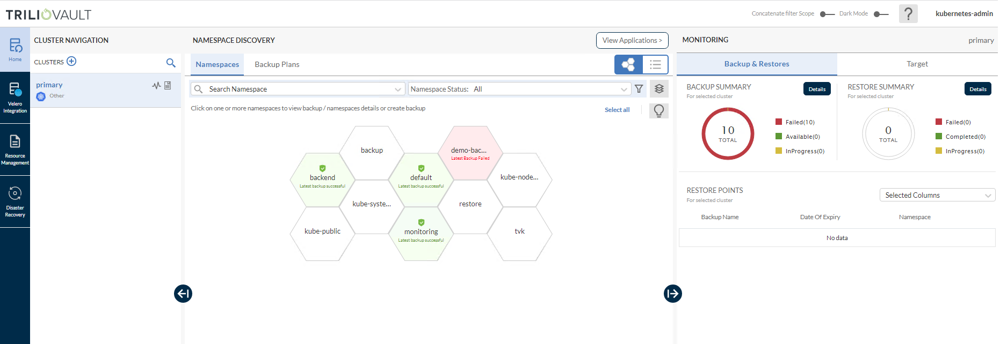
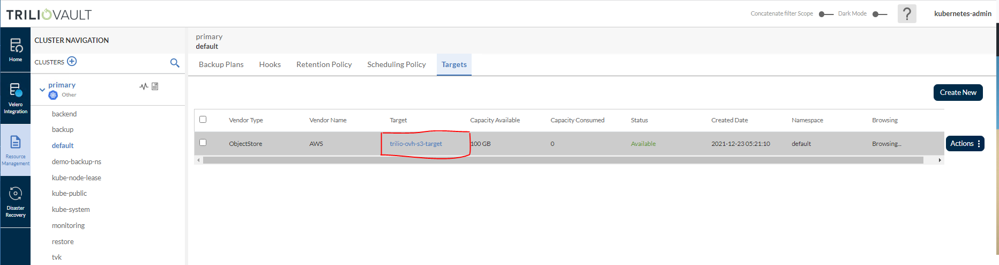
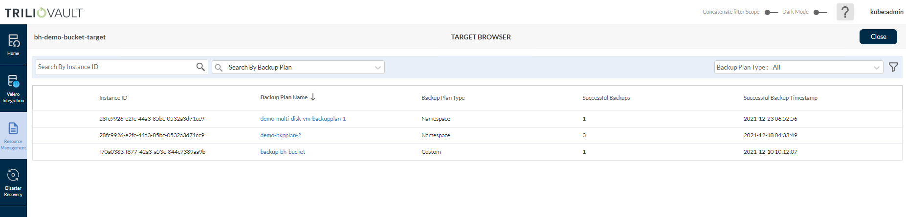

<style>
 pre {
     font-size: 14px;
 }
 pre.console {
   background-color: #300A24;
   color: #ccc;
   font-family: monospace;
   padding: 5px;
   margin-bottom: 5px;
 }
 pre.console code {
   border: solid 0px transparent;
   font-family: monospace !important;
   font-size: 0.75em;
   color: #ccc;
 }
 .small {
     font-size: 0.75em;
 }
</style>

**Last updated December 27<sup>th</sup>, 2021.**

## Introduction

In this tutorial, you will learn how to deploy `TrilioVault for Kubernetes` (or `TVK`) to your `OVH Managed Kubernetes Cluster`, create `backups`, and `recover` from a backup if something goes wrong. You can back up your `entire` cluster by including mutliple namespaces, or optionally choose a single `namespace`, `label` based backups, `Helm Releases` based backups or `Operator` based backups.

Advantages of using `Trilio`:

- Take `full` (or `incremental`) backups of your all namespaces, selective applications and `restore` in case of data loss.
- `Migrate` from one cluster to another.
- `Helm` release backups are supported.
- Backup of `Operator` based application deployment is also supported.
- Run `pre` and `post hooks` for backup and restore operations.
- Web management console, that allows you to inspect your backup/restore operations state in detail (and many other features).
- Define `retention policies` for your backups.
- Application lifecycle (meaning, TVK itself) can be managed via a dedicated `TrilioVault Operator`.
- `Velero` integration (Trilio supports monitoring Velero backups, restores, and backup/snapshot locations via it's web management console).

### How TrilioVault for Kubernetes Works

`TVK` follows a `cloud native` architecture, meaning that it has several components that together form the `Control Plane` and `Data Plane` layers. Everything is managed via `CRDs`, thus making it fully `Kubernetes` native. What is nice about `Trilio` is the clear separation of concerns, and how effective it handles backup and restore operations.

Each `TrilioVault` application consists of a bunch of `Controllers` and the associated `CRDs`. Every time a `CRD` is created or updated, the responsible controller is notified and performs cluster reconciliation. Then, the controller in charge spawns `Kubernetes` jobs that perform the real operation (like `backup`, `restore`, etc) in parallel.

`Control Plane` consists of:

- `Target Controller`, defines the `storage` backend (`S3`, `NFS`, etc) via specific CRDs.
- `BackupPlan Controller`, defines the components to backup, automated backups schedule, retention strategy, etc via specific CRDs.
- `Restore Controller`, defines restore operations via specific CRDs.

`Data Plane` consists of:

- `Datamover` Pods, responsible with transferring data between persistent volumes and backup media (or `Target`). `TrilioVault` works with `Persistent Volumes` (PVs) using the `CSI` interface. For each `PV` that needs to be backed up, an ephemeral `Datamover Pod` is created. After each operation finishes, the associated pod is destroyed.
- `Metamover` Pods, responsible with transferring `Kubernetes API` objects data to backup media (or `Target`). `Metamover` pods are `ephemeral`, just like the `Datamover` ones.

### Understanding TrilioVault Application Scope

`TrilioVault` for Kubernetes works based on `scope`, meaning you can have a `Namespaced` or a `Cluster` type of installation.

A `Namespaced` installation allows you to `backup` and `restore` at the `namespace` level only. In other words, the backup is meant to protect a set of applications that are bound to a namespace that you own. This is how a `BackupPlan` and the corresponding `Backup` CRD works. You cannot mutate those CRDs in other namespaces, they must be created in the same namespace where the application to be backed up is located.

On the other hand, a `Cluster` type installation is not scoped or bound to any namespace or a set of applications. You define cluster type backups via the `Cluster` prefixed `CRDs`, like: `ClusterBackupPlan`, `ClusterBackup`, etc. Cluster type backups are a little bit more flexible, in the sense that you are not tied to a specific namespace or set of applications to backup and restore. You can perform backup/restore operations for multiple namespaces and applications at once, including `PVs` as well (you can also backup `etcd` databased content).

In order to make sure that TVK application `scope` and `rules` are followed correctly, `TrilioVault` is using an `Admission Controller`. It `intercepts` and `validates` each `CRD` that you want to push for `TVK`, before it is actually created. In case TVK application scope is not followed, the admission controller will reject CRD creation in the cluster.

Another important thing to consider and remember is that a TVK `License` is application scope specific. In other words, you need to generate one type of license for either a `Namespaced` or a `Cluster` type installation.

`Namespaced` vs `Cluster` TVK application scope - when to use one or the other? It all depends on the use case. For example, a `Namespaced` scope is a more appropriate option when you don't have access to the whole Kubernetes cluster, only to specific namespaces and applications. Most of the cases you want to protect only the applications tied to a specific namespace that you own. On the other hand, a cluster scoped installation type works at the global level, meaning it can trigger backup/restore operations for any namespace or resource from a Kubernetes cluster (including `PVs` and the `etcd` database).

To summarize:

- If you are a cluster administrator, then you will most probably want to perform `cluster` level `operations` via corresponding CRDs, like: `ClusterBackupPlan`, `ClusterBackup`, `ClusterRestore`, etc.
- If you are a regular user, then you will usually perform `namespaced` only operations (application centric) via corresponding CRDs, like: `BackupPlan`, `Backup`, `Restore`, etc.

The application interface is very similar or uniform when comparing the two types: `Cluster` vs `non-Cluster` prefixed `CRDs`. So, if you're familiar with one type, it's pretty straightforward to use the counterpart.

For more information, please refer to the [TVK CRDs](https://docs.trilio.io/kubernetes/architecture/apis-and-command-line-reference/custom-resource-definitions-application-1) official documentation.

### Backup and Restore Workflow

Whenever you want to `backup` an application, you start by creating a `BackupPlan` (or `ClusterBackupPlan`) CRD, followed by a `Backup` (or `ClusterBackup`) object. Trilio `Backup Controller` is notified about the change and performs backup object inspection and validation (i.e. whether it is `cluster` backup, `namespace` backup, etc.). Then, it spawns worker pods (`Metamover`, `Datamover`) responsible with moving the actual data (Kubernetes metadata, PVs data) to the backend storage (or `Target`), such as `DigitalOcean Spaces`.

Similarly whenever you create a `Restore` object, the `Restore Controller` is notified to restore from a `Backup` object. Then, Trilio `Restore Controller` spawns worker nodes (`Metamover`, `Datamover`), responsible with moving backup data out of the `DigitalOcean Spaces` storage (Kubernetes metadata, PVs data). Finally, the restore process is initiated from the particular backup object.

######### NEED NOT BE INCLUDED
Below is a diagram that shows the `Backup/Restore` workflow for `TVK`:


#########

`Trilio` is ideal for the `disaster` recovery use case, as well as for `snapshotting` your application state, prior to performing `system operations` on your `cluster`, like `upgrades`. For more details on this topic, please visit the [Trilio Features](https://docs.trilio.io/kubernetes/overview/features-and-use-cases) and [Trilio Use Case](https://docs.trilio.io/kubernetes/overview/use-cases) official page.

After finishing this tutorial, you should be able to:

- Configure `OVH Object Storage` backend for `Trilio` to use.
- `Backup` and `restore` your `applications`
- `Backup` and `restore` your entire `OVH Managed Kubernetes Cluster`.
- Create `scheduled` backups for your applications.
- Create `retention policies` for your backups.

## Table of Contents

- [Introduction](#introduction)
  - [How TrilioVault for Kubernetes Works](#how-triliovault-for-kubernetes-works)
  - [Understanding TrilioVault Application Scope](#understanding-triliovault-application-scope)
  - [Backup and Restore Workflow](#backup-and-restore-workflow)
- [Prerequisites](#prerequisites)
- [Step 1 - Installing TrilioVault for Kubernetes](#step-1---installing-triliovault-for-kubernetes)
  - [Installing TrilioVault Operator and Manager Using Helm](#installing-triliovault-operator-and-manager-using-helm)
  - [TrilioVault Application Licensing](#triliovault-application-licensing)
  - [Checking TVK Application Licensing](#checking-tvk-application-licensing)
  - [Creating/Renewing TVK Application License](#creatingrenewing-tvk-application-license)
- [Step 2 - Creating a TrilioVault Target to Store Backups](#step-2---creating-a-triliovault-target-to-store-backups)
- [Step 3 - Getting to Know the TVK Web Management Console](#step-3---getting-to-know-the-tvk-web-management-console)
  - [Getting Access to the TVK Web Management Console](#getting-access-to-the-tvk-web-management-console)
  - [Exploring the TVK Web Console User Interface](#exploring-the-tvk-web-console-user-interface)
- [Step 4 - Namespaced Backup and Restore Example](#step-4---namespaced-backup-and-restore-example)
  - [Creating the Ambassador Helm Release Backup](#creating-the-ambassador-helm-release-backup)
  - [Deleting the Ambassador Helm Release and Resources](#deleting-the-ambassador-helm-release-and-resources)
  - [Restoring the Ambassador Helm Release Backup](#restoring-the-ambassador-helm-release-backup)
  - [Verifying Applications Integrity after Restoration](#verifying-applications-integrity-after-restoration)
- [Step 5 - Backup and Restore Whole Cluster Example](#step-5---backup-and-restore-whole-cluster-example)
  - [Creating the OVH Managed Kubernetes Cluster Backup](#creating-the-ovh-managed-kubernetes-cluster-backup)
  - [Re-creating the OVH Managed Kubernetes Cluster and Restoring Applications](#re-creating-the-ovh-managed-kubernetes-cluster-and-restoring-applications)
  - [Checking OVH Managed Kubernetes Cluster Applications State](#checking-ovh-managed-kubernetes-cluster-applications-state)
- [Step 6 - Scheduled Backups](#step-6---scheduled-backups)
- [Step 7 - Backups Retention Policy](#step-7---backups-retention-policy)
  - [Using Retention Policies](#using-retention-policies)
  - [Using Cleanup Policies](#using-cleanup-policies)
- [Conclusion](#conclusion)

## Prerequisites

To complete this tutorial, you need the following:

1. A [OVH S3 Object Storage Container/Bucket](https://docs.ovh.com/ca/en/storage/pcs/create-container/) and `access` keys. Save the `access` and `secret` keys in a safe place for later use.
2. A [Git](https://git-scm.com/downloads) client, to clone the `OVH Docs` repository.
3. [Helm](https://www.helms.sh), for managing `TrilioVault Operator` releases and upgrades.

4. [Doctl](https://github.com/digitalocean/doctl/releases), for `DigitalOcean` API interaction.

5. [Kubectl](https://kubernetes.io/docs/tasks/tools), for `Kubernetes` interaction.

**Important note:**

In order for `TrilioVault` to work correctly and to backup your `PVCs`, `OVH Managed Kubernetes Cluster` needs to be configured to support the `Container Storage Interface` (or `CSI`, for short). By default it comes with the driver already installed and configured. You can check using below command:

```shell
kubectl get storageclass
```

The output should look similar to (notice the provisioner is [dobs.csi.digitalocean.com](https://github.com/digitalocean/csi-digitalocean)):

```text
NAME                        PROVISIONER                RECLAIMPOLICY   VOLUMEBINDINGMODE   ALLOWVOLUMEEXPANSION   AGE
csi-cinder-classic          cinder.csi.openstack.org   Delete          Immediate           true                   3d
csi-cinder-high-speed       cinder.csi.openstack.org   Delete          Immediate           true                   3d
csi-hostpath-sc (default)   hostpath.csi.k8s.io        Retain          Immediate           false                  2d
```

## Step 1 - Installing TrilioVault for Kubernetes

In this step, you will learn how to deploy `TrilioVault` for `OVH Managed Kubernetes Cluster`, and manage `TVK` installations via `Helm`. Backups data will be stored in the `OVH Object Storage` bucket created earlier in the [Prerequisites](#prerequisites) section.

`TrilioVault` application can be installed as below:

- The `TrilioVault Operator` (installable via `Helm`). You define a `TrilioVaultManager` CRD, which tells `TrilioVault` operator how to handle the `installation`, `post-configuration` steps, and future `upgrades` of the `Trilio` application components.
- The `TrilioVault Manager` via the [k8s-triliovault] yaml definition (https://docs.trilio.io/kubernetes/use-triliovault/installing-triliovault#upstream-kubernetes)
	

### Installing TrilioVault Operator and Manager Using Helm

**Important note**:

`OVH Docs` tutorial is using the `Cluster` installation type for the `TVK` application (`applicationScope` Helm value is set to `"Cluster"`). All examples from this tutorial rely on this type of installation to function properly.

Please follow the steps below, to install `TrilioVault` via `Helm`:

1. First, clone the `OVH Docs` Git repository and change directory to your local copy:

    ```shell
    git clone https://github.com/ovh/docs.git

    cd docs/
    ```

2. Next, add the `TrilioVault` Helm repository, and list the available charts:

    ```shell
    helm repo add triliovault http://charts.k8strilio.net/trilio-stable/k8s-triliovault

    helm search repo triliovault
    ```

    The output looks similar to the following:

    ```text
    NAME                                            CHART VERSION   APP VERSION     DESCRIPTION
	triliovault-operator/k8s-triliovault-operator   2.6.3           2.6.3           K8s-TrilioVault-Operator is an operator designe...
	triliovault/k8s-triliovault                     2.6.3           2.6.3           K8s-TrilioVault provides data protection and re...

    ```

    
3. The chart of interest is `triliovault-operator/k8s-triliovault-operator`, which will install `TrilioVault for Kubernetes Operator` on the cluster. You can run `helm install` command to install the Operator. Install `TrilioVault for Kubernetes Operator` using `Helm`:

    ```shell
    TRILIOVAULT_CHART_VERSION="2.6.3"

    helm install triliovault-operator triliovault-operator/k8s-triliovault-operator --version "${TRILIOVAULT_CHART_VERSION}" \
      --namespace tvk \
      --create-namespace
    ```

    **Note:**

    A `specific` version for the `TrilioVault-Operator` Helm chart is used. In this case `2.6.3` is picked, which maps to the `2.6.3` version of the application (see the output from `Step 2.`). It’s good practice in general, to lock on a specific version. This helps to have predictable results, and allows versioning control via `Git`.

Now, please check your `TVK` deployment:

```shell
helm ls -n tvk
```

The output looks similar to the following (`STATUS` column should display `deployed`):

```text
NAME                    NAMESPACE       REVISION        UPDATED                                 STATUS          CHART                           APP VERSION
triliovault-operator    tvk             1               2021-12-21 08:13:41.644264863 +0000 UTC deployed        k8s-triliovault-operator-2.6.3  2.6.3

```

Next, verify that `TrilioVault-Operator` is up and running:

```shell
kubectl get deployments -n tvk
```

The output looks similar to the following (deployment pods must be in the `Ready` state):

```text
NAME                                			READY   UP-TO-DATE   AVAILABLE   AGE
triliovault-operator-k8s-triliovault-operator   1/1     1            1           3d
```

Now, you can install `TrilioVault Manager Application` using yaml definition (pages/platform/kubernetes-k8s/backup-and-restore-cluster-namespace-and-applications-with-trilio/assets/manifests/triliovault-manager-v2.6.3.yaml)

Run the `kubectl` command to install the `Triliovault Manager` using the yaml

```shell
kubectl apply -f assets/manifests/triliovault-manager-v2.6.3.yaml -n tvk
```

Now, please check your `TVK` deployment: 

```shell
helm ls -n tvk
```

The output looks similar to the following (`STATUS` column should display `deployed`):

```text
NAME                    NAMESPACE       REVISION        UPDATED                                 STATUS          CHART                           APP VERSION
tvk-tvk                 tvk             1               2021-12-21 08:18:06.817766759 +0000 UTC deployed        k8s-triliovault-2.6.3           2.6.3
```

Next, verify that `TrilioVault` is up and running:

```shell
kubectl get deployments -n tvk
```

The output looks similar to the following (all deployments pods must be in the `Ready` state):

```text
NAME                                            READY   UP-TO-DATE   AVAILABLE   AGE
k8s-triliovault-admission-webhook               1/1     1            1           3d
k8s-triliovault-control-plane                   1/1     1            1           3d
k8s-triliovault-exporter                        1/1     1            1           3d
k8s-triliovault-ingress-gateway                 1/1     1            1           3d
k8s-triliovault-web                             1/1     1            1           3d
k8s-triliovault-web-backend                     1/1     1            1           3d
```

You can also check if the TVM Customer Resource is created.

```shell
kubectl get tvm -n tvk
```

The output should look similar to below

```text
NAME                  TRILIOVAULT-VERSION   SCOPE     STATUS     RESTORE-NAMESPACES
triliovault-manager   2.6.3                 Cluster   Deployed
```

If the output looks like above, you installed `TVK` successfully. Next, you will learn how to check license type and validity, as well as how to renew.

### TrilioVault Application Licensing

By default, when installing `TVK` via `Helm`, there is no `Free Trial` license is generated. But if you download a `Free Trial` license and apply, it lets you run `TVK` for `one month` on `unlimited` cluster nodes. You can always go to the `Trilio` website and generate a new [license](https://www.trilio.io/plans) for your cluster that suits your needs (for example, you can pick the `basic license` type that lets you run `TrilioVault` indefinetly if your `cluster capacity` doesn't exceed `50 nodes`).

##################################
**Notes:**

- **TrilioVault is free of charge for Kubernetes clusters with up to 10000 nodes for DigitalOcean users.**
- `Starter Kit` examples rely on a `Cluster` license type to function properly.
##################################

### Checking TVK Application Licensing

Please run below command to see what license is available for your cluster (it is managed via the `License` CRD):

```shell
kubectl get license -n tvk
```

The output looks similar to (notice the `STATUS` which should be `Active`, as well as the license type in the `EDITION` column and `EXPIRATION TIME`):

```text
NAMESPACE   NAME             STATUS   MESSAGE                                   CURRENT NODE COUNT   GRACE PERIOD END TIME   EDITION   CAPACITY   EXPIRATION TIME        MAX NODES
tvk         test-license-1   Active   Cluster License Activated successfully.   3                                            Basic     50         2022-12-22T00:00:00Z   3
```

The license is managed via a special `CRD`, namely the `License` object. You can inspect it by running below command:

```shell
kubectl describe license test-license-1 -n tvk 
```

The output looks similar to (notice the `Message` and `Capacity` fields, as well as the `Edition`):

```yaml
Name:         test-license-1
Namespace:    tvk
Labels:       <none>
Annotations:  generation: 1
              triliovault.trilio.io/creator: kubernetes-admin
              triliovault.trilio.io/instance-id: 46188ee1-8ce1-4c45-96fa-c262f2214ced
              triliovault.trilio.io/updater:
                [{"username":"system:serviceaccount:tvk:k8s-triliovault","lastUpdatedTimestamp":"2021-12-21T10:06:59.796280418Z"}]
API Version:  triliovault.trilio.io/v1
Kind:         License
Metadata:
  Creation Timestamp:  2021-12-21T10:06:59Z
...
  Current Node Count:  3
  Max Nodes:           3
  Message:             Cluster License Activated successfully.
  Properties:
    Active:                        true
    Capacity:                      50
    Company:                       TRILIO-KUBERNETES-LICENSE-GEN-BASIC
    Creation Timestamp:            2021-12-21T00:00:00Z
    Edition:                       Basic
    Expiration Timestamp:          2022-12-22T00:00:00Z
    Kube UID:                      46188ee1-8ce1-4c45-96fa-c262f2214ced
    License ID:                    TVAULT-aa433560-6245-11ec-8d41-0cc47a9fd48e
    Maintenance Expiry Timestamp:  2022-12-22T00:00:00Z
    Number Of Users:               -1
    Purchase Timestamp:            2021-12-21T00:00:00Z
    Scope:                         Cluster
...
```

The above output will also tell you when the license is going to expire in the `Expiration Timestamp` field, and the `Scope` (`Cluster` based in this case). You can opt for a `cluster` wide license type, or for a `namespace` based license. More details can be found on the [Trilio Licensing](https://docs.trilio.io/kubernetes/overview/licensing) documentation page.

### Creating/Renewing TVK Application License

To create or renew the license, you will have to request a new one from the `Trilio` website, by navigating to the [licensing](https://www.trilio.io/plans) page. After completing the form, you should receive the `License` YAML manifest, which can be applied to your cluster using `kubectl`. Below commands assume that TVK is installed in the default `tvk` namespace (please replace the `<>` placeholders accordingly, where required):

```shell
kubectl apply -f <YOUR_LICENSE_FILE_NAME>.yaml -n tvk
```

Then, you can check the new license status as you already learned via:

```shell
# List available TVK licenses first from the `tvk` namespace
kubectl get license -n tvk

# Get information about a specific license from the `tvk` namespace
kubectl describe license <YOUR_LICENSE_NAME_HERE> -n tvk 
```

------------------------------------------------------------------------------------------------------
In the next step, you will learn how to define the storage backend for `TrilioVault` to store backups, called a `target`.

## Step 2 - Creating a TrilioVault Target to Store Backups

`TrilioVault` needs to know first where to store your backups. TrilioVault refers to the storage backend by using the `target` term, and it's managed via a special `CRD` named `Target`. The following target types are supported: `S3` and `NFS`. For `OVH Cloud` and the purpose of the `Tuturial`, it makes sense to rely on the `S3` storage type because it's `cheap` and `scalable`. To benefit from an enhanced level of protection you can create multiple target types (for both `S3` and `NFS`), so that your data is kept safe in multiple places, thus achieving backup redundancy.

Typical `Target` definition looks like below:

```yaml
apiVersion: triliovault.trilio.io/v1
kind: Target
metadata:
  name: trilio-ovh-s3-target
  namespace: tvk
spec:
  type: ObjectStore
  vendor: Other
  enableBrowsing: true
  objectStoreCredentials:
    bucketName: <YOUR_OVH_OBJECT_STORAGE_BUCKET_NAME_HERE>
    region: <YOUR_OVH_OBJECT_STORAGE_BUCKET_REGION_HERE>    # e.g.: bhs5
    url: "https://<YOUR_OVH_OBJECT_STORAGE_BUCKET_ENDPOINT_HERE>"  	# e.g.: storage.bhs.cloud.ovh.net
    credentialSecret:
      name: trilio-ovh-s3-target
      namespace: tvk
  thresholdCapacity: 10Gi
```

Explanation for the above configuration:

- `spec.type`: Type of target for backup storage (S3 is an object store).
- `spec.vendor`: Third party storage vendor hosting the target (for `OVH Object Storage` you need to use `Other` instead of `AWS`).
- `spec.enableBrowsing`: Enable browsing for the target to brose through the backups stored on it.
- `spec.objectStoreCredentials`: Defines required `credentials` (via `credentialSecret`) to access the `S3` storage, as well as other parameters such as bucket region and name.
- `spec.thresholdCapacity`: Maximum threshold capacity to store backup data.

To access `S3` storage, each target needs to know bucket credentials. A `Kubernetes Secret` must be created as well:

```yaml
apiVersion: v1
kind: Secret
metadata:
  name: trilio-ovh-s3-target
  namespace: tvk
type: Opaque
stringData:
  accessKey: <YOUR_OVH_OBJECT_STORAGE_BUCKET_ACCESS_KEY_ID_HERE>	# value must be base64 encoded
  secretKey: <YOUR_OVH_OBJECT_STORAGE_BUCKET_SECRET_KEY_HERE>    	# value must be base64 encoded
```

Notice that the secret name is `trilio-ovh-s3-target`, and it's referenced by the `spec.objectStoreCredentials.credentialSecret` field of the `Target` CRD explained earlier. The `secret` can be in the same `namespace` where `TrilioVault` was installed (defaults to `tvk`), or in another namespace of your choice. Just make sure that you reference the namespace correctly. On the other hand, please make sure to `protect` the `namespace` where you store `TrilioVault` secrets via `RBAC`, for `security` reasons.

Steps to create a `Target` for `TrilioVault`:

1. First, change directory where the `ovh/docs` Git repository was cloned on your local machine:

    ```shell
    cd docs
    ```

2. Next, create the Kubernetes secret containing your target S3 bucket credentials (please replace the `<>` placeholders accordingly):

    ```shell
    kubectl create secret generic trilio-ovh-s3-target \
      --namespace=tvk \
      --from-literal=accessKey="<YOUR_OVH_OBJECT_STORAGE_BUCKET_ACCESS_KEY_HERE>" \
      --from-literal=secretKey="<YOUR_OVH_OBJECT_STORAGE_BUCKET_SECRET_KEY_HERE>"
    ```

3. Then, open and inspect the `Target` manifest file provided in the `docs` repository, using an editor of your choice (preferably with `YAML` lint support). You can use [VS Code](https://code.visualstudio.com) for example:

    ```shell
    code assets/manifests/triliovault-ovh-s3-target.yaml
    ```

4. Now, please replace the `<>` placeholders accordingly for your OVH Object Storage `Trilio` bucket, like: `bucketName`, `region`,  `url` and `credentialSecret`.
5. Finally, save the manifest file and create the `Target` object using `kubectl`:

    ```shell
    kubectl apply -f assets/manifests/triliovault-ovh-s3-target.yaml
    ```

What happens next is, `TrilioVault` will spawn a `worker job` named `trilio-ovh-s3-target-validator` responsible with validating your S3 bucket (like availability, permissions, etc.). If the job finishes successfully, the bucket is considered to be healthy or available and the `trilio-ovh-s3-target-validator` job resource is deleted afterwards. If something bad happens, the S3 target validator job is left up and running so that you can inspect the logs and find the possible issue.

Now, please go ahead and check if the `Target` resource created earlier is `healthy`:

```shell
kubectl get target trilio-ovh-s3-target  -n tvk
```

The output looks similar to (notice the `STATUS` column value - should be `Available`, meaning it's in a `healthy` state):

```text
NAME                   TYPE          THRESHOLD CAPACITY   VENDOR   STATUS      BROWSING ENABLED
trilio-ovh-s3-target   ObjectStore   10Gi                 Other    Available
```

If the output looks like above, then you configured the S3 target object successfully.

**Hint:**

In case the target object fails to become healthy, you can inspect the logs from the `trilio-ovh-s3-target-validator` Pod to find the issue:

```shell
# First, you need to find the target validator
kubectl get pods -n tvk | grep trilio-ovh-s3-target-validator

# Output looks similar to:
# trilio-ovh-s3-target-validator-tio99a-6lz4q              1/1     Running     0          104s

# Now, fetch logs data
kubectl logs pod/trilio-ovh-s3-target-validator-tio99a-6lz4q -n tvk
```

The output looks similar to (notice the exception as an example):

```text
...
INFO:root:2021-11-24 09:06:50.595166: waiting for mount operation to complete.
INFO:root:2021-11-24 09:06:52.595772: waiting for mount operation to complete.
ERROR:root:2021-11-24 09:06:54.598541: timeout exceeded, not able to mount within time.
ERROR:root:/triliodata is not a mountpoint. We can't proceed further.
Traceback (most recent call last):
  File "/opt/tvk/datastore-attacher/mount_utility/mount_by_target_crd/mount_datastores.py", line 56, in main
    utilities.mount_datastore(metadata, datastore.get(constants.DATASTORE_TYPE), base_path)
  File "/opt/tvk/datastore-attacher/mount_utility/utilities.py", line 377, in mount_datastore
    mount_s3_datastore(metadata_list, base_path)
  File "/opt/tvk/datastore-attacher/mount_utility/utilities.py", line 306, in mount_s3_datastore
    wait_until_mount(base_path)
  File "/opt/tvk/datastore-attacher/mount_utility/utilities.py", line 328, in wait_until_mount
    base_path))
Exception: /triliodata is not a mountpoint. We can't proceed further.
...
```

Next, you will discover the TVK web console which is a really nice and useful addition to help you manage backup and restore operations very easy, among many others.

## Step 3 - Getting to Know the TVK Web Management Console

While you can manage backup and restore operations from the `CLI` entirely via `kubectl` and `CRDs`, `TVK` provides a [Web Management Console](https://docs.trilio.io/kubernetes/management-console/user-interface) to accomplish the same operations via the GUI. The management console simplifies common tasks via point and click operations, provides better visualization and inspection of TVK cluster objects, as well as to create disaster recovery plans (or `DRPs`).

The Helm based installation covered in [Step 1 - Installing TrilioVault for Kubernetes](#step-1---installing-triliovault-for-kubernetes) already took care of installing the required components for the web management console.

### Getting Access to the TVK Web Management Console

To be able to access the console and explore the features it offers, you can either user LoadBalancer, NodePort or need to port forward the ingress gateway service for TVK.

First, you need to identify the `ingress-gateway` service from the `tvk` namespace:

```shell
kubectl get svc -n tvk
```

The output looks similar to (search for the `k8s-triliovault-ingress-gateway` line, and notice that it listens on port `80` in the `PORT(S)` column):

```text
NAME                                TYPE        CLUSTER-IP       EXTERNAL-IP   PORT(S)                      AGE
k8s-triliovault-admission-webhook   ClusterIP   10.245.121.127   <none>        443/TCP                      22m
k8s-triliovault-ingress-gateway     NodePort    10.245.186.164   <none>        80:30090/TCP,443:30530/TCP   22m
k8s-triliovault-web                 ClusterIP   10.245.62.14     <none>        80/TCP                       22m
k8s-triliovault-web-backend         ClusterIP   10.245.69.118    <none>        80/TCP                       22m
trilio-s3-target-browser-u8wf5f     ClusterIP   10.245.7.116     <none>        80/TCP                       38s
```

If you are using LoadBalancer for the `k8s-triliovault-ingress-gateway` then the output would look like:

```text
NAME                                                            TYPE           CLUSTER-IP     EXTERNAL-IP     PORT(S)                      AGE
k8s-triliovault-admission-webhook                               ClusterIP      10.3.64.146    <none>          443/TCP                      24h
k8s-triliovault-ingress-gateway                                 LoadBalancer   10.3.57.207    51.222.45.171   80:30090/TCP,443:30530/TCP   24h
k8s-triliovault-web                                             ClusterIP      10.3.207.185   <none>          80/TCP                       24h
k8s-triliovault-web-backend                                     ClusterIP      10.3.249.53    <none>          80/TCP                       24h
triliovault-operator-k8s-triliovault-operator-webhook-service   ClusterIP      10.3.59.49     <none>          443/TCP                      24h
```

`TVK` is using an `Nginx Ingress Controller` to route traffic to the management web console services. Routing is host based, and the host name is `ovh-k8s-tvk.demo.trilio.io` as defined in the `Helm` values file from the `ovh/docs`:

```yaml
# The host name to use when accessing the web console via the TVK ingress gateway
ingressConfig:
  host: "ovh-k8s-tvk.demo.trilio.io"
```

Having the above information at hand, please go ahead and edit the `/etc/hosts` file, and add this entry:

```text
127.0.0.1 ovh-k8s-tvk.demo.trilio.io
```

Next, create the port forward for the TVK ingress gateway service:

```shell
kubectl port-forward svc/k8s-triliovault-ingress-gateway 8080:80 -n tvk
```

Finally download the `kubeconfig` file for your OVH Managed Kubernetes Cluster present under `Service` tab as `Kubeconfig file`. This step is required so that the web console can authenticate you using kubeconfig file:

After following the above presented steps, you can access the console in your web browser by navigating to: http://ovh-k8s-tvk.demo.trilio.io. When asked for the `kubeconfig` file, please select the one that you created in the last command from above.

**Note:**

Please keep the generated `kubeconfig` file safe because it contains sensitive data.

### Exploring the TVK Web Console User Interface

The home page looks similar to:



Go ahead and explore each section from the left, like:

- `Home`: This is the main dashboard which gives you a general overview for whole cluster, like: Kubernetes clusters, discovered namespaces, Backup/Restore operations summary, etc.
- `Resource Management`: Lists all the available resources from your cluster (e.g. application namespaces), as well as settings for each, like: backup plans, retention policies, etc.
- `Disaster Recovery`: Allows you to manage and perform disaster recovery operations.

You can also see the S3 Target created earlier, by navigating to `Resource Management -> TVK Namespace -> Targets` (in case of `ovh/docs` the TVK Namespace is `tvk`):



Going further, you can browse the target and list the available backups by clicking on the `Actions` button from the right, and then select `Launch Browser` option from the pop-up menu (for this to work the target must have the `enableBrowsing` flag set to `true`):



For more information and available features, please consult the [TVK Web Management Console User Interface](https://docs.trilio.io/kubernetes/management-console/user-interface/overview) official documentation.

Next, you will learn how to perform backup and restore operations for specific use cases, like:

- Specific `namespace(s)` backup and restore.
- Whole `cluster` backup and restore.
